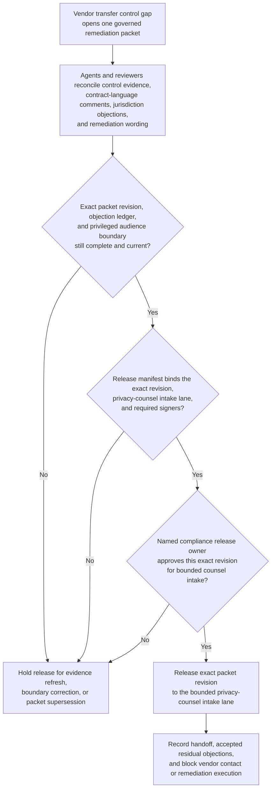
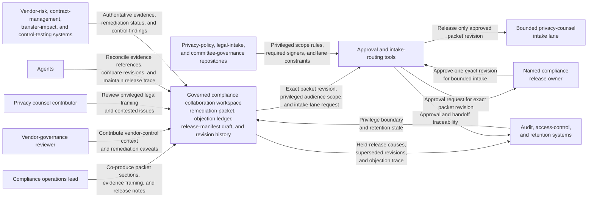

# Vendor transfer remediation packet approved for privacy counsel intake

## Linked pattern(s)

- `approval-gated-collaborative-artifact-release`

## Domain

Compliance.

## Scenario summary

Compliance operations, privacy counsel, and vendor-governance reviewers are co-producing one remediation packet after a vendor data-transfer control gap is identified and needs formal legal review before any external communication or remediation commitment is made. Agents help reconcile control evidence, contract-language comments, jurisdiction-specific objections, and remediation wording into the shared packet while preserving which issues remain contested and what audience boundary is allowed. The workflow ends only when the named compliance release owner approves that exact packet revision for one bounded privacy-counsel intake lane, where downstream legal reviewers can decide what action or communication should follow. It does not decide the legal outcome, contact the vendor, or execute remediation steps.

## Target systems / source systems

- Governed compliance collaboration workspace storing the remediation packet, objection ledger, release-manifest draft, and revision history
- Vendor-risk, contract-management, transfer-impact, and control-testing systems providing authoritative evidence and remediation status
- Privacy-policy, legal-intake, and committee-governance repositories defining privileged audience scope, required signers, and release-lane constraints
- Approval and intake-routing tools used to release one approved packet revision into the privacy-counsel lane
- Audit, access-control, and retention systems preserving privilege boundaries, held-release causes, and superseded packet versions

## Why this instance matters

This grounds the pattern in compliance work where humans and agents collaborate around one governed artifact, then explicitly approve release of that artifact itself into a downstream legal lane. The packet is more than a synthesis brief because the collaboration loop preserves disagreement, section ownership, and release-state discipline across multiple revisions. The example stays family-safe by ending at the counsel-intake handoff instead of making the legal decision, contacting external parties, or running remediation work.

## Likely architecture choices

- Approval-gated execution fits because the remediation packet can be collaboration-complete before it is allowed to cross into the privileged privacy-counsel intake boundary.
- Human-in-the-loop control is essential because only accountable compliance and legal owners may accept residual disagreement, preserve privilege boundaries, and release the packet onward.
- Agents may update evidence references, compare section revisions, and maintain the release trace, but they must not adjudicate legal posture or initiate vendor communications.

## Governance notes

- The release manifest should bind one exact packet revision, the privileged intake lane, signer identities, and any residual objections that were explicitly accepted by the human release owner.
- Jurisdiction-specific issues, contractual caveats, and remediation-status disagreements should remain visible in the packet or boundary ledger instead of being flattened before release.
- Audience scope and privilege boundaries should stay explicit; promotion of the packet into broader regulator, vendor, or executive channels should require separate downstream approval.
- If new control-test evidence or legal guidance changes the remediation narrative materially, the workflow should hold release and supersede the prior packet revision rather than reusing stale approval.

## Evaluation considerations

- Rate at which privacy-counsel intake accepts the released packet without finding hidden disagreement, stale control evidence, or privilege-boundary drift
- Time required to maintain one collaborative remediation packet as evidence, legal comments, and approval state evolve
- Reliability of binding between the released packet revision, accepted residual disagreement, and the bounded privileged intake scope
- Frequency with which humans reject agent-assisted edits because they drifted into legal adjudication, external communication, or remediation execution
