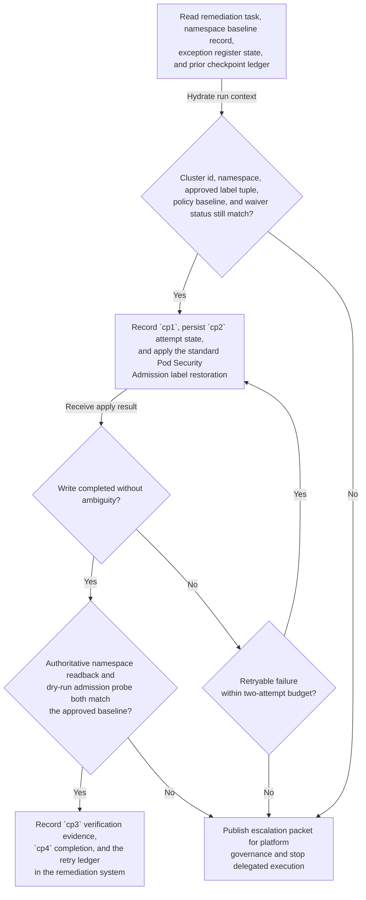

# Approved managed-Kubernetes namespace pod-security label restoration runbook execution

## Linked pattern(s)

- `exception-aware-task-execution`

## Domain

Engineering.

## Scenario summary

A restricted platform remediation queue receives one prequalified task to restore the approved Pod Security Admission label set on the `payments-settlement-prod` namespace in cluster `mks-us-east-1-prod-03` after a known control-plane reconciliation drift removed the required `enforce`, `audit`, and `warn` labels. The delegated workflow is limited to one approved runbook, `MKS-PSA-Label-Restore-v3`, and may proceed only if the authoritative namespace baseline register, active platform-exception register, current cluster inventory snapshot, and namespace-ownership directory still agree on the cluster identifier, namespace name, approved label tuple, policy-baseline version, and absence of an open waiver. Checkpoint lineage is fixed at `cp0` intake, `cp1` prerequisite revalidation, `cp2` label-write attempt, `cp3` post-write readback plus dry-run admission probe, and `cp4` durable completion or escalation. The workflow may retry only two documented retryable failures, such as a transient Kubernetes API timeout or one `resourceVersion` conflict, and it must stop if an ownership alias mismatch, open exception record, label-propagation lag beyond the verification window, or ambiguous dry-run result appears. Leah Moran, Director of Kubernetes Platform Governance, is the named human owner for the runbook, and any out-of-bounds condition must be packaged for her team as an escalation packet rather than triggering policy interpretation, namespace redesign, or downstream workload changes.

## Target systems / source systems

- Restricted platform remediation queue holding the delegated task, runbook identifier, retry budget, and durable checkpoint ledger
- Namespace baseline register and platform-exception register that define the authoritative approved Pod Security Admission label tuple and whether a waiver is active
- Managed-Kubernetes cluster API or approved remediation worker used to apply namespace-label changes and return retryable or terminal status
- Admission-verification probe and Kubernetes audit log used to confirm that readback state and dry-run enforcement behavior match the approved baseline
- Platform governance evidence store and escalation queue that retain checkpoints, retry reasons, verification artifacts, and the exception packet for human takeover

## Why this instance matters

This grounds the pattern in engineering work where the useful delegation is a narrow, governed remediation runbook rather than an investigation, recommendation, or live incident command loop. Platform teams often need a safe way to carry one known namespace-control repair through to completion when the facts still match the approved baseline, while stopping immediately when an exception, ownership drift, or ambiguous verification signal suggests the task has left routine bounds. The example shows why durable checkpoints and explicit post-action verification matter: reapplying labels is easy, but proving that the namespace now reflects the right baseline without a hidden waiver or propagation problem is the real operational requirement.

## Likely architecture choices

- An orchestrated execution flow can separate task intake, prerequisite revalidation, label restoration, authoritative verification, and escalation packaging while preserving one durable checkpoint ledger for the namespace-remediation task.
- Durable state should record the last completed checkpoint, current retry count, namespace `resourceVersion`, runbook revision, and verification evidence so an interrupted run does not replay the same write blindly.
- Verification should re-read the namespace from the authoritative cluster API and run the dry-run admission probe after each consequential action rather than trusting the label-write response alone.
- Human takeover should trigger automatically when a waiver appears, namespace ownership no longer matches the directory, retry budget is exhausted, or the dry-run probe produces a result that cannot be reconciled to the approved baseline.

## Governance notes

- The workflow should copy only the cluster identifier, namespace identifier, approved label tuple, policy-baseline version, waiver state, retry state, and verification evidence needed for execution or escalation, not broader workload manifests, secret references, or unrelated tenant metadata.
- Audit traces should record each checkpoint transition, every label-write attempt, the reason for any retry, the authoritative readback result, the dry-run admission outcome, and the exact condition that caused escalation.
- Every automated action should be idempotent or guarded by checkpoint checks so a resumed run does not overwrite a newer namespace state after partial success.
- The automation must not create or retire a namespace waiver, reinterpret platform policy, modify workload manifests, restart workloads, or continue after ambiguous verification of the restored labels.
- `MKS-PSA-Label-Restore-v3` should remain visibly revisioned over the earlier `v1` and `v2` procedures so responders can reconstruct which checkpoint and retry rules governed any given run.

## Evaluation considerations

- Percentage of in-scope namespace label-restoration tasks completed without manual intervention beyond the documented exception checkpoints
- Rate of waiver-state mismatches, ownership-directory drift, retry-budget exhaustion, or verification-window failures detected before an incorrect namespace state is recorded as complete
- Completeness of retry ledgers and escalation packets handed to platform governance when the delegated runbook cannot finish safely
- Reliability of replay-safe recovery when a transient Kubernetes API failure occurs after checkpoint state is written but before post-action verification succeeds
