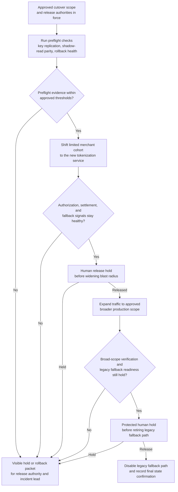
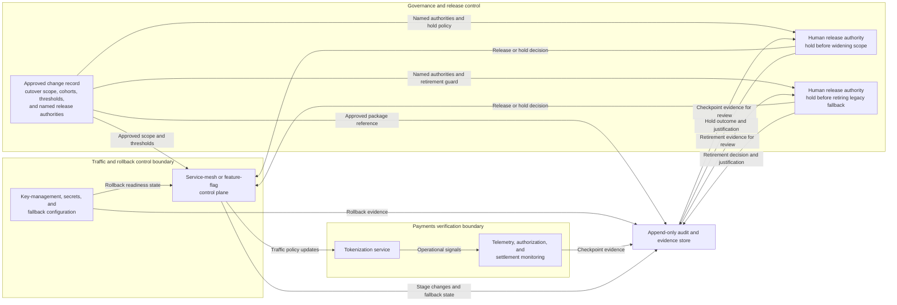

# Approved payments tokenization cutover staged execution

## Linked pattern(s)

- `staged-change-execution-with-rollback-holds`

## Domain

Engineering.

## Scenario summary

After architecture, production-change, and payments-risk owners approve migration of card-token lookups from a legacy vault path to a new tokenization service, a release engineering team must execute the live cutover during a narrow evening window. The workflow should not re-decide whether the change is allowed. It should carry the already approved cutover through sequenced preflight checks on key replication, shadow-read parity, and rollback health; then move traffic in bounded stages, verify authorization and settlement signals at each checkpoint, and hold visibly for human release before widening blast radius or retiring the legacy fallback path.

## Target systems / source systems

- Engineering change record holding the approved cutover scope, protected traffic cohorts, rollback thresholds, and named release authorities
- Service-mesh or feature-flag control plane used to shift tokenization traffic between legacy and new paths
- Tokenization service telemetry, authorization error dashboards, settlement reconciliation feeds, and customer-impact monitoring
- Key-management, secrets, and fallback configuration systems needed to confirm rollback viability before each stage
- Audit and evidence store preserving checkpoint results, hold releases, rollback notes, and final state confirmation

## Why this instance matters

This grounds the pattern in an engineering workflow where execution itself can change live payment behavior for customers and downstream settlement systems. The key challenge is not deployment planning, browser submission, or routine retry logic. It is disciplined progression through a preapproved cutover that can still go badly if parity checks drift, fallback health erodes, or an early canary exposes customer-facing regressions before the wider traffic shift.

## Likely architecture choices

- Orchestrated multi-agent coordination fits because separate roles can manage preflight validation, stage execution, payments verification, and rollback-readiness checking while sharing one authoritative cutover ledger.
- Human-in-the-loop control should remain normal at the hold points before widening traffic from the first merchant cohort to broad production scope and again before disabling the legacy vault path.
- Exception-gated autonomy is appropriate because the workflow may advance automatically inside narrow thresholds, but latency spikes, authorization mismatches, or settlement-parity drift should force a visible hold or rollback packet rather than silent continuation.
- The workflow should preserve one append-only record showing which release authority cleared each hold and what telemetry justified that release.

## Governance notes

- The workflow should confirm that approved traffic cohorts, blast-radius ceilings, rollback credentials, and fallback key material still match the signed change package before any traffic moves.
- Checkpoint evidence should include authorization success rate, token-lookup latency, settlement parity, and fallback health rather than relying on one blended success signal.
- Logs and evidence should minimize exposure of cardholder data, secrets, and customer identifiers while still proving which stage ran and why.
- If the first traffic shift exposes elevated declines, partial parity loss, or degraded fallback readiness, the workflow should hold or roll back before expanding scope rather than treating degraded but ambiguous signals as acceptable noise.
- Retirement of the legacy path should remain a protected human-visible hold because it narrows reversibility even if the earlier stages looked healthy.

## Evaluation considerations

- Percentage of approved tokenization cutovers completed without unplanned customer-impacting rollback or hidden parity drift
- Rate of degraded canary behavior or rollback-readiness loss caught at a visible hold before broader traffic expansion
- Completeness of the cutover ledger linking preflight evidence, staged traffic changes, hold releases, and any rollback action
- Speed and clarity of rollback when the new tokenization path passes basic health checks but fails deeper settlement or authorization verification
