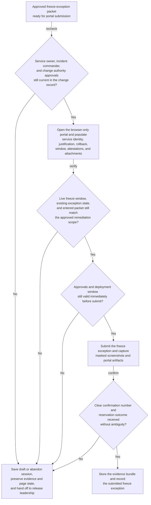
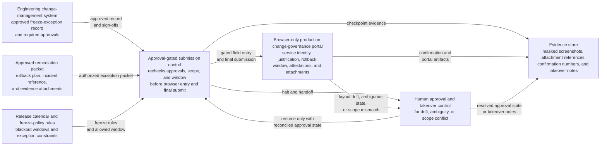

# Approved production change-freeze exception portal submission

## Linked pattern(s)

- `browser-based-form-completion-with-approval-gates`

## Domain

Engineering.

## Scenario summary

A release engineering operator needs to submit an already approved production change-freeze exception for an urgent database-connection pool fix on a customer-facing checkout service during a year-end commerce blackout. The target change-governance portal is browser-only, spreads the exception across service identity, customer-impact justification, rollback readiness, deployment window, approver attestations, and evidence-attachment tabs, and final submission may proceed only after the service owner, incident commander, and production change authority have all signed off in the engineering change record. Because the portal action can authorize production work during a freeze period and may trigger downstream paging, compliance logging, and deployment-window reservations, the workflow must recheck approvals, confirm the exception packet still matches the approved remediation scope, and halt safely if the live portal, freeze calendar state, or confirmation path becomes ambiguous.

## Target systems / source systems

- Engineering change-management system holding the freeze-exception request, required approvals, and segregation-of-duties record
- Browser-only production change-governance portal used to submit or finalize freeze-period exception requests
- Approved remediation packet, rollback plan, incident reference, service ownership record, and deployment evidence attachments
- Release calendar, freeze-policy rules, and environment-specific constraints for blackout periods and exception categories
- Evidence store for masked screenshots, uploaded-attachment references, portal confirmation numbers, and exception or takeover notes

## Why this instance matters

This grounds the execution pattern in an engineering workflow where the browser submission itself can unlock a sensitive production path that would otherwise remain frozen. The value is not deployment automation or release planning. It is governed portal execution that proves the exception was fully approved, the submitted scope matched the authorized production change, and the workflow stopped rather than guessing when the freeze portal or approval state no longer looked trustworthy.

## Likely architecture choices

- Approval-gated execution should assemble the exception packet, verify that service-owner, incident-command, and change-authority approvals remain current, and block final commit until those approvals are rechecked immediately before submit.
- A tool-using single agent can navigate the change-governance portal, populate freeze-exception fields, upload the approved rollback and evidence packet, and capture masked evidence at each gated checkpoint.
- Human-in-the-loop control should remain standard for changed blast-radius statements, blackout-window conflicts, unexpected approver mismatches, portal layout drift, or any warning that the submission would authorize a broader production action than the approved exception covers.

## Governance notes

- The workflow should confirm that the approved service identifier, environment, exception category, rollback plan version, deployment window, and incident or customer-impact reference all align before any browser entry begins.
- Screenshots and logs should preserve which approvals unlocked the submission, which evidence artifacts were attached, and which portal confirmation was received, while minimizing exposure of secrets, customer-impact details, internal incident notes, or privileged deployment metadata.
- If the portal shows a different freeze window, an already-open exception for the same service, missing rollback fields, or approver state that does not reconcile to the change record, the workflow should stop at a saved draft or abandon the session rather than guess and authorize an unapproved production path.
- Human takeover steps should preserve current page state, entered-but-unsubmitted values, uploaded attachments, and the reason for the halt so release leadership can resume safely without duplicating the exception or silently widening its scope.
- Safe-halt behavior should be explicit when the approval chain is stale, the requested window overlaps a newly imposed blackout, or final confirmation is ambiguous enough that duplicate exception submissions could leave the production record in an inconsistent state.

## Evaluation considerations

- Percentage of approved freeze exceptions submitted without duplicate portal records, unauthorized scope expansion, or post-submission correction to the production change window
- Rate of stale approvals, rollback-plan mismatches, blackout conflicts, or portal anomalies caught before final submission
- Completeness of evidence bundles linking the submitted exception to the approved change record, rollback materials, and human approval chain
- Reliability of safe halt and human takeover when the portal changes, times out, or returns unclear confirmation during a high-governance production exception workflow
