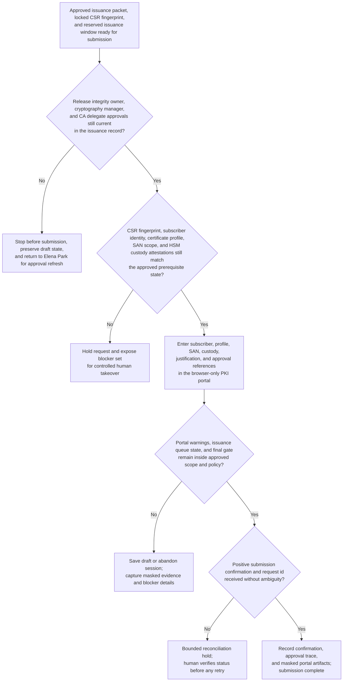
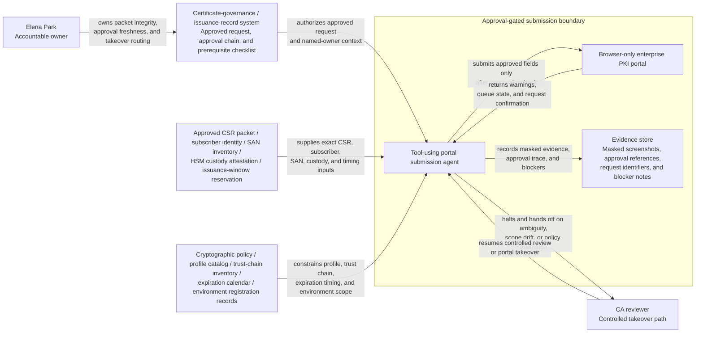

# Approved production signing certificate issuance portal submission

## Linked pattern(s)

- `browser-based-form-completion-with-approval-gates`

## Domain

Engineering.

## Scenario summary

A certificate operations engineer needs to submit an already approved production signing certificate issuance request for the package-signing service used by customer-delivered release artifacts after the replacement certificate package has been prepared, the CSR fingerprint has been locked, and the issuance window has been reserved ahead of an expiring intermediate-trust deadline. The target enterprise PKI portal is browser-only, spreads the action across subscriber identity, certificate profile, SAN set, HSM custody attestations, issuance justification, and approver-attestation tabs, and final submission may proceed only after the release integrity owner, cryptography engineering manager, and security certificate authority delegate have all signed off in the governed issuance record. Because the portal action can place a new production signing credential into the issuance queue and bind sensitive trust-chain metadata that later release processes may depend on, the workflow must recheck approvals, confirm the approved CSR, profile, and subject scope still match the authoritative issuance packet, and halt safely if the live portal, prerequisite state, or confirmation path becomes ambiguous. Named owner accountability remains with Certificate Operations Owner Elena Park, who is responsible for the approved submission packet, takeover decisions, and evidence completeness, but not for downstream certificate issuance, key activation, deployment, or release execution.

## Target systems / source systems

- Engineering certificate-governance or issuance-record system holding the approved request, named owner, approval chain, segregation-of-duties evidence, and prerequisite checklist
- Browser-only enterprise PKI or certificate authority portal used to request production signing certificate issuance under controlled certificate profiles
- Approved CSR packet, subscriber-service identity record, SAN inventory, HSM custody attestation, and issuance-window reservation tied to the production signing service
- Cryptographic policy, certificate profile catalog, trust-chain inventory, expiration calendar, and environment registration records governing which production signing certificates may be requested
- Evidence store for masked screenshots, approval references, portal request identifiers, visible blocker notes, and safe-halt or takeover records

## Why this instance matters

This grounds the execution pattern in an engineering workflow where the browser submission can place a highly sensitive production credential request into an authoritative issuance lane without yet issuing or activating that certificate. The value is not certificate lifecycle automation in general. It is governed portal execution that proves the exact issuance request was already approved, the prerequisite cryptographic state remained valid at submit time, and the workflow stopped rather than guessing when approval integrity, subscriber scope, or portal confirmation no longer looked trustworthy.

## Likely architecture choices

- Approval-gated execution should assemble the issuance packet, verify that release-integrity, cryptography-management, and certificate-authority approvals remain current, and block final commit until those approvals are rechecked immediately before submit.
- A tool-using single agent can navigate the PKI portal, populate subscriber, profile, SAN, and custody fields, attach or reference the approved issuance artifacts, and capture masked evidence at each gated checkpoint.
- Human-in-the-loop control should remain standard for CSR or SAN drift, unexpected certificate-profile changes, trust-chain warnings, portal layout changes, duplicate pending requests, or any prompt that suggests the submission would create a broader certificate request than the approved packet allows.

## Governance notes

- The workflow should confirm prerequisite state before any browser entry begins: the CSR fingerprint is the approved one, subscriber identity and environment registration are current, HSM-backed key custody attestations are still valid, the requested certificate profile is authorized for production signing use, and the reserved issuance window has not expired or been superseded.
- Screenshots and logs should preserve which authoritative approvals unlocked the submission, which exact CSR and profile references were used, which visible blockers were checked, and which portal confirmation was returned, while minimizing exposure of private key material, token identifiers, full certificate metadata, internal trust-anchor details, or sensitive service topology.
- If the portal shows a different certificate profile, an expanded SAN set, a conflicting subscriber record, a pending compromise or revocation investigation, a duplicate open issuance request, or a missing approval gate, the workflow should stop at a saved draft or abandon the session rather than guess and submit a request that exceeds the approved boundary.
- Safe-halt behavior should preserve current page state, entered-but-unsubmitted values, uploaded attachments or references, approval identifiers, blocker visibility, and the exact reason for the halt so Elena Park or the designated certificate authority reviewer can resume safely without duplicating the request or widening certificate scope.
- Accountability should remain explicit: Elena Park owns packet integrity, approval freshness, and takeover routing for this submission, while downstream issuance ceremony steps, certificate activation, release-system enrollment, and production signing usage remain outside this workflow boundary and require separate governed processes.

## Evaluation considerations

- Percentage of approved production signing certificate issuance submissions completed without duplicate requests, profile-scope errors, or post-submission correction to subscriber or SAN data
- Rate of stale approvals, prerequisite-state mismatches, duplicate pending requests, or PKI-portal anomalies caught before final submission
- Completeness of evidence bundles linking the submitted request to the approved issuance packet, named accountable owner, prerequisite attestations, and human approval chain
- Reliability of safe halt and human takeover when the PKI portal changes, times out, or returns unclear confirmation during a high-governance production certificate request
