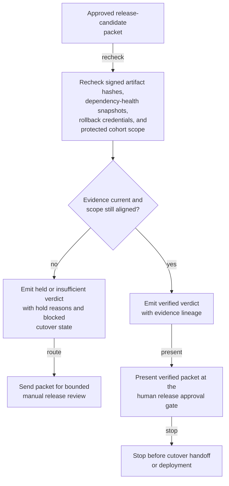
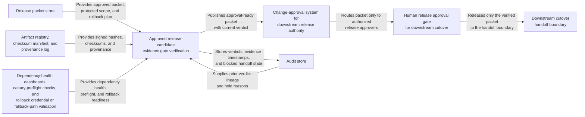

# Approved release candidate evidence gate verification

## Linked pattern(s)

- `evidence-gated-verification-for-release`

## Domain

Engineering.

## Scenario summary

A release board has an approved production packet for a payments-platform release candidate, but the packet cannot be handed into the cutover workflow until current evidence still proves the release is safe to rely on. The workflow rechecks signed artifact hashes, dependency-health snapshots, rollback credential validity, and protected cohort scope against the approved package, then emits an inspectable verified, held, or insufficient verdict for human release approval. It must not narrow the rollout plan, republish artifacts, or start the deployment itself.

## Target systems / source systems

- Release packet store holding the approved component versions, protected service scope, and rollback plan for the candidate
- Artifact registry, checksum manifest store, and provenance log for signed build outputs
- Dependency-health dashboards, canary-preflight checks, and rollback credential or fallback-path validation systems
- Change-approval system recording who may authorize downstream cutover from the verified packet
- Audit store preserving package versions, evidence timestamps, hold reasons, and approval events

## Why this instance matters

This grounds the pattern in an engineering workflow where evidence sufficiency is the hard problem after a release packet exists but before live cutover begins. Teams often treat an approved packet as if it stays trustworthy automatically, even though rollback credentials expire, dependency state changes, or a protected service drops out of scope. The value here is a bounded verification gate that proves the packet is still current enough for human reliance without drifting into go/no-go recommendation or production execution.

## Likely architecture choices

- Approval-gated execution fits because the verification packet can be assembled automatically, yet downstream cutover remains concretely blocked until a release manager approves use of the verified result.
- Human-in-the-loop review should remain standard because release leadership must decide whether held conditions are acceptable, require refresh, or force a separate downstream decision workflow.
- Durable verification state should preserve superseded verdicts, packet revisions, and repeated hold reasons so later approvals can distinguish genuine drift from duplicate checks.

## Governance notes

- Only approved artifact, dependency-health, and rollback evidence should count toward the verdict; chat assurances or stale screenshots should not clear the release packet.
- The verification result should show package-version lineage, evidence freshness, protected cohort scope comparison, and any unresolved hold conditions directly in the approval-ready packet.
- Human approval is required before the verified packet is handed to the staged execution workflow or used to justify production reliance by downstream teams.
- Any change to rollout shape, release scope, or cutover sequencing belongs in recommendation or execution patterns, not inside this verification gate.

## Evaluation considerations

- Percentage of approved release packets that receive a verdict with complete artifact, dependency, and rollback lineage
- Rate at which stale evidence, scope drift, or degraded rollback readiness are caught before a cutover starts
- Reviewer agreement that verified and held verdicts applied the right protected-scope and freshness rules
- Reliability of repeated verification near the release window when packet revisions and evidence updates arrive asynchronously
