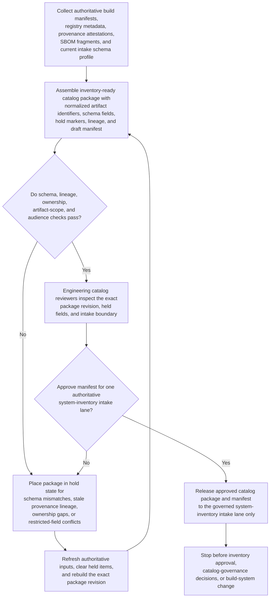
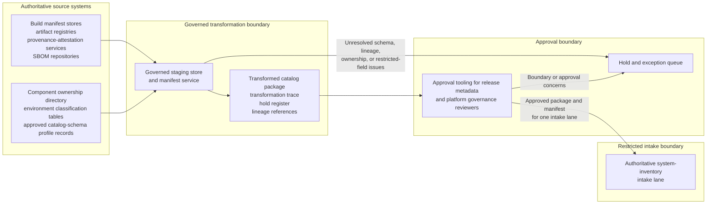

# Build artifact catalog schema transformation approved for system-inventory intake

## Linked pattern(s)

- `approval-gated-transformation-release`

## Domain

Engineering.

## Scenario summary

A release metadata engineering team is preparing one exact build-artifact catalog package revision for a newly standardized system-inventory intake lane that only accepts governed schema-conformant submissions. The authoritative source state spans signed build manifests, artifact registry metadata, software bill of materials fragments, provenance attestations, component ownership records, environment-class mappings, prior intake hold history, and the currently approved catalog schema profile for that intake lane. The downstream lane expects one transformed package with normalized component and artifact identifiers, inventory-ready schema fields, held-field markers, lineage references, and an approval manifest authorizing handoff into that single authoritative system-inventory intake queue. The workflow must stop once that exact transformed package revision is approved for intake, without deciding catalog-governance policy, adjudicating license or legal questions, approving the system-inventory submission itself, deprecating artifacts, cleaning up obsolete records, or changing any build-system behavior.

## Target systems / source systems

- Build manifest stores, artifact registries, provenance-attestation services, and SBOM repositories holding the authoritative build-artifact state and lineage inputs
- Component ownership directory, environment classification tables, and approved catalog-schema profile records used to normalize package fields for the intake lane
- Governed staging store and manifest service that assemble the transformed build-artifact catalog package, preserve lineage, and record held fields or annexes
- Approval tooling used by release metadata and platform governance reviewers to sign the exact package version, schema scope, and restricted intake boundary
- Hold and exception queue for unresolved schema mismatches, missing provenance lineage, ownership gaps, restricted-field exposure, or artifact-identifier drift before any system-inventory workflow receives the package

## Why this instance matters

This grounds the pattern in engineering work where the important output is one downstream-ready transformed catalog package revision rather than a release decision, inventory approval, or build-system modification. Platform and release teams often need to reshape authoritative build records into the exact schema a governed intake lane can consume while keeping unresolved lineage and hold conditions explicit instead of masking them inside a seemingly complete catalog feed. The instance shows how approval-gated transformation release stays in-family when it centers on transformation, hold-state visibility, lineage preservation, and manifest-bound handoff rather than governance adjudication, legal review, inventory acceptance, or downstream execution.

## Likely architecture choices

- Approval-gated execution fits because the transformed catalog package may be technically complete for one authoritative intake lane while remaining blocked until named engineering reviewers approve the exact version and schema scope in the manifest.
- Human-in-the-loop governance is required because accountable reviewers must confirm held fields, provenance continuity, ownership mappings, and the single downstream intake boundary before release.
- The workflow should emit only the transformed build-artifact catalog package, transformation trace, hold register, lineage references, and approval manifest rather than an inventory acceptance decision, artifact retirement plan, legal or license judgment, or build-pipeline change request.
- Approved reference data may normalize artifact ids, component classes, environment labels, inventory schema fields, and ownership codes, but unsupported inference about package deprecation, policy compliance, license allowability, or inventory approval readiness should force a hold.

## Governance notes

- Every consequential field, especially artifact identity, build manifest version, provenance reference, SBOM fragment link, ownership mapping, environment class, schema profile, and intake-lane scope, should retain lineage to authoritative source records and the exact package version approved for intake.
- The manifest should bind one exact package revision, one authoritative system-inventory intake lane, signer identities, schema scope, and any held fields so downstream inventory operators cannot inherit stale approval or broader reuse authority.
- The workflow should hold release when provenance evidence lacks traceable lineage, artifact scope changed after package assembly began, ownership mappings no longer match the authoritative directory, restricted metadata would exceed the approved intake audience, or the package no longer conforms to the approved schema profile.
- Release metadata and platform governance owners must approve package-schema changes, audience-scope rules, and hold-release criteria; the workflow ends before catalog-governance adjudication, legal or license review, inventory approval, artifact deprecation, cleanup execution, or build-system updates.

## Evaluation considerations

- Percentage of approved build-artifact catalog packages accepted by the authoritative system-inventory intake lane without manual package rebuilding or reopening source systems
- Rate of post-approval corrections caused by package-version drift, hidden held fields, schema-profile mismatches, or broken lineage references
- Completeness of manifest binding between the approved package revision, signer set, held fields, lineage trace, and the single restricted intake boundary
- Reliability of supersession behavior when updated attestations arrive late, one held ownership gap is cleared during approval review, or the intake schema profile changes before the package is consumed
