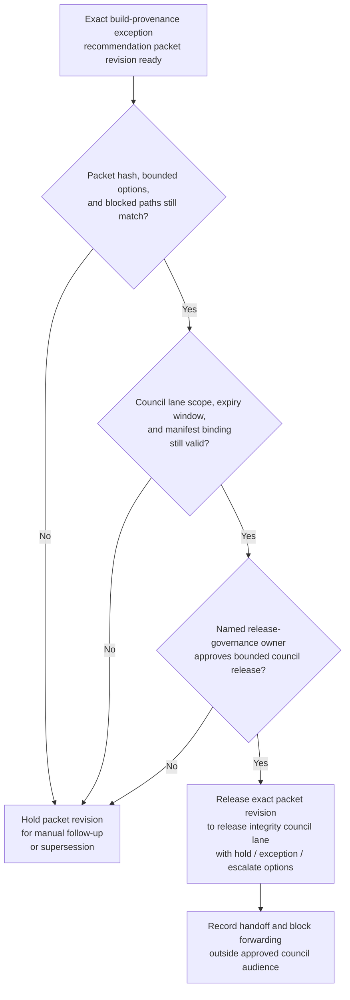
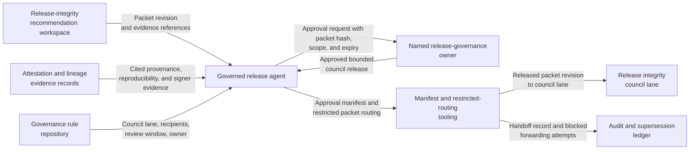

# Build-provenance exception recommendation packet revision approved for release integrity council decision lane

## Linked pattern(s)

- `approval-gated-recommendation-release`

## Domain

Engineering.

## Scenario summary

A release integrity workflow has already prepared one exact recommendation packet revision for a production build-provenance exception after a trusted attestation service outage left one release train without its normally required signed provenance bundle. The packet narrows the bounded options to hold promotion until provenance generation is restored and the artifact is rebuilt, approve one time-boxed exception with compensating reproducibility and signer-quorum evidence, or escalate to the enterprise software supply chain council, and it keeps blocked paths such as unsigned direct promotion, retroactive provenance fabrication, or open-ended waiver reuse explicit. Before that exact packet revision can enter the restricted release integrity council decision lane, a named release-governance owner must approve the audience scope, review-window expiry, and manifest binding so council members receive the governed recommendation artifact rather than a stale or broadened copy. The workflow stops at governed release of that packet revision; it does not adjudicate the exception, rebuild artifacts, schedule shipment, rotate signing material, or authorize downstream deployment.

## Target systems / source systems

- Release-integrity recommendation workspace holding the current packet revision, bounded option set, blocked-path notes, and superseded drafts
- Build-attestation, provenance-signing, reproducible-build verification, and artifact lineage records already cited by the recommendation packet
- Governance rule repository defining the named release integrity council lane, allowed recipients, review-window timing, and the human owner who may approve packet release
- Approval manifest and restricted-routing tooling that records the exact packet hash, lane scope, approver identity, and any blocked forwarding attempts outside the approved audience
- Audit and supersession ledger used to hold older packet revisions when provenance status, reproducibility evidence, or release scope changes before council review

## Why this instance matters

This grounds the pattern in engineering where the reusable challenge is release control over a sensitive software-supply-chain recommendation artifact, not generating new exception analysis or deciding the release itself. Build-provenance exception packets can change late when attestation services recover, reproducibility checks fail, or signer-quorum evidence is refreshed, so approval must bind to one reviewed recommendation revision and one restricted council lane instead of to a vague permission to keep circulating supply-chain advice. The example keeps the family boundary explicit by ending at packet release for human review rather than exception adjudication, artifact rebuild work, signing-key handling, or deployment follow-through.

## Likely architecture choices

- Approval-gated execution fits because the recommendation packet remains blocked until a named release-governance owner authorizes release into the release integrity council decision lane.
- Human-in-the-loop review remains necessary because only accountable engineering governance owners should confirm audience scope, expiry timing, and blocked-path visibility without turning release approval into approval of the provenance exception itself.
- A governed agent can verify packet hashes, assemble the manifest, and block broadened distribution, but it should not approve the exception, mint provenance, rebuild artifacts, or trigger production release actions.

## Governance notes

- Approval should bind to one immutable packet revision, one named release integrity council lane, one bounded review window, and one exact option set so later edits cannot inherit release authority silently.
- Blocked paths such as unsigned direct promotion, retroactive provenance fabrication, or broad reuse of a one-time exception should remain visible in the released packet rather than being compressed into a cleaner exception narrative.
- If provenance status, reproducibility evidence, artifact scope, or council audience changes during approval review, the pending packet should be held and superseded rather than routed under stale approval.
- Audit records should preserve the released packet id, option-set hash, approver identity, council-recipient scope, expiry timing, and any blocked redistribution attempts.

## Evaluation considerations

- Percentage of release integrity council releases where the packet revision id, option-set hash, lane scope, and manifest metadata match exactly without later correction
- Rate at which stale, superseded, or out-of-scope build-provenance exception recommendation packets are blocked before council review
- Time required to move from packet-ready status to approved bounded council release when provenance evidence and routing metadata are complete
- Reviewer correction rate for missing blocked paths, wrong audience scope, or stale-state handling after the council receives the released recommendation packet
