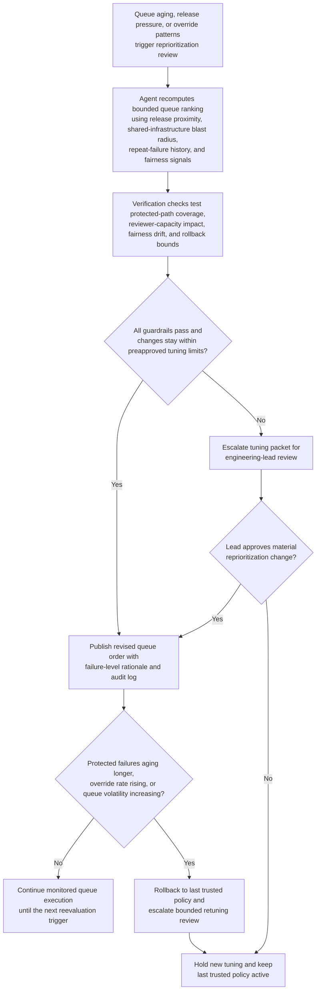

# CI pipeline failure review queue reprioritization

## Linked pattern(s)

- `queue-prioritization-optimization`

## Domain

Engineering.

## Scenario summary

A developer productivity engineering lead is overseeing an existing queue of CI pipeline failures that need review before merge flow, release-candidate promotion, and shared test infrastructure stability degrade further. The backlog mixes release-branch build breaks, flaky integration-suite failures, security-scan regressions, expired signing-certificate jobs, and recurring failures tied to shared build images or test fixtures. Recent handling data shows that reviewers have been pulling forward easy-to-reproduce single-repository failures while cross-repository failures, release-blocking branches, and jobs with repeated quarantine or reopen history are aging until they disrupt downstream engineering work across multiple teams. The optimization workflow must reprioritize the review queue within bounded limits so release proximity, shared-infrastructure blast radius, repeat-failure patterns, and protected production-readiness paths rise appropriately without letting smaller repositories, lower-visibility teams, or slower-to-diagnose failures be systematically pushed back.

## Target systems / source systems

- CI orchestration platform with active pipeline-failure backlog, branch metadata, workflow type, current queue order, and rerun history
- Test analytics and flake-tracking systems with quarantine records, repeated-failure rates, reopen history, and time-to-clear by failure class
- Source-control and service-catalog metadata showing repository criticality, owning teams, release-candidate linkage, and shared dependency relationships
- Build artifact, signing, and dependency-scanning systems with failure-category evidence, image versions, certificate status, and shared toolchain context
- Reviewer-capacity view showing platform engineer coverage, specialty ownership for build systems or test infrastructure, and temporary release-week staffing shifts
- Queue governance dashboard used by engineering managers to inspect ranking changes, freeze tuning, and restore the last trusted prioritization policy

## Why this instance matters

This grounds the optimization pattern in an engineering workflow where queue order affects merge throughput, release readiness, and shared platform stability rather than incident response or direct remediation. A naive reprioritization loop could keep favoring failures that are easiest to reproduce, leaving branch-protection blockers, cross-repository regressions, or security-sensitive pipeline failures to age until reversibility weakens and more teams are impacted. The instance stays squarely in optimize/adapt territory: the system is tuning the order of an existing review backlog using outcome feedback and operating context, not investigating root cause, deciding whether code is correct, scheduling release meetings, or executing pipeline fixes.

## Likely architecture choices

- Event-driven monitoring should trigger queue reevaluation when release branches accumulate failures, shared build-image regressions appear, reopen rates climb, or reviewers repeatedly override the current ordering.
- A tool-using single agent can recompute bounded prioritization weights, simulate the effect on merge blockage and reviewer load, and publish a revised ranked queue with failure-level rationale for supervisory inspection.
- Exception-gated autonomy fits because in-policy tuning can adjust queue ordering automatically within preapproved ranges, but changes that materially alter protected-branch handling, security-related priority rules, or fairness balancing should require engineering-manager review before activation.
- Engineering leads should remain able to freeze optimization updates, pin specific failures, and revert to the last trusted ranking policy when feedback quality drops or major release-policy changes make recent outcome history unreliable.

## Governance notes

- Failures tied to release branches, production-signing or artifact-integrity checks, mandatory security scans, and shared CI infrastructure regressions should remain protected classes that cannot be demoted for quick-clearance reasons.
- Fairness checks should test for repeated deferral of lower-visibility repositories, internal platform consumers, or failures owned by teams with less reviewer overlap instead of letting ease of reproduction become a proxy for importance.
- Auditability should be durable: every reprioritization should log the release-pressure signals, blast-radius indicators, reopen history, reviewer-capacity assumptions, overrides, and guardrail checks that justified the ranking change.
- Optimization views should minimize exposure of sensitive build logs, embedded secrets, proprietary test data, or internal signing details while preserving enough evidence for authorized engineering review.
- Reversibility should be explicit: if release-blocking failures age longer, override rates spike, or queue volatility increases during a release window, the workflow should restore the prior trusted policy and escalate the tuning packet for review.
- Bounded autonomy should stay visible so the optimizer can reorder review work only inside approved guardrails and cannot quarantine tests, waive branch protections, or trigger remediation directly.

## Evaluation considerations

- Reduction in release-branch blockage time, repeated pipeline reopen volume, and cross-team merge delays after tuned queue ordering is applied
- Change in aging distribution for protected-priority failures versus routine repository-local failures, including whether fairness guardrails prevent systematic delay for lower-visibility teams
- Frequency and pattern of reviewer overrides that indicate the optimized ranking conflicted with release policy, security posture, fairness, or shared-infrastructure expectations
- Speed and clarity of rollback when updated tuning degrades queue stability, overweights easy wins, or conflicts with new release-governance guidance
