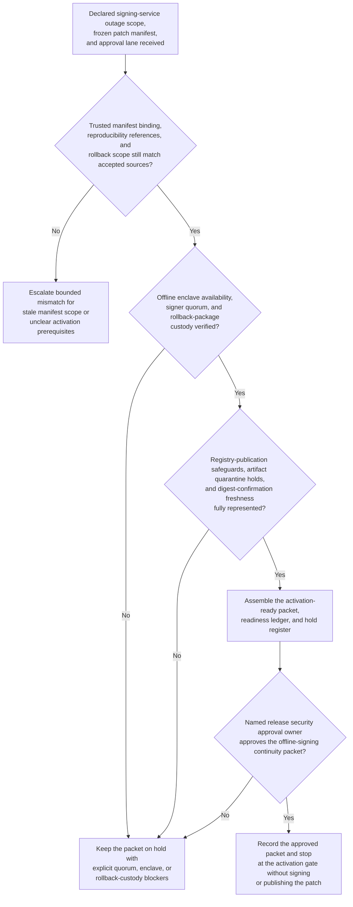
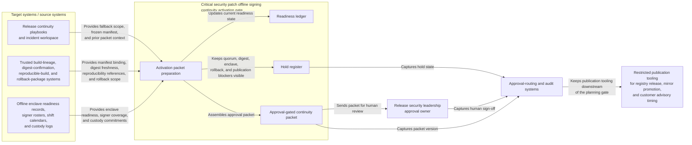

# Critical security patch offline signing continuity activation gate

## Linked pattern(s)

- `contingency-plan-activation-gate`

## Domain

Engineering.

## Scenario summary

After a release attestation and online signing control outage is declared, release security leadership has already identified the bounded fallback path and accountable approval owner: a hardware-backed offline signing continuity path for one critical security patch train whose shipment window would otherwise expire before the normal provenance services recover. Upstream truth-restoration and authority-routing work has already established the trusted patch branch, frozen artifact manifest, reproducibility references, rollback package scope, and approval lane. The planning workflow now has to prepare one activation-ready packet showing enclave availability, signer-quorum coverage by shift, reproducibility-check references, registry-publication safeguards, rollback-package custody, and quarantine holds for any artifact outside the frozen manifest. It should preserve explicit holds for any missing signer quorum, stale digest confirmation, unsealed enclave attestation, unresolved rollback-package gap, or publication-scope ambiguity, and stop at the approval gate rather than performing offline signing, publishing artifacts, restoring the attestation service, notifying customers, or shipping the patch.

## Target systems / source systems

- Release continuity playbooks and incident workspace with the declared fallback scope, frozen patch manifest, prior packet versions, and guarded publication boundaries
- Trusted build-lineage, digest-confirmation, reproducible-build, and rollback-package systems already accepted as authoritative inputs for contingency preparation
- Hardware security module or offline enclave readiness records, signer rosters, shift calendars, dual-custody schedules, and sealed-media custody logs for release security and platform engineering
- Approval-routing and audit systems that capture packet versions, open holds, resource commitments, and human sign-off before any offline signing continuity mode may start
- Restricted publication tooling for registry release, mirror promotion, and customer advisory timing that remains downstream of the planning gate

## Why this instance matters

This grounds the pattern in engineering where the hard problem is not deciding whether a security patch should ship or executing the offline signing fallback itself. The hard problem is keeping one approval-gated readiness packet current while manifest binding, signer coverage, enclave readiness, and rollback custody can all drift under supply-chain outage pressure. It shows why contingency planning deserves its own slice apart from truth restoration, authority recommendation, release exception analysis, and patch publication: leaders need a disciplined activation gate artifact before any offline signing continuity path can be approved safely.

## Likely architecture choices

- Approval-gated execution fits because the offline signing continuity mode may be technically prepared while still blocked until release security leadership approves the packet.
- The readiness ledger should tie frozen-manifest binding, signer coverage, enclave status, rollback custody, digest freshness, and artifact quarantine holds to one current packet version.
- Explicit holds should remain visible whenever signer quorum, enclave sealing, rollback-package custody, or publication-boundary controls are incomplete rather than being compressed into a nominally ready packet.
- The workflow should stop at the packet and hold register rather than recommending a different authority lane, re-establishing build truth, or performing offline signing and publication.

## Governance notes

- Protected prerequisites such as frozen-manifest binding, signer-quorum coverage, enclave attestation, rollback-package custody, digest-confirmation freshness, and artifact quarantine controls should be encoded as non-waivable holds in the packet.
- Shared packets should expose timing, readiness, and blocker state without copying signing secrets, full repository paths, sensitive vulnerability details, or unrestricted artifact manifests outside governed release-security channels.
- Human release security ownership is required before the packet becomes the authoritative basis for any offline signing continuity activation.
- Repeated packet revisions should preserve append-only lineage so audit and software supply-chain review teams can reconstruct exactly which manifest references, signer commitments, enclave checks, and protected holds changed before approval.

## Evaluation considerations

- Time from updated offline-signing continuity preparation request to a human-reviewable activation packet with complete enclave, signer, rollback, and hold state
- Percentage of signer-quorum, digest-freshness, or publication-boundary blockers kept explicit in the hold register rather than hidden in a partially prepared continuity packet
- Agreement between the workflow's packet and the final human-approved activation gate used for downstream offline signing continuity
- Stability of the readiness packet when signer availability, enclave status, or frozen-manifest scope changes within the same patch-shipment window
