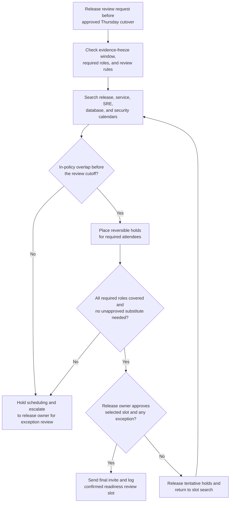

# Cross-team release-readiness review scheduling

## Linked pattern(s)

- `calendar-conflict-coordination`

## Domain

Engineering.

## Scenario summary

A release engineering coordinator needs to schedule a release-readiness review for a customer-facing identity service before an approved Thursday evening production cutover. The meeting must include the release manager, the service owner, the on-call site reliability lead, the database migration owner, and a security reviewer because the release changes authentication flows and schema state together. The workflow is about constructing a viable meeting slot inside the evidence-freeze window, placing reversible holds across multiple calendars, and escalating quickly when a required attendee cannot make the allowed review window rather than guessing at substitutes or committing to the final meeting without human confirmation.

## Target systems / source systems

- Change-management ticket with the requested cutover window, rollback checkpoint, and required review roles
- Team calendars for release engineering, service ownership, site reliability, database engineering, and security review
- Release calendar showing freeze periods, launch blackouts, and already-booked production review slots
- CI/CD release dashboard and readiness checklist used only to determine whether the review must occur before specific evidence deadlines
- Calendar and meeting tools that support tentative holds, delegate-aware attendee lists, and reversible invite drafts
- Engineering coordination channel where release owners track attendee substitutions, policy exceptions, and final approval status

## Why this instance matters

This grounds the scheduling pattern in an engineering workflow where the value comes from reconciling hard attendee requirements, cutover timing constraints, and policy-bound meeting windows before a production change proceeds. It is distinct from recommendation or execution work because the workflow is not deciding whether the release should ship, scoring launch risk, or triggering the deployment itself. Instead, it handles bounded-delegation calendar coordination so humans can spend their attention on the readiness decision once the right people are assembled at the right time.

## Likely architecture choices

- A tool-using single agent gathers free-busy availability, freeze-window constraints, required-attendee rules, and existing production-review bookings from approved engineering systems.
- Bounded delegation fits because the agent can rank feasible slots, place short-lived tentative holds, and draft a meeting packet linked to the governing change record, but it should not move the cutover window, replace a required reviewer silently, or finalize the review invitation without the release owner’s confirmation.
- Human checkpoints remain necessary when no in-policy overlap exists before the evidence cutoff, when only after-hours options remain for a required team, or when a designated delegate would change the review’s approval authority.

## Governance notes

- Required attendees should be explicit and role-based before any hold is placed: release manager, service owner, on-call reliability lead, database migration owner, and security reviewer for authentication-impacting changes.
- Calendar access should stay limited to free-busy, working-hour, delegate, and policy metadata rather than exposing private event details from engineering or security staff.
- Tentative holds should be reversible, time-bounded, and tied to the specific change ticket so stale placeholders do not block other release reviews.
- The workflow should escalate instead of improvising when the only feasible slot would violate freeze policy, bypass a required attendee, or require a substitute whose authority has not been confirmed by the human release owner.
- Final commitments should stay human-owned: the release owner or release manager confirms the selected slot and any approved attendee substitutions before the meeting invite becomes authoritative.

## Evaluation considerations

- Median time from release-review scheduling request to a viable slot covering all required engineering roles inside the approved pre-cutover window
- Rate of readiness reviews confirmed without manual back-and-forth beyond defined release-owner checkpoints
- Frequency of rescheduling caused by stale free-busy data, expired tentative holds, or missed required-attendee constraints
- Audit usefulness of the coordination log for showing which slots were rejected, which reversible holds were placed, and why a human had to approve the final commitment or attendee exception
