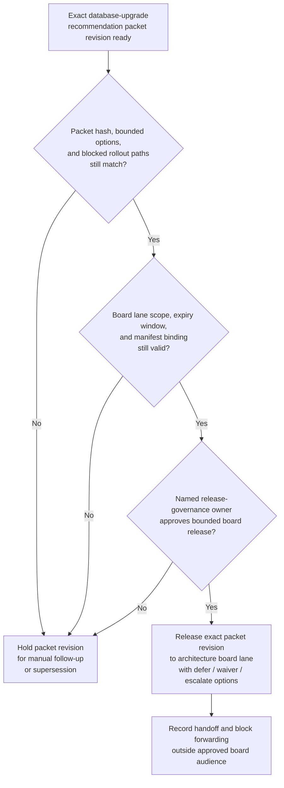

# Database-upgrade exception recommendation packet revision approved for architecture board decision lane

## Linked pattern(s)

- `approval-gated-recommendation-release`

## Domain

Engineering.

## Scenario summary

A platform engineering review workflow has already prepared one exact recommendation packet revision for a managed database major-version upgrade exception. The packet narrows the bounded options to defer the upgrade, approve one time-boxed waiver with compensating controls, or escalate to executive risk review, and it records why broader rollout paths are blocked. Before that exact packet revision can enter the restricted architecture board decision lane, a named release-governance owner must approve the lane scope, expiry window, and manifest binding so board members receive the reviewed recommendation artifact rather than a stale or broadened copy. The workflow stops at governed release of that packet revision; it does not decide whether the waiver is granted, schedule the upgrade, or execute any production change.

## Target systems / source systems

- Architecture-exception workspace holding the current recommendation packet revision, bounded option set, blocked-path notes, and superseded drafts
- Upgrade readiness evidence sources covering benchmark regressions, rollback posture, dependency caveats, and service-owner sign-offs already cited by the packet
- Governance rule repository defining the named architecture board lane, allowed recipients, expiry timing, and release-approval owner
- Approval manifest and routing tooling that records the exact packet hash, approver identity, board scope, and any blocked forwarding attempts
- Audit and supersession ledger used to hold older packet revisions when new dependency evidence changes the bounded option set

## Why this instance matters

This grounds the pattern in engineering where the reusable problem is release control over a recommendation artifact, not creation of the exception analysis from scratch. Large upgrade reviews often generate several near-final packets as benchmark, dependency, or rollback evidence shifts, so approval must bind to one reviewed recommendation revision and one board decision lane instead of to a vague permission to keep circulating upgrade advice. The example keeps the family boundary clear by stopping at packet release for human decision review rather than drifting into approval adjudication, change planning, or deployment execution.

## Likely architecture choices

- Approval-gated execution fits because the recommendation packet remains held until a human release owner approves one exact revision for the architecture board decision lane.
- Human-in-the-loop review remains necessary because only accountable engineering governance owners should decide whether the packet is safe to release without implying that the waiver decision is already approved.
- A governed agent can verify packet hashes, compare superseded revisions, assemble the manifest, and block broadened distribution, but it should not rewrite the recommendation or convert release approval into upgrade authorization.

## Governance notes

- Approval should bind to one immutable recommendation packet revision, one named board lane, one bounded expiry window, and one exact option set so later edits cannot inherit permission silently.
- Blocked paths such as immediate rollout without compensating controls should remain visible in the released packet rather than being compressed into a cleaner-looking waiver narrative.
- If benchmark regressions, dependency exceptions, or board scope change during approval review, the pending packet should be held and superseded rather than released under stale approval.
- Audit records should preserve the released packet id, option-set hash, approver identity, board-recipient scope, expiry timing, and any blocked forwarding attempts.

## Evaluation considerations

- Percentage of architecture board releases where the packet revision id, option-set hash, lane scope, and manifest metadata match exactly without later correction
- Rate at which superseded or stale upgrade-exception recommendation packets are blocked before board review
- Time required to move from packet-ready status to approved bounded board release when rationale and evidence are complete
- Reviewer correction rate for missing blocked options, wrong audience scope, or stale-state handling after the board receives the released recommendation packet
