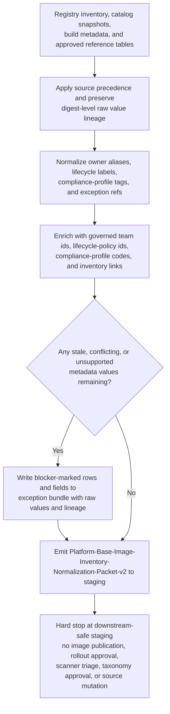
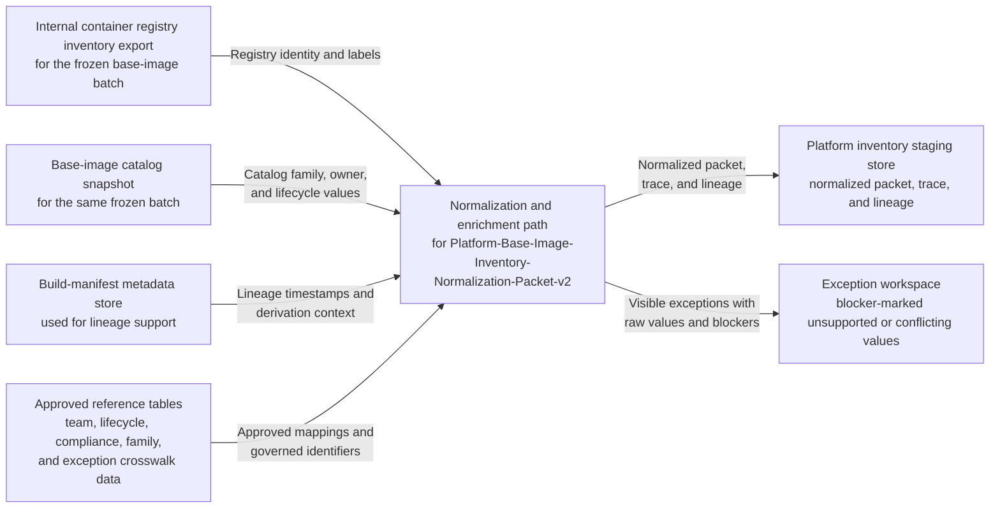

# Internal container base-image inventory ownership, lifecycle, and compliance metadata normalization for platform-inventory staging

## Linked pattern(s)

- `normalization-and-enrichment`

## Domain

Engineering.

## Scenario summary

A platform engineering metadata team maintains one governed staging artifact, `Platform-Base-Image-Inventory-Normalization-Packet-v2`, for internal container base-image inventory records before downstream search, portfolio reporting, and routine governance dashboards consume them. The raw inputs already exist as structured exports from the internal registry inventory, base-image catalog snapshots, build-manifest metadata, and approved reference tables, but the fields are inconsistent: owner values mix current team ids with retired platform aliases, lifecycle labels alternate between `current`, `active`, `golden`, and legacy ring names, compliance profile fields use both approved identifiers and informal shorthand, and exception references may appear as free-text notes instead of governed crosswalk ids. The workflow must apply explicit source precedence, preserve raw field values and digest-level lineage, normalize supported aliases into the approved staging schema, enrich records only with governed owner, lifecycle, and compliance identifiers, and keep unsupported or conflicting values visible in an exception bundle. It stops once the normalized packet, trace, and blocker-marked exceptions are written to downstream-safe staging; it does not approve base images, recommend migration, investigate scanner findings, publish images, update source registries, or mutate any authoritative platform record.

## Target systems / source systems

- Internal container registry inventory export containing repository names, immutable digests, publication channels, retained labels, and current metadata attached to approved base-image repositories
- Base-image catalog snapshot containing platform-facing family names, owner references, lifecycle state, support window markers, and approved usage notes for the same base-image set
- Build-manifest metadata store preserving base-image family lineage, upstream derivation markers, signed build timestamps, and release-batch references used only for staging traceability
- Approved reference sources such as the canonical team directory, lifecycle-policy matrix, compliance-profile registry, base-image family alias table, and governed exception-id crosswalk
- Platform inventory staging store that accepts schema-aligned base-image records, reference-data versions, per-field lineage, unresolved-field markers, and batch-level trace summaries before downstream search or reporting
- Exception workspace where platform metadata stewards inspect unsupported aliases, stale snapshots, missing crosswalks, or conflicting ownership and lifecycle metadata before broader reuse

## Why this instance matters

This grounds `normalization-and-enrichment` in an engineering scenario that is materially different from service-catalog owner and environment cleanup. The work centers on base-image inventory metadata that spans registry, catalog, lifecycle, and compliance-reference surfaces, where downstream search and reporting break if equivalent images appear under mismatched family names, owner aliases, or lifecycle labels. The value comes from reversible canonicalization and approved enrichment of low-stakes metadata while keeping raw digest lineage, visible blockers, and exception discipline intact rather than drifting into publication verification, security investigation, migration recommendation, or source-of-truth mutation.

## Source precedence

1. Approved staging schema and normalization policy for `Platform-Base-Image-Inventory-Normalization-Packet-v2` — primary authority for required fields, canonical values, and unsupported-value handling
2. Internal container registry inventory export — authoritative source for repository identity, immutable digest, publication channel, and retained attached labels for the frozen batch
3. Base-image catalog snapshot — authoritative source for approved family display name, declared owner reference, lifecycle window marker, and catalog linkage when it does not contradict higher-precedence identity fields
4. Approved reference tables — team-directory mappings, lifecycle-policy ids, compliance-profile registry entries, family alias crosswalks, and governed exception-id mappings used for allowed enrichment
5. Build-manifest metadata store — trace-only support for lineage timestamps, signed build references, and upstream derivation context when it does not override approved identity or canonical policy
6. Lower-precedence inventory notes or repository annotation comments — context only for traceability and blocker explanation, never for silent canonicalization

If the registry inventory and catalog snapshot disagree on owner, lifecycle state, or family identity for a required field, the workflow keeps the affected field unresolved, records both values in the trace, and routes the record to the exception bundle instead of choosing a winner silently.

## Prerequisites and blockers

- The schema version, alias tables, lifecycle-policy matrix, compliance-profile registry snapshot, and exception-id crosswalk for the batch must be pinned before normalization begins so the packet can be replayed exactly.
- The input inventory batch must already be frozen with a capture timestamp, registry-export revision, catalog-snapshot revision, and build-manifest lineage references for every included digest.
- Required prerequisite fields include repository id, immutable digest, family context, at least one owner reference, and one lifecycle or compliance reference capable of normalization; records missing these minimum identifiers remain in exceptions.
- Visible blockers include stale catalog snapshots older than the frozen registry batch, unresolved retired team aliases, missing lifecycle-policy mappings for legacy ring labels, compliance-profile shorthand without an approved crosswalk, conflicting governed exception references, and digests present in the catalog but absent from the frozen registry export.
- Any record already tied to an open vulnerability investigation, image publication hold, or migration campaign may preserve that linked identifier for lineage, but this workflow must not interpret, clear, prioritize, or escalate that downstream process.

## Likely architecture choices

- A tool-using single agent can ingest the frozen inventory batch, apply source-precedence rules, query approved lookup tables, and write the normalized packet, trace, and exception bundle in one bounded batch loop.
- The target schema should keep observed registry or catalog values separate from normalized and enriched fields so downstream consumers can distinguish directly observed metadata from governed canonical identifiers.
- Safe enrichment may add canonical team ids, lifecycle-policy ids, compliance-profile codes, governed exception references, and stable family identifiers, but unsupported inference about image risk, migration urgency, rollout readiness, or policy approval must remain out of scope.
- The staging write path should be append-friendly or snapshot-based so metadata stewards can replay the same digest set after controlled alias-table or policy updates without mutating registries, catalogs, or source manifests.

## Governance notes

- Every normalized field should retain digest-level lineage to the exact registry row, catalog row, or build-manifest reference that supplied the raw value, plus the mapping-table or reference-data version used during canonicalization.
- Approved enrichment sources must be explicit and limited to maintained platform registries, policy tables, and crosswalks rather than commit messages, chat discussion, scanner screenshots, or ad hoc spreadsheet edits.
- Unknown, stale, or conflicting values should remain visible in the exception bundle with blocker tags such as `owner-alias-unresolved`, `lifecycle-policy-missing`, `compliance-profile-shorthand-unsupported`, or `catalog-registry-conflict` instead of being forced into a nearby canonical bucket.
- The workflow must stop at downstream-safe staging: it may not approve image adoption, publish or deprecate base images, recommend service migration, triage compliance findings, update taxonomy tables, or write back to the registry or catalog.
- Audit records should preserve enough trace detail to compare packet `v2` against the frozen source bundle, replay normalization after a controlled mapping update, and explain why any digest record remained unresolved.

## Evaluation considerations

- Percentage of staged base-image inventory records accepted by downstream search, reporting, or governance-dashboard preparation without additional owner, lifecycle, compliance-profile, or exception-reference cleanup
- Percentage of normalized and enriched fields that preserve raw-value lineage, source-precedence evidence, and reference-data version traceability at digest level
- Rate of unsupported aliases, stale snapshots, or cross-system conflicts correctly routed to the exception bundle instead of being silently normalized
- Replay reliability when a team alias is retired, a lifecycle-policy identifier changes, or a compliance-profile crosswalk is updated after the batch has already been staged
- Absence of boundary violations such as image publication changes, vulnerability-triage decisions, migration recommendations, catalog mutations, or registry write-backs emerging from the normalization run
