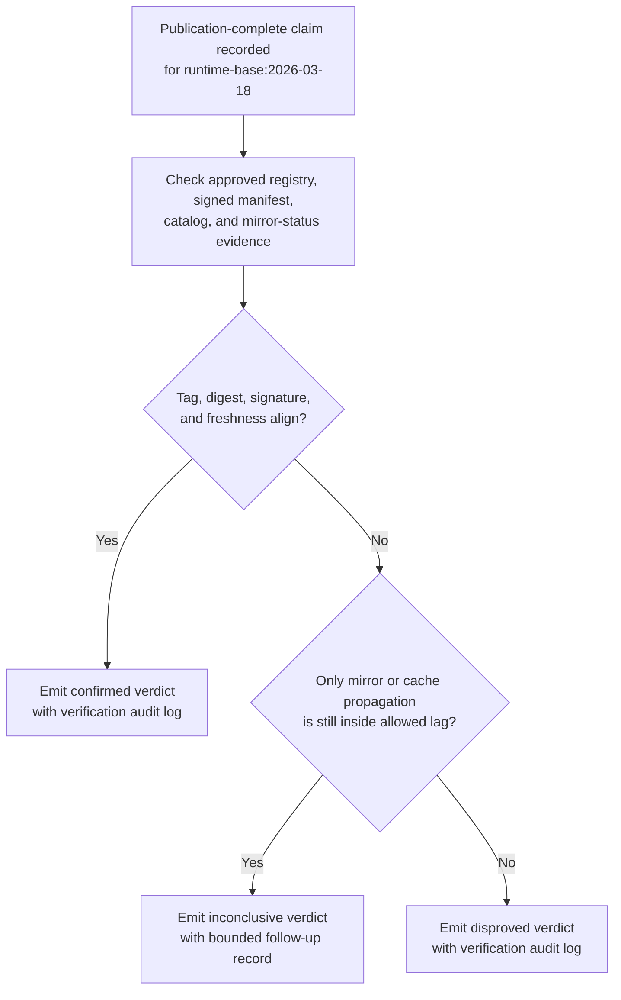

# Internal container base image publication verification

## Linked pattern(s)

- `claimed-state-verification`

## Domain

Engineering.

## Scenario summary

A platform engineering pipeline marks a new hardened internal container base image as published after image build, signature attachment, and catalog-update steps report success for revision `runtime-base:2026-03-18`. Application teams and service owners still need to know whether that claimed publication state is actually true across the approved internal registry, signed digest manifest, and base-image catalog surfaces before they rely on the image as the current approved foundation for routine development work. The workflow verifies the publication claim against those authoritative sources and emits a bounded confirmed, disproved, or inconclusive verdict; it must not republish the image, approve workload rollout, reopen vulnerability review, or trigger downstream rebuilds.

## Target systems / source systems

- Internal container registry that records the published base-image tag, immutable digest, and repository visibility state
- Signed digest manifest store containing the approved image digest set, signature reference, and manifest publication timestamp
- Internal base-image catalog portal that presents the current approved image revision, digest, and support metadata to engineering teams
- Registry mirror-status or cache-propagation endpoint showing whether the approved base image reached supported internal pull surfaces
- Platform pipeline event feed or release tracker recording the base-image-publication-complete claim and any replayed publication events
- Verification audit log preserving claim ids, evidence checks, observed digests, verdict history, and bounded follow-up records

## Why this instance matters

This grounds the pattern in an engineering workflow where a green publication signal can look trustworthy even though one approved surface still serves the prior base-image digest or the catalog has not yet updated to the newly claimed revision. The useful work is evidence-backed confirmation of a low-risk internal publication state before other teams treat the image as available for normal dependency planning. The workflow stays inside investigate/reconcile/verify because it stops at verdicting and traceability rather than image promotion, deployment approval, rebuild orchestration, or remediation.

## Likely architecture choices

- Event-driven monitoring fits because the verification run should begin when the base-image-publication-complete claim is recorded rather than only after engineers notice digest mismatches.
- A tool-using single agent can compare image tags, immutable digests, signature references, manifest timestamps, and mirror-status freshness across the approved internal surfaces while applying allowed propagation tolerances.
- Bounded delegation is appropriate because platform owners can predefine the authoritative registry, manifest, catalog, and mirror-status sources plus lag rules while humans retain authority over republish, rollback, or adoption decisions.
- Durable verification state should preserve duplicate publication claims and prior inconclusive checks so repeated runs do not create contradictory verdicts for the same base-image revision.

## Governance notes

- Only the approved container registry, signed manifest store, base-image catalog, and mirror-status endpoint should count as authoritative evidence; chat announcements, copied shell output, or dashboard screenshots should not confirm the claim.
- Verification records should preserve the claimed tag, observed immutable digests, signature reference, catalog revision marker, and freshness timestamps so later reviewers can reconstruct why publication was confirmed or held.
- If one approved internal pull surface remains stale within an allowed propagation window, the workflow should keep the result explicitly inconclusive instead of overstating either complete publication or failure.
- Republishing the image, changing support status, approving workload migration, or launching downstream rebuild jobs remains outside this verification workflow and under human control.

## Evaluation considerations

- Percentage of internal base-image publication claims that receive a verdict with complete registry, manifest, catalog, and mirror-status traceability
- Rate at which stale or partially propagated base-image publication claims are detected before engineering teams rely on the claimed current revision
- Reviewer agreement that the workflow applied the correct digest-match, signature, freshness, and lag-tolerance rules
- Reliability of duplicate-event handling when the same publication-complete claim is replayed or rechecked during allowed propagation delay
