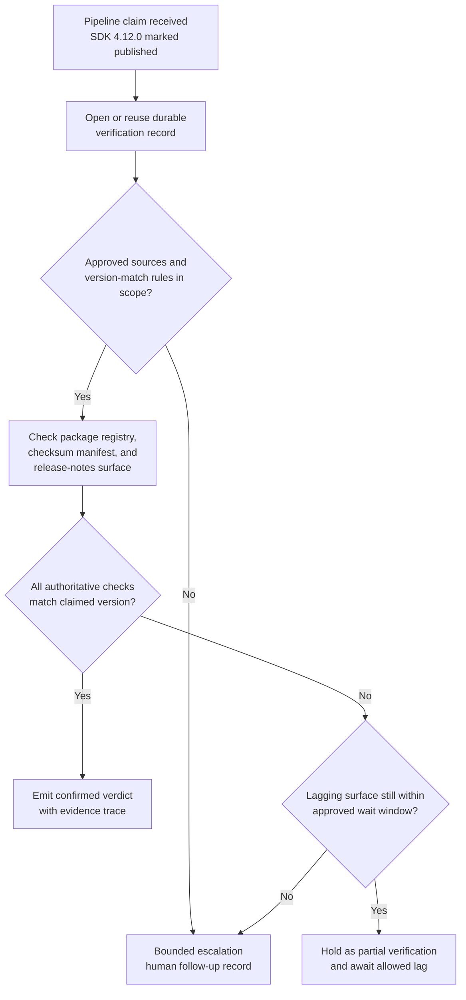

# Internal SDK release asset publication verification

## Linked pattern(s)

- `claimed-state-verification`

## Domain

Engineering.

## Scenario summary

An internal developer-platform pipeline marks version `4.12.0` of a shared SDK as published after package build, checksum generation, and release-note steps report success. Release coordinators still need to know whether the claimed state is actually true across the approved package registry, checksum manifest store, and internal release-notes surface before other teams depend on the version for routine integration work. The workflow verifies the publication claim against those authoritative sources and emits a bounded verdict; it must not republish assets, reopen the build, or infer a broader release-readiness decision.

## Target systems / source systems

- Internal package registry that records the published package version, platform targets, and immutable artifact identifiers
- Checksum manifest store containing the signed hash bundle for the released SDK version
- Internal release-notes system used by platform teams to reference the official package publication
- CI pipeline event feed that emits the original publication-complete claim and any replayed status events
- Verification log or audit store preserving claim ids, evidence checks, verdicts, and follow-up records

## Why this instance matters

This grounds the pattern in an engineering workflow where the hard problem is not deciding whether a version should ship and not propagating any downstream state. Teams frequently see a green pipeline status and assume the package, checksums, and notes all reached their intended destinations, even when one surface lags or a partial publish leaves the claim only partly true. The value comes from bounded evidence-backed confirmation of a low-stakes claimed state before humans rely on it for coordination.

## Likely architecture choices

- Event-driven monitoring fits because the workflow begins from the publication-complete claim emitted by the pipeline rather than from a manually opened investigation.
- A tool-using single agent can query the registry, compare checksum manifest versions, check the release-notes record, and write one inspectable verdict with any unresolved gaps.
- Bounded delegation is appropriate because engineering owners can predefine the accepted sources, version-matching rules, and tolerated lag while humans retain ownership of any republish, rollback, or broader release decision.
- Durable verification state should collapse duplicate pipeline events into one traceable record so repeated checks do not create contradictory publication verdicts.

## Governance notes

- Only the approved package registry, signed manifest store, and release-notes record should count as authoritative evidence; chat announcements or ad hoc screenshots should not confirm the claim.
- Audit traces should preserve the claimed version, observed artifact identifiers, manifest timestamp, and release-notes version so later reviewers can reconstruct why a publish was accepted or flagged.
- If one approved surface still lags within the allowed window, the workflow should mark that explicitly instead of treating the publish as either fully failed or fully complete.
- Any republish, artifact deletion, or change to the version's release status remains human-owned and outside this verification workflow.

## Evaluation considerations

- Percentage of SDK publication claims that receive a verdict with complete registry, manifest, and release-note traceability
- Rate at which partial or stale publication claims are detected before downstream teams rely on the version
- Reviewer agreement that the verification verdict used the correct version-match and freshness rules
- Reliability of duplicate-event handling when the same pipeline publication claim is replayed
