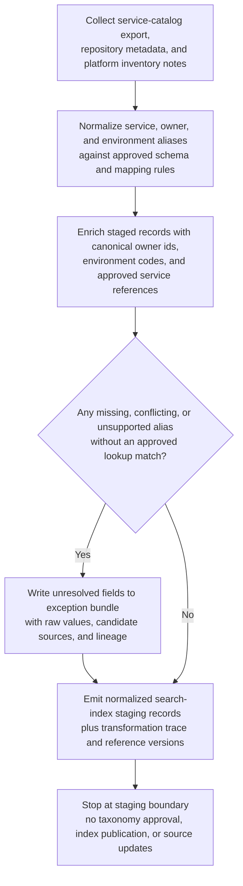

# Internal service catalog owner and environment alias normalization for search-index staging

## Linked pattern(s)

- `normalization-and-enrichment`

## Domain

Engineering.

## Scenario summary

An internal developer-platform team maintains a search index that helps engineers find services by owner, runtime environment, support tier, and platform tag. The source metadata arrives from a low-stakes service-catalog export, repository-level metadata files, and platform inventory notes, but the fields are inconsistent: owner names mix team aliases and legacy org labels, environment values alternate between `prod`, `production`, and `live`, and some service names still carry retired platform nicknames. Before the next index refresh, the workflow must normalize those aliases into the approved service-catalog schema, enrich each staged record with canonical owner and environment identifiers from approved reference tables, preserve field-level lineage back to the raw source values, and route unresolved aliases into an explicit exception bundle rather than guessing. The workflow ends once the cleaned records and trace are written to a search-index staging store; it does not approve taxonomy changes, publish the search index, notify owners, or modify any authoritative source system.

## Target systems / source systems

- Internal service-catalog export containing the current service rows, free-form owner strings, service aliases, and environment labels used by engineering teams
- Repository metadata files and platform inventory notes that provide additional low-stakes descriptive fields for search only, not authoritative ownership changes
- Approved reference sources such as the canonical team directory, environment code list, service registry, and alias-mapping table maintained by platform metadata stewards
- Search-index staging store that accepts schema-aligned service metadata records, enrichment provenance, and unresolved-alias markers before any downstream publication step
- Exception queue or review workspace where taxonomy owners inspect unsupported aliases, conflicting owner mappings, or missing canonical identifiers

## Why this instance matters

This grounds the pattern in an engineering workflow where the value is careful metadata cleanup and approved reference enrichment rather than document extraction, release governance, approval-gated package publication, or operational execution. Internal service metadata often becomes noisy as teams rename themselves, legacy environment shorthands persist, and repository maintainers use informal aliases that remain understandable to humans but unreliable for search and filtering. A bounded normalization workflow improves downstream search usability only when it keeps original values visible, uses approved lookup sources, and leaves unresolved cases explicit instead of forcing a plausible-but-unsupported canonical record.

## Likely architecture choices

- A tool-using single agent can ingest the source rows, apply normalization rules, query approved lookup tables, and write staged normalized records plus a trace in one bounded batch loop.
- The canonical target schema should separate observed source values from normalized values so downstream consumers can distinguish direct metadata from approved enrichment.
- Reference lookups may standardize service aliases, team identifiers, environment codes, and support-tier labels, but unsupported inference about ownership, production criticality, or service lifecycle should remain out of scope and route to exceptions.
- The workflow should write only to a reversible staging layer for search-index preparation and must stop before index publication, taxonomy-table edits, team notifications, or any change to authoritative service records.

## Governance notes

- Every normalized field should retain lineage to the exact source row, metadata file, or inventory note that supplied the original value, along with the alias-mapping or reference-table version used for canonicalization.
- Approved enrichment sources should be explicit and limited to maintained internal registries such as the team directory, environment vocabulary, and service registry rather than inferred from commit history, chat context, or unreviewed notes.
- Unknown, ambiguous, or conflicting aliases should remain visible in the exception bundle with the raw value and candidate context instead of being collapsed into the nearest canonical owner or environment bucket.
- The workflow should preserve enough trace detail to replay the same batch after a mapping-table update without rewriting source systems or losing evidence of which records were unresolved.
- The stop boundary must remain clear: taxonomy owners may later decide whether to add a new alias mapping, but this workflow itself ends at downstream-safe staging and does not publish the search index or approve canonical taxonomy changes.

## Evaluation considerations

- Percentage of staged service records accepted by downstream search-index preparation without additional manual owner, environment, or alias cleanup
- Percentage of normalized and enriched fields that retain original-value lineage, approved reference provenance, and mapping-table version information
- Rate of unsupported or ambiguous aliases correctly routed to the exception bundle instead of being forced into a canonical owner or environment value
- Replay reliability when the team directory changes, a new environment code is introduced, or a previously unknown service alias becomes approved after the batch has already been staged
