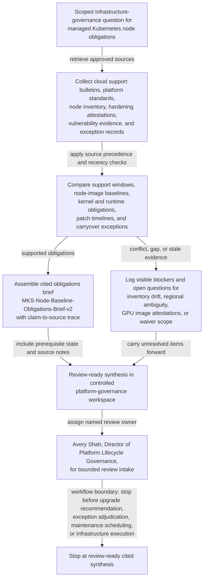

# Managed Kubernetes node support and hardening obligation synthesis for platform governance review

## Linked pattern(s)

- `research-synthesis-with-citation-verification`

## Domain

Engineering.

## Scenario summary

A platform infrastructure governance team is preparing a quarterly review of managed Kubernetes clusters that run customer-facing workloads, regulated internal services, and GPU-backed batch platforms across multiple cloud regions. Before anyone recommends upgrade waves, grants support-window exceptions, changes node-image retirement dates, approves budget for emergency remediation, or schedules maintenance windows, the workflow needs one cited current-state obligations brief, `MKS-Node-Baseline-Obligations-Brief-v2`, showing which cloud-provider support commitments, internal node-image hardening requirements, kernel and container-runtime baseline obligations, vulnerability-remediation timelines, and exception-record carryovers are actually supported by the approved source set. The useful output is a review-ready synthesis that makes source precedence explicit, confirms prerequisite inventory and policy state, surfaces visible blockers such as inconsistent node-pool tagging or stale GPU image attestations, records open questions such as regional support-bulletin ambiguity or grandfathered exception scope, and names Avery Shah, Director of Platform Lifecycle Governance, as the human review owner for downstream platform-governance intake.

## Target systems / source systems

- Controlled platform-governance workspace where `MKS-Node-Baseline-Obligations-Brief-v2`, the claim-to-source trace, prerequisite-state checklist, blocker register, and open-questions log are stored
- Cloud-provider managed Kubernetes support bulletins, lifecycle calendars, release-channel notices, GPU node-pool compatibility matrices, and deprecation advisories for the currently approved provider accounts and regions
- Internal platform standards repository containing the approved Kubernetes minor-version policy, node operating system and kernel-hardening baseline, container-runtime requirements, emergency patch SLA, and exception-review criteria
- Cluster inventory, asset-discovery, and node-image attestation systems that identify active clusters, node pools, approved image families, region tags, workload criticality, last attestation timestamps, and control-plane versus worker-node version state
- Vulnerability-management dashboard, patch validation records, and security engineering evidence covering critical kernel CVEs, runtime package remediation status, compensating controls, and unresolved scanner exceptions
- Prior platform-governance review archive and exception register holding still-effective waivers, superseded brief revisions, and earlier reviewer questions that remain relevant to the current quarter

## Why this instance matters

This grounds the gather-and-synthesize pattern in infrastructure governance rather than migration planning, release-governance packet approval, or shared-workbench upkeep. Managed Kubernetes obligations often span provider notices, internal hardening baselines, vulnerability evidence, and lingering exception records that do not carry the same authority, freshness, or scope. The value is a cited current-state brief that separates verified platform obligations from stale implementation assumptions so reviewers can inspect what is actually supported before any upgrade recommendation, waiver decision, maintenance-window scheduling, or remediation execution begins.

## Likely architecture choices

- A tool-using single agent can retrieve approved support bulletins, platform standards, cluster inventory snapshots, attestation records, vulnerability evidence, and prior exception files, then assemble a structured obligations brief with claim-to-source mappings and explicit source-precedence annotations.
- Human-in-the-loop review should remain mandatory for conflicts between provider lifecycle notices, internal hardening policy, vulnerability-severity interpretations, and still-effective exception records, especially when regional scope or workload class changes the applicable obligation.
- The workflow should preserve an evidence trace that distinguishes binding provider support commitments, current internal platform standards, observed inventory state, security evidence, and lower-authority contextual materials such as migration notes or service-owner comments.
- Retrieval should stay inside approved platform, security, and infrastructure-governance repositories, and the synthesis should stop at review-ready obligations framing rather than inferring whether a cluster should be upgraded first, whether an exception should be renewed, or how remediation should be executed.

## Governance notes

- Current cloud-provider lifecycle notices and the approved internal platform-standard baseline should outrank service-owner spreadsheets, chat threads, migration standups, or stale ticket summaries when sources disagree about support windows, allowed node images, or patch obligations.
- The brief should explicitly identify prerequisite state for use of `MKS-Node-Baseline-Obligations-Brief-v2`: the current quarter's cluster inventory export is frozen, the active platform-standard version is published, the exception register is current through the review cutoff, and the latest node-image attestation ingest completed successfully.
- Revision lineage should remain visible because `MKS-Node-Baseline-Obligations-Brief-v2` supersedes `v1` after a provider GPU compatibility bulletin changed one region's support posture and an inventory correction split one shared node pool into separate regulated and non-regulated scopes.
- Open questions should remain explicit for issues such as unclear grandfathering of a prior support-window waiver, missing attestation evidence for GPU image families, conflicting region tags between asset discovery and cluster metadata, or ambiguity about whether a managed-runtime deprecation notice applies to self-managed add-ons in scope.
- Avery Shah, Director of Platform Lifecycle Governance, should remain the named human review owner, with platform security engineering and managed Kubernetes service owners listed as required reviewers for unresolved source conflicts or evidence gaps.
- Cluster identifiers, attestation excerpts, and vulnerability details should follow least-privilege handling, with copied evidence minimized to what reviewers need to inspect each cited claim.

## Evaluation considerations

- Percentage of material claims about support windows, hardening baselines, patch-timeline obligations, exception carryovers, and node-image requirements backed by inspectable citations to the current approved source set
- Reviewer correction rate for source precedence, regional applicability, prerequisite-state assumptions, or citation mismatch during platform-governance review
- Rate at which stale lifecycle notices, inconsistent inventory state, missing GPU image attestations, or unresolved waiver-scope ambiguity are surfaced explicitly before downstream upgrade, exception, or scheduling workflows begin
- Usefulness of the open-questions and prerequisite-state sections for helping platform governance, security engineering, and infrastructure owners close evidence gaps without reconstructing the source corpus from scratch
