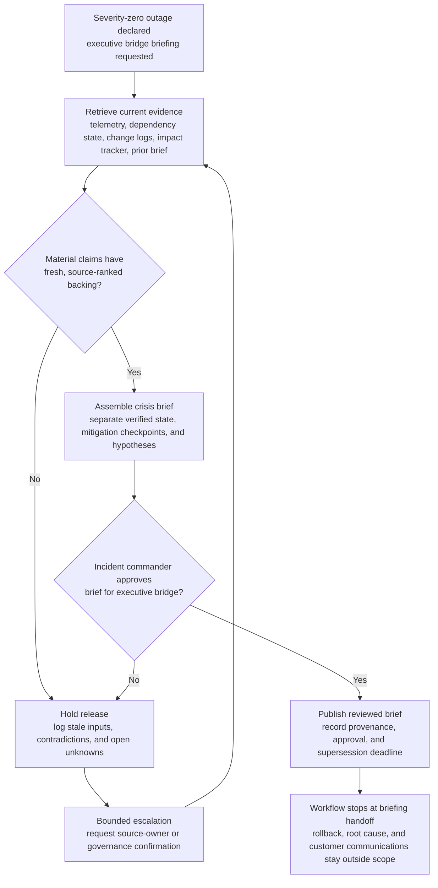
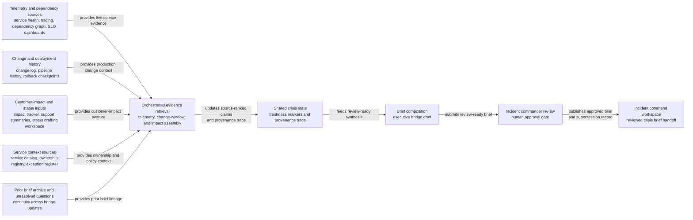

# Multi-region payments outage crisis briefing evidence synthesis

## Linked pattern(s)

- `crisis-briefing-evidence-synthesis`

## Domain

Engineering.

## Scenario summary

After incident command has already declared a severity-zero outage for a multi-region payments platform disruption, an executive bridge needs one source-backed situation brief every thirty minutes. Before anyone recommends rollback paths, attributes root cause, approves customer communications, or executes mitigation steps, the workflow assembles a grounded crisis brief showing verified customer impact, failing dependencies, current mitigation checkpoints, recent production changes, external-status posture, and open unknowns. The useful output is a provenance-preserving synthesis that separates confirmed service state from operator hypotheses and stale bridge commentary so human responders start from one inspectable picture instead of fragmented war-room updates.

## Target systems / source systems

- Incident command workspace where reviewed crisis briefs and superseded versions are stored
- Service-health telemetry, distributed tracing, dependency graph, and SLO dashboards for the affected payments surfaces
- Change-management log, deployment pipeline history, and rollback checkpoint records for the active incident window
- Customer-impact tracker, support escalation summaries, and status-page drafting workspace
- Service catalog, ownership registry, and exception register for dependency scope and emergency policy context
- Prior executive bridge brief archive and unresolved-question tracker for continuity across updates

## Why this instance matters

This grounds the new canonical pattern in an engineering crisis where the highest-value artifact is not another alert, diagnosis, or remediation plan, but one disciplined shared briefing package. Major outages often generate dozens of partially authoritative narratives across observability tools, release records, support bridges, and incident chat. The instance shows why critical-risk gather/synthesize work deserves its own bounded pattern: human leaders need rapid cross-source compression with freshness and provenance controls before they can safely make downstream decisions.

## Likely architecture choices

- An orchestrated multi-agent setup can separate telemetry retrieval, change-window reconstruction, customer-impact assembly, and final briefing composition while sharing one source-ranked crisis state.
- Human-in-the-loop review should remain mandatory for each executive bridge brief because ambiguous blast-radius statements, mitigation claims, and external-status wording can materially affect response leadership.
- The workflow should preserve a provenance trace that marks which statements come from authoritative telemetry, which come from ticket state, and which remain lower-authority operator notes awaiting confirmation.
- Retrieval should stay inside approved incident, production, and customer-impact systems; unsupported root-cause claims or rollback recommendations should be blocked from the brief itself.

## Governance notes

- Current telemetry, approved change records, and incident-commander acknowledgements should outrank chat speculation, manually copied spreadsheet updates, or stale status drafts when sources disagree.
- Each briefing statement should carry freshness markers because a claim that was accurate fifteen minutes ago may already be superseded in a fast-moving outage.
- Customer-identifying details, sensitive security findings, and payment data should be minimized in the distributed brief, with restricted annexes used only when the target audience genuinely needs them.
- Every brief revision, reviewer approval, redaction choice, and supersession should be logged so later review can reconstruct what leaders were told at each handoff point.

## Evaluation considerations

- Median time from declared severity-zero status to reviewer-approved crisis brief with complete freshness and provenance trace
- Percentage of material customer-impact, dependency-status, mitigation-checkpoint, and change-window statements backed by inspectable source references and timestamps
- Reviewer correction rate for blast-radius, source-authority, or stale-state handling across successive bridge briefs
- Rate at which open unknowns such as rollback readiness, regional recovery variance, or unresolved dependency impact are surfaced explicitly before downstream action decisions
