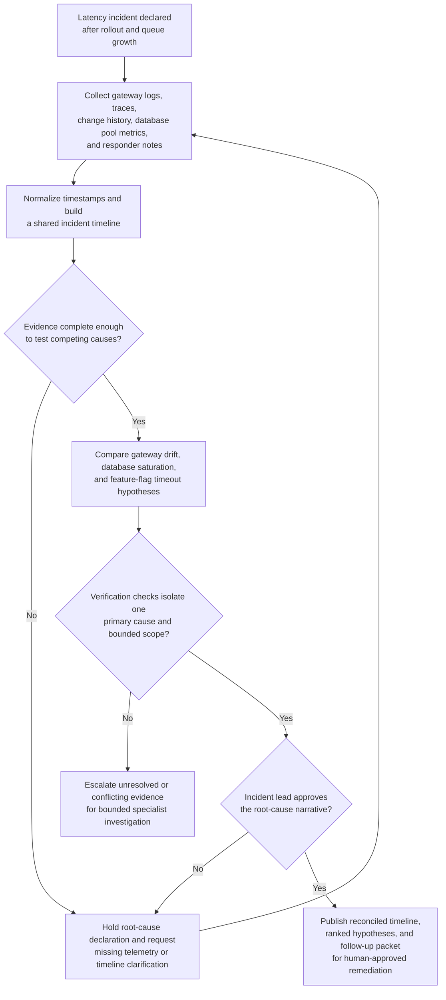
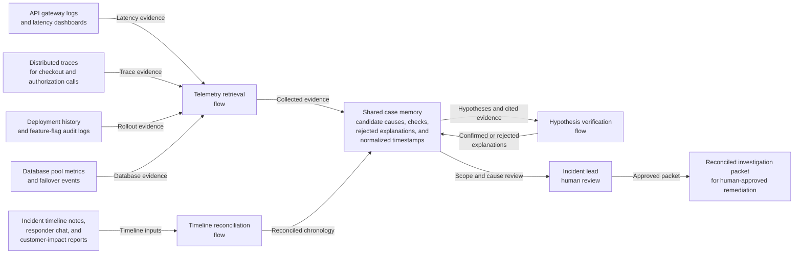

# Payments API latency incident investigation

## Linked pattern(s)

- `incident-root-cause-analysis`

## Domain

Engineering.

## Scenario summary

A payments platform experiences a sustained increase in checkout authorization latency during peak traffic after a routine infrastructure rollout. Alerts show elevated p95 response times and queue growth, but the immediate cause is unclear because the incident may involve gateway configuration drift, database pool saturation, or a dependency timeout introduced by a feature-flag change.

## Target systems / source systems

- API gateway logs and service-level latency dashboards
- Distributed traces for checkout and authorization calls
- Deployment records, infrastructure change history, and feature-flag audit logs
- Database connection-pool metrics and failover events
- Incident timeline notes, responder chat, and customer-impact reports

## Why this instance matters

This is a strong first engineering instance because it shows why incident analysis is more than post hoc summarization. The workflow must reconcile conflicting evidence streams, preserve rejected hypotheses, and give incident leaders a defensible narrative before remediation and postmortem conclusions become institutional memory.

## Likely architecture choices

- An orchestrated multi-agent flow separates telemetry retrieval, timeline reconciliation, and hypothesis verification so evidence handling stays explicit.
- Shared case memory preserves candidate causes, confirming checks, rejected explanations, and timestamp normalization across responders.
- Human-in-the-loop review remains necessary for incident-scope decisions, primary-cause declaration, and approval of corrective actions.

## Governance notes

- Evidence collection should use read-only access where possible and avoid copying sensitive payment payloads into the investigation record.
- The workflow should distinguish observed facts from inferred causes and keep multiple plausible explanations visible until checks close them.
- Incident closure, external communication, and production remediations should remain human-approved even if the analysis strongly favors one cause.
- Investigation artifacts should retain timeline provenance, human overrides, and discarded hypotheses for postmortem review.

## Evaluation considerations

- Time to first defensible hypothesis with cited supporting evidence
- Completeness and ordering quality of the reconciled incident timeline
- Agreement between the workflow's ranked hypotheses and the final adjudicated root cause
- Whether missing telemetry or conflicting human reports degrade into explicit uncertainty instead of overconfident conclusions
