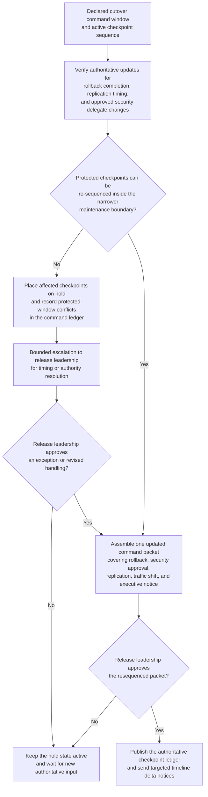
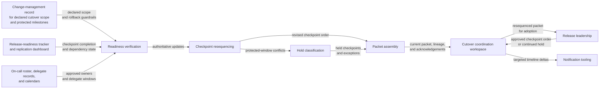

# Payments cutover command-window checkpoint resequencing

## Linked pattern(s)

- `critical-command-window-resequencing`

## Domain

Engineering.

## Scenario summary

A payments-platform release has already entered a declared overnight cutover command window with an approved checkpoint sequence for rollback validation, database replication confirmation, security approval, traffic-shift readiness, and executive release communication. Mid-window, authoritative conditions change: rollback validation finishes later than expected, the security approver's delegate mapping changes because of a concurrent incident bridge, and the final replication confirmation can only occur inside a narrower maintenance boundary. The workflow must rebuild one authoritative checkpoint timeline, preserve explicit holds where protected checkpoints cannot yet move safely, and hand release leadership one current command packet rather than letting separate teams coordinate from stale war-room notes.

## Target systems / source systems

- Change-management record holding the declared cutover scope, protected milestones, and rollback guardrails
- Release-readiness tracker and database replication dashboard publishing authoritative checkpoint completion and dependency state
- On-call roster, delegate records, and calendars for release engineering, database engineering, security review, and executive communications
- Cutover coordination workspace where packet versions, acknowledgements, and held checkpoints are tracked
- Notification tooling used to send targeted timeline deltas without automatically approving the new live sequence

## Why this instance matters

This grounds the pattern in engineering work where the critical problem is no longer ordinary scheduling or broad replanning, but preserving one trustworthy cutover timeline while the live command window is already in motion. The workflow has to keep checkpoint order, human ownership, and protected timing boundaries explicit under pressure without deciding whether to continue the release or executing the cutover steps itself. That keeps the instance squarely inside planning and coordination scope even though the surrounding event is high consequence.

## Likely architecture choices

- An orchestrated multi-agent design can separate readiness verification, checkpoint resequencing, hold classification, and packet assembly while preserving one shared cutover ledger.
- Human-directed control fits because release leadership must adopt any materially changed checkpoint order before the new packet becomes authoritative for live coordination.
- The workflow should track superseded command packets, changed owner acknowledgements, and protected-window conflicts so teams can see exactly why the sequence changed.
- The workflow should stop at the updated checkpoint ledger and hold register rather than recommending go/no-go, changing deployment state, or posting final external communications.

## Governance notes

- Protected checkpoints such as rollback validation, security approval, and replication confirmation should remain explicit before any resequencing begins.
- Delegate changes should be accepted only from approved release and security authority mappings, not from ad hoc chat messages or unofficial substitutions.
- Targeted delta notices should go only to materially affected checkpoint owners and observers rather than rebroadcasting sensitive release context broadly.
- Human release ownership is required before the resequenced packet becomes the authoritative basis for traffic shift, executive messaging, or any other consequential downstream step.

## Evaluation considerations

- Time from authoritative readiness or delegate change to a human-reviewable resequenced cutover packet
- Rate of protected checkpoint conflicts correctly held for release-owner action instead of being flattened into an invalid schedule
- Ability of affected teams to identify the current authoritative command packet and understand what changed from the superseded version
- Stability of the resequencing loop when multiple cutover dependencies move within the same narrow maintenance window
