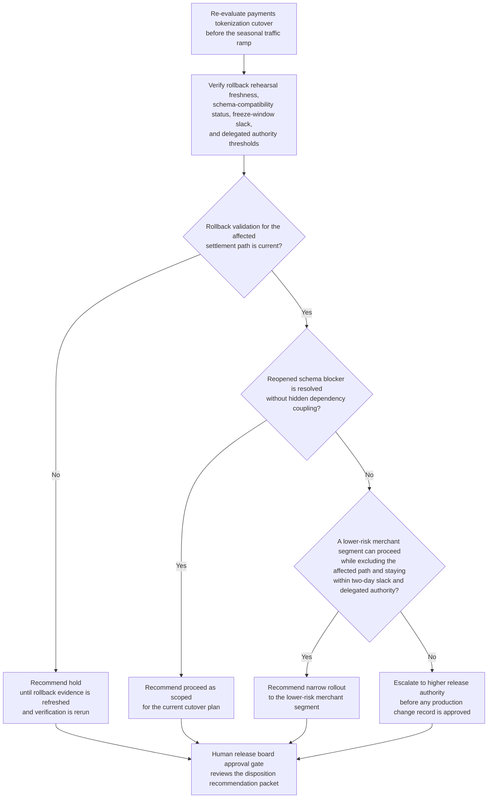

# Payments tokenization cutover readiness gate disposition recommendation

## Linked pattern(s)

- `readiness-gate-disposition-recommendation`

## Domain

Engineering.

## Scenario summary

A platform engineering release board is re-evaluating whether a payments tokenization cutover should enter its governed production gate before a seasonal traffic ramp. Since the last review, rollback validation for one downstream settlement path expired, one dependency team reopened a schema-compatibility blocker, and the remaining freeze-window slack narrowed from five days to two. The workflow must recommend whether engineering should proceed with the cutover as scoped, hold for refreshed evidence, narrow to a lower-risk merchant segment, or escalate because rollback confidence, blocker coupling, and change-governance thresholds no longer fit delegated release authority before any production change record is approved.

## Target systems / source systems

- Release gate tracker, change record, and delegated production authority matrix
- Deployment evidence store, rollback rehearsal log, and service dependency status dashboard
- Schema-compatibility issue tracker, test result history, and environment-drift verification reports
- Freeze-calendar policy, customer-impact forecasts, and prior gated-cutover exception register
- Observability baseline snapshots and recovery-time objective references from reliability engineering

## Why this instance matters

This instance grounds the pattern in engineering where the hard problem is not synthesizing readiness evidence or scheduling the gate meeting. The value is turning fresh blocker movement, evidence-freshness drift, and deadline pressure into a governed proceed, hold, narrow, or escalate recommendation before release leadership commits the cutover.

## Likely architecture choices

- Event-driven monitoring fits because blocker reopen events, expired rollback evidence, and freeze-window changes should automatically trigger a refreshed gate recommendation instead of waiting for a manual checklist pass.
- Human-in-the-loop review is mandatory because the workflow should advise on the gate disposition, not approve the change record, edit release scope, or start the production rollout.
- Read-only integration with release tracking, verification, observability, and policy systems is preferable so the agent cannot silently convert a recommendation into a live deployment decision.

## Governance notes

- The output should distinguish full-proceed paths, narrow rollout paths that isolate unresolved risk, hold conditions driven by stale or missing evidence, and escalation triggers tied to release-authority thresholds.
- Any narrow recommendation should show which merchant segments, dependencies, or rollback paths are intentionally excluded and why that narrower boundary remains within policy.
- Reopened blockers, expired rollback rehearsals, or freeze-window exceptions should trigger explicit escalation rather than being absorbed into weighted readiness scoring alone.
- Service topology details, customer-impact estimates, and production recovery notes should remain visible only to authorized engineering, reliability, security, and change-approval reviewers under normal access controls.
- Recommendation packets should preserve the trigger events, evidence versions, blocker deltas, and reviewer comments used so release leaders can later audit why the cutover was allowed to proceed, held, narrowed, or escalated.

## Evaluation considerations

- Reviewer agreement with the recommended gate disposition before any production cutover approval is recorded
- Rate at which stale evidence, blocker reopen events, or freeze-policy breaches are surfaced before the release board meets
- Quality of evidence linking rollback readiness, dependency status, and authority thresholds to the disposition recommendation
- Stability of recommendations when dependency state, evidence freshness, or deadline pressure changes during the final gate window
