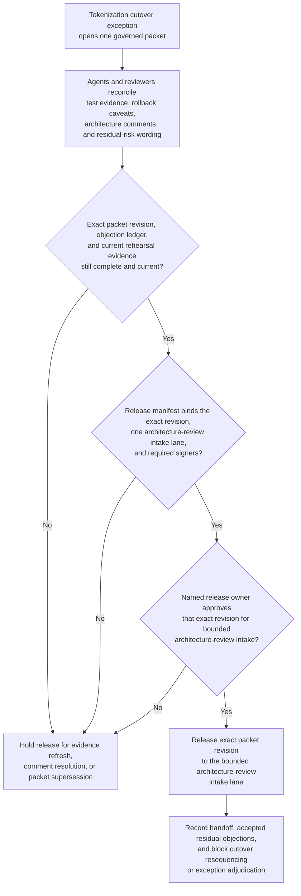

# Payments tokenization exception packet approved for architecture review intake

## Linked pattern(s)

- `approval-gated-collaborative-artifact-release`

## Domain

Engineering.

## Scenario summary

A platform security lead, a payments architect, and release engineering reviewers are co-producing one governed exception packet because a tokenization cutover needs a temporary deviation from the standard rollback-control policy for one release train. Agents help reconcile test evidence, rollback caveats, architecture comments, and residual-risk wording into the shared packet while preserving which objections remain unresolved and which edits the human artifact owner accepted. The workflow ends only when the named release owner approves that exact packet revision for one bounded architecture-review intake lane, where downstream reviewers may decide whether to grant or reject the exception. It does not choose the review outcome, resequence the change window, or execute the cutover.

## Target systems / source systems

- Governed collaboration workspace holding the shared exception packet, comment threads, objection state, and release-manifest draft
- Architecture standards, rollback-policy, and release-governance repositories defining the permitted intake boundary and required signers
- CI, deployment rehearsal, and rollback-evidence systems supplying current test artifacts, dependency waivers, and mitigation proof
- Approval and intake-routing tooling used to release one approved packet revision into the architecture-review lane
- Audit systems preserving packet supersession, release-owner decisions, audience-boundary changes, and blocked-release history

## Why this instance matters

This grounds the pattern in engineering work where the main reusable challenge is not readiness recommendation alone and not schema packaging. Humans and agents repeatedly refine one exception artifact, keep disagreement visible, and then attach explicit approval to release that artifact itself into a downstream review lane. The example stays on the collaboration boundary because the architecture board's adjudication and any resulting release action remain downstream.

## Likely architecture choices

- Approval-gated execution fits because the shared packet can be collaboration-ready before it is allowed to cross into the architecture-review intake queue.
- Human-in-the-loop collaboration is mandatory because only accountable engineering and security owners may accept residual disagreement, approve audience scope, and release the packet onward.
- Agents may refresh evidence links, rewrite disputed sections, and maintain the release manifest, but they must not decide whether the board should approve the exception or trigger the change.

## Governance notes

- The release manifest should bind one exact packet revision, the approved architecture-review lane, signer identities, and any residual objections that the human release owner accepted explicitly.
- Rollback caveats, dependency waivers, and residual-risk language should remain traceable to current evidence and visible disagreement rather than being compressed into a falsely clean packet.
- Audience scope should stay limited to the named review lane; broader distribution or reuse of the packet should require a new explicit approval event.
- If fresh rehearsal evidence changes rollback feasibility materially, the workflow should hold release and return to collaboration rather than letting the old packet revision proceed.

## Evaluation considerations

- Rate at which architecture-review intake accepts the released packet without bounce-back for stale evidence, hidden objections, or unclear release ownership
- Time spent reconciling comments, signer state, and artifact revisions before one governed packet can enter the review lane
- Reliability of binding between the released packet revision, accepted residual disagreement, and the bounded downstream intake scope
- Frequency with which humans reject agent-assisted edits because they drifted into exception adjudication, schedule control, or implied cutover approval
