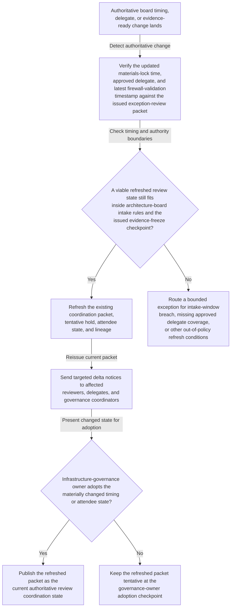
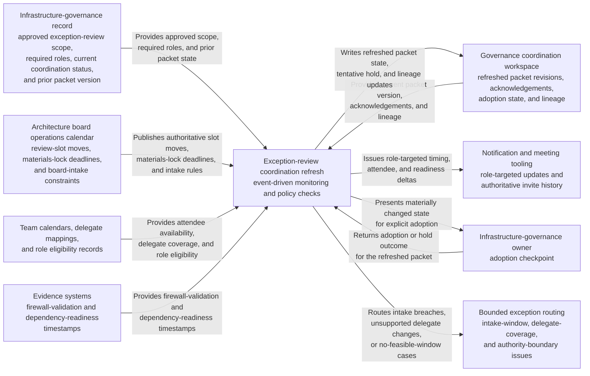

# Platform network segmentation exception review coordination refresh after architecture board materials-lock shift

## Linked pattern(s)

- `authoritative-change-coordination-refresh`

## Domain

Engineering.

## Scenario summary

A platform network-segmentation exception review for legacy administrative endpoints already has an issued coordination packet, required-attendee list, tentative architecture-board hold, and evidence-freeze checkpoint linked to the governing infrastructure-governance record. After that packet is issued, authoritative board conditions change: architecture board operations moves the materials-lock deadline earlier and shifts the review slot later the same day, the principal security architect hands attendance to an approved delegate because of executive travel, and updated firewall-validation evidence posts later than the original packet expected. The workflow should refresh the existing coordination package, send participant-specific delta notices, and hold the changed state at an explicit infrastructure-governance owner adoption or exception checkpoint rather than rewriting the exception rationale, deciding whether the variance is acceptable, or implementing any network-policy changes.

## Target systems / source systems

- Infrastructure-governance record with the approved exception-review scope, required participant roles, current coordination status, and prior packet version
- Architecture board operations calendar publishing authoritative review-slot moves, materials-lock deadlines, and board-intake constraints
- Team calendars, delegate mappings, and role eligibility records for platform engineering, security architecture, network engineering, service ownership, and governance operations
- Evidence systems publishing authoritative firewall-validation and dependency-readiness timestamps that constrain when the exception review can validly occur
- Governance coordination workspace where packet revisions, acknowledgements, adoption state, and refresh lineage are maintained
- Notification or meeting tooling capable of issuing role-targeted updates without silently replacing the authoritative invite history

## Why this instance matters

This grounds the pattern in an engineering governance workflow where the key need is keeping one already-issued architecture-board coordination packet synchronized with authoritative board timing, attendee, and readiness changes. The value comes from preserving one current packet, one clear delta trail, and explicit human adoption of consequential changes so the right reviewers can evaluate the same exception package without confusion. It stays within coordination-refresh scope because the workflow updates meeting timing, attendee state, and checkpoint lineage only; it does not revise the exception argument, adjudicate the board outcome, or carry out any infrastructure change.

## Likely architecture choices

- Event-driven monitoring should react only to approved architecture-board operations updates, authoritative evidence-ready changes, and governed delegate-state changes that affect the issued review packet.
- Exception-gated autonomy fits because the workflow can refresh the packet, revise the tentative hold, and issue targeted participant notices automatically when changes remain inside intake and authority guardrails.
- The infrastructure-governance owner should adopt any changed meeting time, required-attendee substitution, or materials-lock-sensitive shift before the refreshed packet becomes authoritative.
- Exception handling should route no-feasible-window cases, unsupported delegate changes, or board-intake boundary violations instead of publishing a misleading current coordination state.

## Governance notes

- Required roles and approved delegates should be explicit and auditable for platform engineering, security architecture, network engineering, service ownership, and governance operations before automatic refresh is enabled.
- Refreshed notices should include only the timing, attendee, and readiness deltas needed for coordination rather than the full exception narrative, threat-model detail, or unrelated board commentary.
- The workflow should preserve append-only lineage connecting each authoritative board-timing or evidence-ready change to the resulting packet refresh, targeted notices, and governance-owner adoption outcome.
- Automatic refresh should stop when the changed slot crosses a protected board-intake boundary, the trigger comes from an unofficial chat update, or a required role loses approved delegate coverage.
- Churn-heavy refresh periods near the materials-lock deadline should be monitored so participants can still identify one current packet without sifting through conflicting revisions.

## Evaluation considerations

- Time from authoritative board-timing or evidence-ready change to a refreshed exception-review packet with explicit adoption or exception status
- Rate of intake-threatening shifts, unsupported delegate substitutions, or unresolved required-attendee changes correctly escalated before the packet becomes authoritative
- Participant ability to tell what changed between the prior and current coordination packet without reconstructing the full governance thread manually
- Notification-deduplication performance when multiple board-operations or evidence-readiness updates arrive near the protected materials-lock boundary
