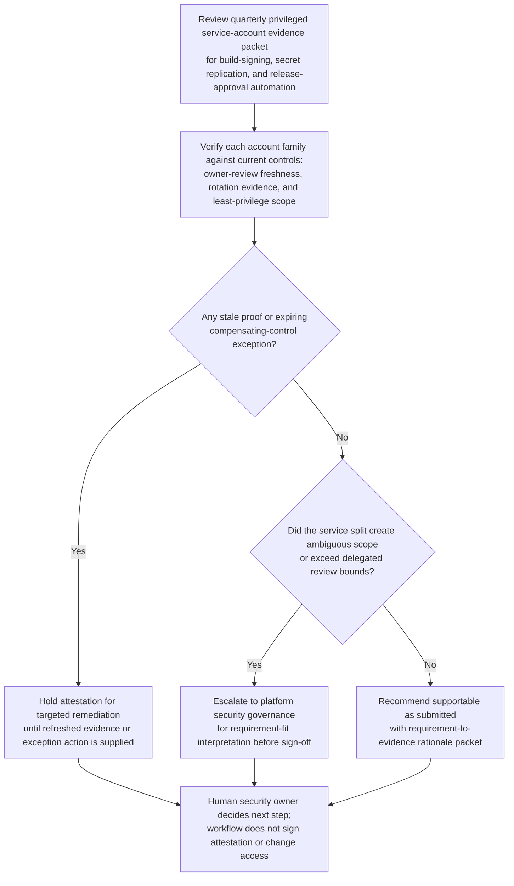
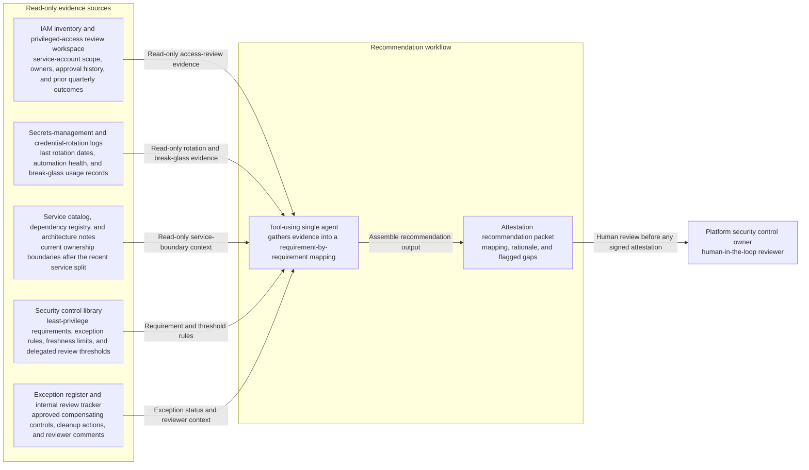

# Privileged service-account quarterly control attestation recommendation

## Linked pattern(s)

- `control-requirement-attestation-recommendation`

## Domain

Engineering.

## Scenario summary

A platform security control owner is preparing the quarterly internal attestation for a small set of privileged production service accounts used by build-signing, secret replication, and release-approval automation. The evidence packet already exists, but one account family has stale owner-review evidence, another relies on a soon-to-expire compensating-control exception, and a recent service split changed whether two identities still fall inside the same least-privilege scope. The workflow must recommend whether the attestation package is supportable as submitted, should pause for targeted remediation, or should escalate to platform security governance because the current requirement fit is ambiguous before any human signs the quarter's control record or changes live access.

## Target systems / source systems

- IAM inventory and privileged-access review workspace with service-account scope, owners, approval history, and prior quarterly outcomes
- Secrets-management and credential-rotation logs showing last rotation dates, automation health, and break-glass usage records
- Service catalog, dependency registry, and architecture notes showing current ownership boundaries after the recent service split
- Security control library with least-privilege requirements, exception rules, freshness limits, and delegated review thresholds
- Exception register and internal review tracker containing approved compensating controls, pending cleanup actions, and reviewer comments

## Why this instance matters

This grounds the pattern in engineering where the hard part is not opening tickets to fix access or routing a package through a long collaboration loop. The useful output is a bounded recommendation about whether a current evidence packet actually satisfies a known control-attestation requirement set, with exact visibility into stale proof, scope ambiguity, and exception dependence before a human security owner signs anything. It stays distinct from readiness-gate work because the center of gravity is requirement fit for an attestation packet, not proceed-or-hold guidance at a milestone.

## Likely architecture choices

- A tool-using single agent can gather the latest access-review exports, exception metadata, service ownership records, and rotation evidence into a requirement-by-requirement mapping.
- Human-in-the-loop review should remain mandatory because platform security owners must decide whether partial evidence or compensating controls are acceptable for the quarter's signed attestation.
- Read-only integration is preferable so the workflow cannot silently alter IAM state, rotate credentials, or mark the attestation approved.

## Governance notes

- Each requirement should map to inspectable evidence, including owner-review timestamps, scope definitions, exception ids, and rotation status, rather than collapsing the packet into one summary score.
- Stale access-review evidence, ambiguous service ownership after the split, or expiring compensating controls should trigger explicit remediation or escalation instead of soft downgrading.
- Infrastructure metadata, privileged identity details, and break-glass records should remain visible only to authorized security, platform, and reliability reviewers under normal least-privilege controls.
- The packet should record the exact boundary between recommendation and action: approving the attestation, extending an exception, or changing account permissions remains human-owned and outside this workflow.

## Evaluation considerations

- Reviewer agreement with the recommended approve, remediate, or escalate posture without major requirement-mapping corrections
- Rate at which stale owner-review evidence, scope drift, or exception expiry is surfaced before quarterly sign-off
- Quality of traceability from each least-privilege requirement to current evidence, exception history, and reviewer commentary
- Stability of recommendations when service ownership, credential-rotation state, or exception posture changes during the review window
