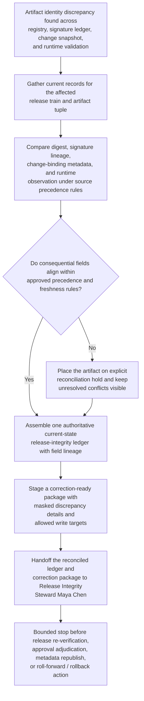
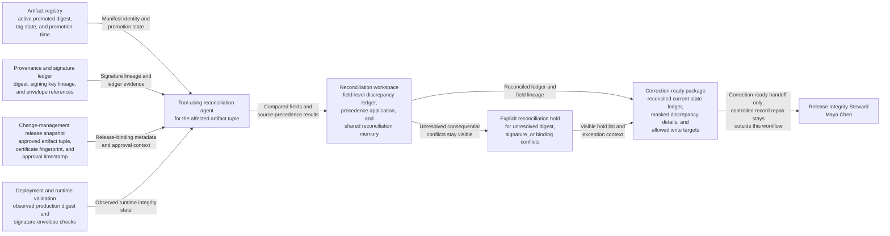

# Production artifact hash and signature discrepancy authoritative record reconciliation

## Linked pattern(s)

- `authoritative-record-reconciliation`

## Domain

Engineering.

## Scenario summary

After a production hotfix is promoted through an emergency release lane and several downstream records are updated asynchronously, release engineering discovers that the current artifact identity no longer agrees across the artifact registry, the provenance and signature ledger, the change-management release snapshot, and the deployment-validation record used for runtime integrity checks. The registry still marks image digest `sha256:8f4…7ac` as the active promoted artifact for release train `rel-2026.03.22.4`, the signature ledger records the same tag against digest `sha256:8f4…71e` with signing key `kms-prod-sign-09`, and the change snapshot carries the newer digest but an older certificate fingerprint and approval timestamp. Runtime validation for the production cluster matches the newer digest but shows a signature envelope id that cannot yet be linked back to the approved ledger entry. Before anyone re-verifies evidence sufficiency, approves the release, republishes metadata, rolls anything forward or back, or decides why the records drifted, the workflow must restore one trusted current release-integrity record for that artifact set, keep unresolved conflicts on explicit hold, and hand off a correction-ready package to Release Integrity Steward Maya Chen for controlled record repair.

## Target systems / source systems

- Artifact registry records holding immutable manifest digests, promotion timestamps, repository coordinates, and active production tags
- Provenance and signature ledger entries holding signature envelope ids, signer or certificate lineage, attestation bundle references, and ledger write times
- Change-management release snapshot records holding the approved production artifact tuple, release-window reference, exception notes, and reviewer-visible current-state fields
- Deployment or runtime validation records holding the observed production digest, admission-controller signature checks, cluster identifier, and last-known integrity observation time
- Reconciliation workspace tooling used to preserve field-level discrepancy ledgers, masked artifact identifiers, explicit exception holds, and reversible correction packages

## Why this instance matters

This grounds the pattern in an engineering workflow where the urgent task is not deciding whether the release is acceptable, rebuilding the release packet, or proving the artifact is safe to deploy, but restoring one defensible current record across authoritative release-integrity systems after they have diverged. Production artifact governance often spreads authority across registry state, signed provenance records, approved change snapshots, and runtime observation surfaces, so teams can end up with conflicting hash, signature, or approval-lineage fields even when each individual system looks internally consistent. The instance stays in this family because it centers on source-of-truth precedence, field-level discrepancy resolution, explicit holds, and correction-ready handoff rather than evidence verdicting, approval adjudication, deployment action, or root-cause analysis.

## Likely architecture choices

- A tool-using single agent can gather the registry manifest record, signature-ledger entry, change snapshot, and runtime-validation observation into one bounded reconciliation run for the affected artifact tuple.
- Human-in-the-loop review should remain standard when digest lineage and signature lineage disagree, when a runtime observation cannot be linked cleanly to an approved ledger entry, or when any proposed correction would alter production-facing release records.
- Shared reconciliation memory should preserve superseded digest values, signature envelope references, precedence-rule application, prior steward annotations, and rollback references so later reviewers can inspect exactly why one field value became authoritative.
- The workflow should end at a reconciled current-state ledger plus a correction-ready handoff to Maya Chen, not at packet regeneration, signature re-verification, release disposition, or deployment execution.

## Governance notes

- Source precedence should be explicit at the field level: the artifact registry remains authoritative for immutable manifest identity, the provenance ledger remains authoritative for signature envelope and signer lineage, the approved change snapshot remains authoritative for release-window and exception-binding metadata, and runtime validation may confirm observed production state but should not override signed source records without steward review.
- Every consequential field, including digest, tag-to-digest mapping, signature envelope id, signer fingerprint, release-window reference, and observation timestamp, should retain lineage to the exact source record and extraction time used in reconciliation.
- The workflow should place the artifact on explicit reconciliation hold whenever digest identity, signature lineage, or change-snapshot binding cannot be aligned inside approved precedence and freshness rules; held fields must remain visible rather than being silently normalized.
- Working ledgers and handoff packets should mask repository paths, cluster names, certificate fingerprints, and full digest values where complete detail is not necessary for steward review.
- Release Integrity Steward Maya Chen should receive the correction-ready package with the unresolved exception list, masked discrepancy ledger, and allowed write targets so she can authorize controlled record repair without reopening release decisioning.

## Evaluation considerations

- Time to produce a human-reviewable authoritative artifact-integrity ledger with complete field-level lineage, explicit hold states, and a correction-ready steward handoff
- Agreement between the workflow's reconciled artifact record and the final steward-accepted current-state view across registry, provenance, change-management, and runtime-validation systems
- Percentage of hash, signature, or release-binding conflicts routed into explicit exception holds rather than silently overwritten during reconciliation
- Reliability of correction-package generation when registry promotions, ledger backfills, or runtime-validation updates arrive out of order during repeated reconciliation runs
