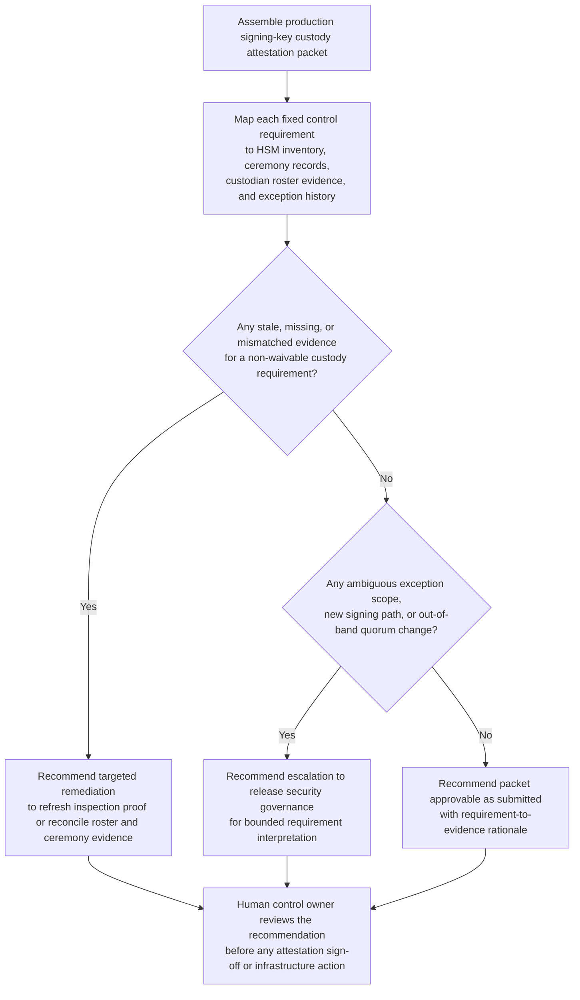

# Production artifact-signing key custody attestation recommendation

## Linked pattern(s)

- `control-requirement-attestation-recommendation`

## Domain

Engineering.

## Scenario summary

A release security owner is preparing the semiannual internal attestation for the production artifact-signing keys used to publish desktop agent binaries, internal CLI packages, and emergency hotfix bundles. The requirement set is fixed: every production signing key must remain HSM-backed, all key-policy or quorum changes must have dual-operator ceremony evidence, escrow media must have current seal-inspection proof, authorized custodians must still match the approved roster, and any bridge used for legacy notarization must stay within an approved exception boundary. The evidence packet is close, but one ceremony log still references a temporary operator role from a recent on-call rotation change, one escrow-envelope inspection record predates the last media replacement, and a legacy notarization bridge exception may not clearly cover a newly added hotfix-signing path. The workflow must recommend whether the packet is supportable as submitted, needs targeted remediation, or should escalate to release security governance because the current requirement fit is no longer routine before any human signs the attestation or changes live signing infrastructure.

## Target systems / source systems

- HSM inventory, signing-key custody registry, and audit logs showing key residency, quorum settings, operator actions, and backup-material metadata
- Key-ceremony record store with witness logs, approval notes, role assignments, and evidence for policy or quorum changes
- Identity and access governance workspace with the approved custodian roster, training acknowledgements, separation records, and prior attestation outcomes
- Release engineering pipeline configuration, notarization bridge documentation, and hotfix-signing path notes showing where production signing material is invoked
- Security controls library and exception register defining attestation requirements, evidence freshness rules, compensating-control limits, and escalation thresholds

## Why this instance matters

This grounds the pattern in engineering where the valuable output is a bounded recommendation on whether a release-integrity control packet actually satisfies a known attestation checklist. The scenario stays inside the family boundary by focusing on requirement mapping, visible evidence gaps, and recommendation-ready rationale rather than key rotation, notarization changes, release approval, incident response, or live signing-system updates. It also shows that an engineering attestation review can remain low-risk while still demanding precise evidence visibility because a weak recommendation can hide custody drift or exception overreach before a human reviewer notices.

## Likely architecture choices

- A tool-using single agent can retrieve the current requirement set, align ceremony records with custodian and HSM evidence, compare exception scope against the newly added signing path, and assemble one reviewable rationale packet.
- Human-in-the-loop review is required because release security owners must decide whether partial custody evidence is acceptable, whether exception scope is still in band, or whether the case needs governance escalation.
- Read-only integration with HSM, identity-governance, release-configuration, and exception systems is preferable so the workflow cannot alter key policy, update roster state, approve the attestation, or trigger live signing changes.

## Governance notes

- The packet should preserve requirement-by-requirement status as satisfied, partial, stale, missing, or exception-backed, with direct links to the exact HSM record, ceremony log, roster snapshot, inspection proof, or bridge-exception artifact used.
- Temporary operator roles that are no longer on the approved roster, stale escrow-inspection evidence, or a legacy exception stretched onto a new signing path should trigger explicit remediation or escalation instead of being summarized away.
- Custody records, key metadata, signer identities, and emergency hotfix-path details should remain visible only to authorized release security, platform engineering, and security governance reviewers under normal least-privilege controls.
- The boundary between recommendation and action must stay explicit: signing the attestation, extending an exception, changing quorum policy, rotating keys, or modifying release pipelines remains outside this workflow.

## Evaluation considerations

- Reviewer agreement with the recommended approve, remediate, or escalate posture without major requirement-mapping corrections
- Rate at which stale escrow proof, roster drift, or exception-scope ambiguity is surfaced before semiannual attestation sign-off
- Quality of traceability from each signing-key custody requirement to current HSM, ceremony, identity-governance, and release-path evidence
- Stability of recommendations when custodian rosters, signing-path topology, or exception posture changes during the review window
