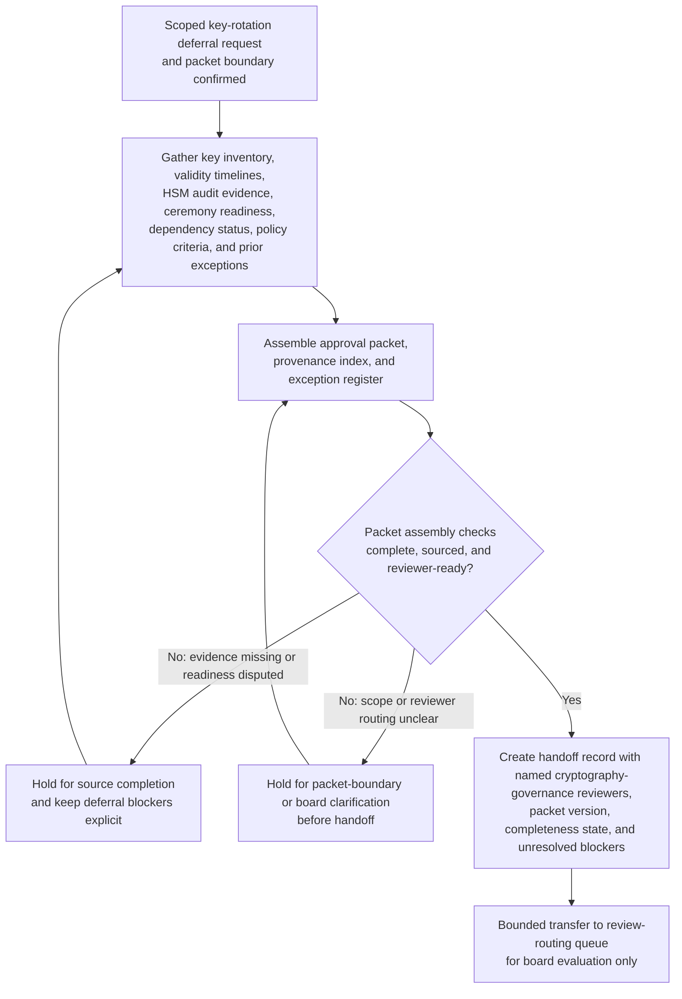
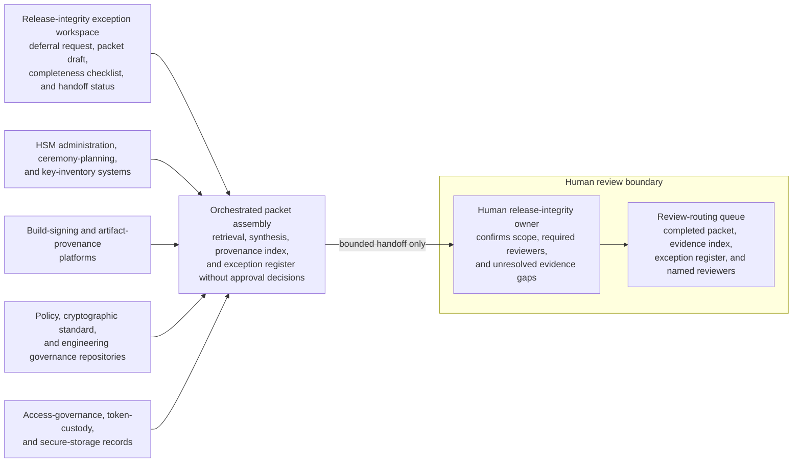

# Production artifact-signing key-rotation deferral approval packet for cryptography governance board review

## Linked pattern(s)

- `approval-packet-generation`

## Domain

Engineering.

## Scenario summary

A release integrity program manager must assemble a decision-ready approval packet because the scheduled quarterly rotation of a production artifact-signing intermediate key cannot proceed on time after an HSM firmware attestation mismatch blocks the planned quorum ceremony and leaves a bounded request to defer the rotation pending cryptography governance board review. The workflow gathers the scoped deferral request, key-inventory records, certificate validity timelines, HSM audit logs, ceremony-preparation evidence, dependent build-system enrollment status, cryptographic policy requirements, prior deferral history, and the already-defined interim monitoring and access constraints into one governed packet for engineering review. Agents help map packet claims to exact source evidence, build a reviewer-visible provenance index, keep unresolved issues such as stale backup-token custody attestations, incomplete signer availability confirmation, or disputed downstream dependency cutover readiness in an explicit exception register, and prepare the handoff record showing the named board reviewers, packet version, and current completeness status. The workflow stops at packet generation and handoff; it does not recommend whether the deferral should be granted, adjudicate cryptographic risk acceptability, schedule the replacement ceremony, rotate any keys, modify signing infrastructure, or direct downstream release execution.

## Target systems / source systems

- Release-integrity exception workspace holding the scoped deferral request, packet draft, completeness checklist, and handoff status
- Hardware security module administration, ceremony-planning, and key-inventory systems containing key metadata, signer quorum assignments, firmware attestation state, audit logs, and scheduled rotation milestones
- Build-signing and artifact-provenance platforms documenting dependent signer enrollment, trust-chain distribution status, verification failures, and release-readiness dependencies
- Security policy, cryptographic standard, and engineering governance repositories containing mandatory rotation intervals, deferral criteria, reviewer-routing rules, and required disclosure language
- Access-governance, token-custody, and secure-storage records preserving backup-token attestations, privileged-access reviews, custody checks, and prior exception history
- Review-routing queue where the completed approval packet, evidence index, exception register, and named human reviewers are transferred for bounded board evaluation

## Why this instance matters

This grounds `approval-packet-generation` in an engineering workflow where the hard part is assembling a trustworthy approval packet from cryptographic governance, infrastructure, build-signing, and custody evidence without letting unresolved key-management gaps disappear behind a clean narrative. Cryptography deferral review depends on one inspectable packet that preserves provenance, narrow exception scope, and visible blockers before reviewers decide whether the request is ready for their lane. The example stays inside the gather-family boundary because the primary outputs are the packet, evidence index, exception register, and handoff record rather than a risk recommendation, approval outcome, rotation plan, ceremony schedule, or signing-system change.

## Likely architecture choices

- Orchestrated multi-agent retrieval and synthesis fit because key inventories, HSM audit logs, policy requirements, ceremony-readiness records, and dependency evidence often live in separate systems and require coordinated packet assembly.
- Human-in-the-loop checkpoints should remain mandatory so an accountable release-integrity owner can confirm deferral scope, required reviewers, and whether unresolved evidence gaps are acceptable to surface in the packet before handoff.
- Agents may reconcile key identifiers, align validity and ceremony timelines, and draft packet sections, but they should not decide whether the deferral is acceptable, extend the exception window, authorize any release activity, or initiate the delayed rotation.

## Governance notes

- Every consequential claim about the affected key scope, certificate expiry runway, HSM attestation state, quorum readiness, dependency enrollment, interim monitoring coverage, or board routing should link to inspectable source evidence in the provenance index.
- The exception register should keep stale backup-token custody attestations, missing signer confirmations, disputed downstream trust-chain readiness, unclear firmware-attestation interpretation, and any prior-deferral carryover visible so the packet cannot appear cleaner than the underlying control state.
- The handoff record should name the intended cryptography governance board reviewers, packet version, completeness state, unresolved blockers, and the explicit boundary where packet generation ends and human approval review begins.
- Sensitive key metadata, signer identities, custody details, and security-restricted infrastructure evidence should remain access-controlled, minimally excerpted, and fully auditable across packet assembly and handoff.
- If new evidence shows active key compromise, unauthorized signing activity, materially shortened validity beyond the approved packet scope, or a broader software-supply-chain incident, the workflow should stop and escalate into incident handling rather than continue packet assembly.

## Evaluation considerations

- Percentage of cryptography governance board intakes accepted without missing mandatory evidence, routing corrections, or hidden deferral exceptions
- Reviewer correction rate for packet sections where agent-assisted synthesis overstated attestation health, understated custody gaps, or implied review readiness without sufficient support
- Time required for reviewers to trace a challenged packet claim back to the exact HSM audit entry, policy clause, custody attestation, certificate record, or dependency-status artifact in the provenance index
- Bounce rate from board review caused by stale evidence, incomplete exception visibility, or unclear handoff ownership
