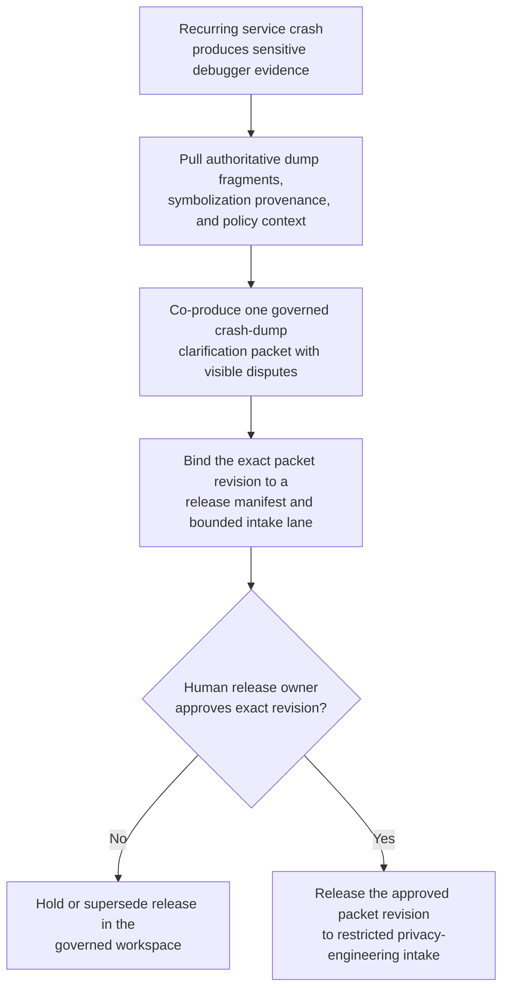
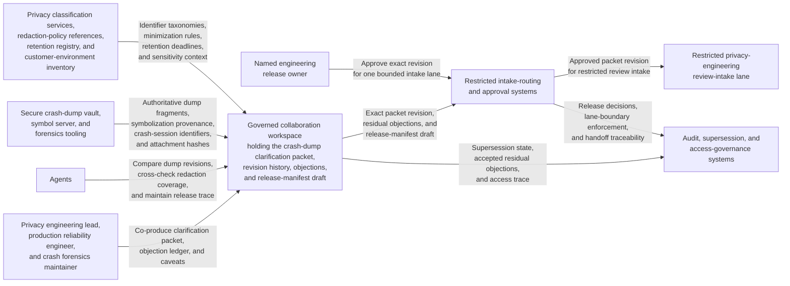

# Production crash-dump redaction clarification packet approved for restricted privacy-engineering review intake

## Linked pattern(s)

- `approval-gated-collaborative-artifact-release`

## Domain

Engineering.

## Scenario summary

A privacy engineering lead, a production reliability engineer, and a crash forensics maintainer are co-producing one governed production crash-dump redaction clarification packet because a recurring service crash in a customer-facing environment generated debugger evidence that may still expose customer identifiers, session payload fragments, and stack-local data even after the first sanitization pass. Agents help reconcile crash-dump excerpts, redaction diffs, symbolization requests, retention-policy notes, and reviewer objections into the shared packet while preserving which memory regions remain disputed, which symbolization requests exceed the approved debugging scope, which customer-identifier leakage risks stay unresolved, and which residual caveats the human artifact owner accepted explicitly. The workflow ends only when the named engineering release owner approves that exact packet revision and its release manifest for one restricted privacy-engineering review intake lane, where downstream reviewers may decide whether the packet is sufficient for formal privacy review or needs narrower evidence and fresh sanitization. It does not adjudicate the incident, enable debugger access, contact customers, share crash artifacts beyond the approved lane, or decide the downstream review outcome.

## Target systems / source systems

- Governed engineering collaboration workspace holding the production crash-dump redaction clarification packet, revision history, objection ledger, and release-manifest draft
- Secure crash-dump vault, symbol server, and forensics tooling supplying authoritative dump fragments, symbolization provenance, crash-session identifiers, and attachment hashes for the exact governed packet revision
- Privacy classification services, redaction-policy references, data-retention registry, and customer-environment inventory providing identifier taxonomies, minimization rules, retention deadlines, and environment-sensitivity context
- Restricted privacy-engineering intake-routing and approval systems defining required signers, approved reviewer audience, and the one bounded downstream review lane
- Audit, supersession, and access-governance systems preserving held-release reasons, accepted residual objections, retention-window conflicts, and downstream handoff traceability

## Why this instance matters

This grounds the pattern in engineering privacy stewardship rather than architecture exception handling, open-source license review, or deployment readiness. The reusable challenge is collaborative control of one exact crash-dump clarification artifact whose revision must be explicitly approved before it can cross into a restricted privacy-engineering review lane, while disagreement about symbolization scope, customer-identifier leakage, retention-window conflicts, debugging-evidence minimization, and dump-fragment necessity remains inspectable instead of being normalized away. The example stays inside the pattern boundary because incident adjudication, debugger enablement, customer communication, broader artifact sharing, and downstream privacy review decisions remain separate workflows. Crash-dump evidence is especially sensitive because debugging usefulness and privacy risk move together, so stale approval or hidden disagreement can broaden disclosure long before anyone decides what remediation should follow.

## Likely architecture choices

- Approval-gated execution fits because the clarification packet can be collaboration-ready while still blocked from restricted privacy-engineering intake until the human release owner approves the exact revision with its accepted residual caveats.
- Human-in-the-loop control is required because only accountable privacy and production engineering leaders may accept residual leakage risk, confirm symbolization boundaries, and authorize release of the packet itself into the bounded review lane.
- Agents may compare dump revisions, cross-check redaction coverage, flag identifier-class mismatches, refresh retention metadata, and maintain the release trace, but they must not decide whether the artifact is privacy-safe, enable debugger access, or transmit crash evidence outside the approved lane.

## Governance notes

- The release manifest should bind one exact packet revision, the named restricted privacy-engineering review-intake lane, signer identities, the covered crash-session scope, approved symbolization boundaries, included dump-fragment hashes, retention expiry state, and any residual objections the human release owner accepted explicitly.
- Disputes about customer-identifier leakage, memory-region minimization, symbolization depth, retention-window conflicts, stack-frame necessity, and attachment lineage should remain visible in the packet or boundary ledger rather than being collapsed into a single reconciled narrative before release.
- Audience scope should stay limited to the approved privacy-engineering intake lane; reuse of the packet for incident command review, debugger enablement, customer communications, vendor escalation, or wider artifact sharing should require separate downstream approval.
- If new crash evidence arrives, symbol maps change, retention deadlines shift, sanitization rules are updated, or reviewer assignments change materially during approval review, the workflow should hold release and supersede the prior packet revision rather than letting stale approval carry forward.

## Evaluation considerations

- Rate at which restricted privacy-engineering intake accepts the released packet without discovering hidden identifier leakage, stale symbolization evidence, unresolved retention conflicts, or audience-boundary mistakes
- Time required to keep one collaborative crash-dump clarification packet synchronized as dump extracts, redaction decisions, symbolization scope, retention clocks, and signer state evolve under incident pressure
- Reliability of binding between the released artifact revision, accepted residual disagreement, covered crash-session scope, and the bounded restricted privacy-engineering review-intake lane
- Frequency with which humans reject agent-assisted edits because they drifted into incident adjudication, debugger access enablement, customer communication, wider artifact sharing, or downstream review decisions
