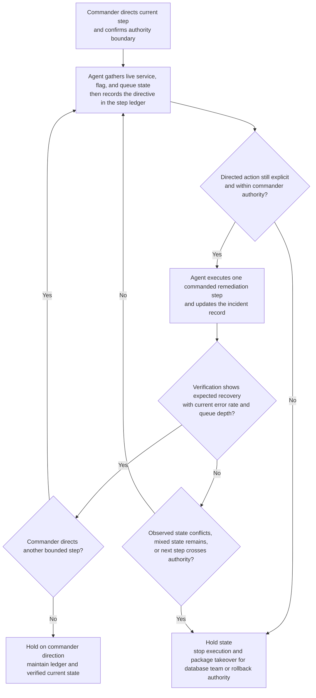

# Production incident guided remediation task orchestration

## Linked pattern(s)

- `human-directed-task-orchestration`

## Domain

Engineering.

## Scenario summary

A senior incident commander is directing live remediation for a checkout-platform outage after a bad cache invalidation sequence and stale feature-flag state start cascading request failures across two regions. The agent is allowed to execute specific remediation steps only when the commander calls them: gather the current service and flag state, disable one canary rule, drain one worker pool, restart one dependency tier, verify error-rate and queue-depth recovery, and update the incident record after each step. Because the bridge is evolving quickly and the next safe action depends on what the previous step actually changed, the workflow must preserve one authoritative step ledger, stop before improvising a new branch, and package an exact takeover state if the commander hands control to the database platform team or rollback authority.

## Target systems / source systems

- Incident command record, bridge timeline, and production-severity governance log
- Feature-flag control plane, service orchestration console, and privileged restart tooling
- Metrics, tracing, dependency-health, and rollback-readiness dashboards used to verify each directed step
- Runbook fragments, exception boundaries, and incident-role roster defining which actions remain under commander control
- Audit store holding the step ledger, tool outputs, verification snapshots, and takeover packets

## Why this instance matters

This grounds the pattern in engineering work where the value is not autonomous recovery and not predeclared staged cutover. The hard part is guided live execution: the incident commander retains control of the important branch choices while the agent handles the operational mechanics, state bookkeeping, and verification discipline that keep each step safe, fast, and resumable under pressure.

## Likely architecture choices

- A tool-using single agent can run the commanded operational actions, collect metrics, update the incident record, and maintain the current authoritative step ledger between bridge instructions.
- Human-in-the-loop control is the normal mode because the incident commander must direct significant next steps, especially before any restart, traffic shift, or rollback that could widen blast radius.
- The workflow should package takeover-ready state for database, network, or platform specialists whenever the bridge lead redirects execution to a narrower team with different authority.

## Governance notes

- The workflow should not infer a remediation branch from prior chat or runbook context; each significant action should map to an explicit current human instruction recorded in the incident ledger.
- Verification should be mandatory after each consequential step so the bridge does not queue the next action against stale assumptions about flag state, dependency health, or regional impact.
- Privileged command output, customer-impact traces, and rollback evidence should be retained in approved audit stores, with sensitive details minimized in broad incident notes.
- If observed state conflicts with the commander's expectation, if restart scope would cross the declared authority boundary, or if partial remediation leaves the system in an ambiguous mixed state, the workflow should stop and publish a takeover packet rather than guess.
- Handoff material should preserve the exact last directed step, current regional health, pending blocked actions, and any partially completed control-plane changes so successor responders do not repeat or skip remediation work.

## Evaluation considerations

- Percentage of guided remediation runs completed or safely handed off without unauthorized branch expansion or duplicate operational action
- Rate of stale metrics, contradictory state, or boundary-violating requests caught before the next commanded step executes
- Completeness of incident audit traces linking each human instruction to the tool action, verification result, and current bridge state
- Reliability of takeover packets when the incident lead transfers the procedure to a specialist team mid-remediation
