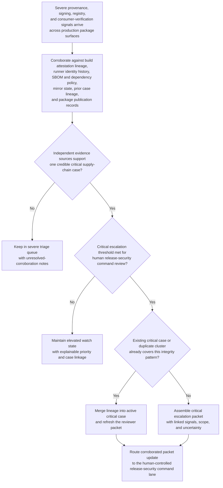
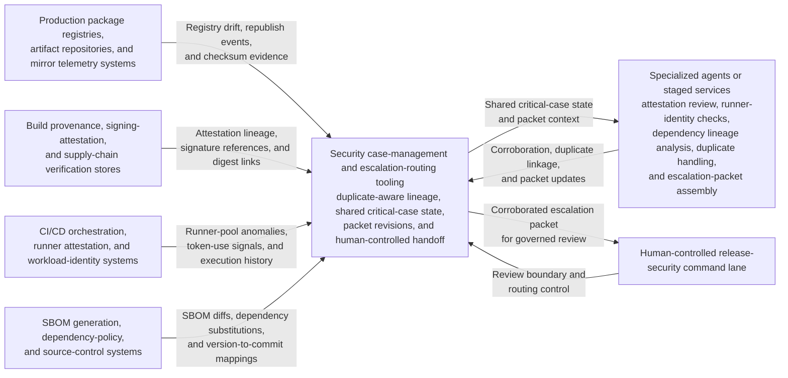

# Production package provenance tamper critical corroboration triage

## Linked pattern(s)

- `critical-signal-corroboration-triage`

## Domain

Engineering.

## Scenario summary

A platform security and release-engineering team watches for severe software supply-chain integrity signals affecting production package publication: provenance attestations that no longer match the published digest, signing-service telemetry from an unexpected workload identity or runner pool, SBOM diffs introducing undeclared dependencies, internal mirror checksum drift for the same package version, registry metadata showing an out-of-band republish, and downstream consumer verification failures tied to one release lineage. The workflow must determine whether these signals corroborate one potentially critical supply-chain tamper case, preserve duplicate-aware linkage across packages, digests, build ids, and open trust cases, assemble an escalation packet with the linked evidence and unresolved uncertainty, and route that packet into a human-controlled release-security command lane. It stops before deciding key revocation, package removal, release rollback, runner quarantine, customer notification, public disclosure, or root-cause investigation.

## Target systems / source systems

- Production package registries, internal artifact repositories, and mirror telemetry systems capturing immutable digests, republish events, replication lag, and registry metadata changes
- Build provenance, signing-attestation, and software-supply-chain verification stores holding SLSA or in-toto attestations, signature references, workflow identity claims, and digest lineage across release stages
- CI/CD orchestration, ephemeral runner-attestation, and workload-identity systems exposing unexpected runner pools, token-use anomalies, build-environment drift, and prior execution history for the affected package lineage
- SBOM generation, dependency-policy, and source-control systems showing undeclared dependency additions, package-source substitutions, exception history, and version-to-commit mappings
- Security case-management and escalation-routing tooling used to preserve duplicate-aware lineage, packet revisions, policy checks, and human-controlled handoff to release-security leadership

## Why this instance matters

This grounds the pattern in an engineering setting where the urgent problem is not one failed signature check or one stale registry surface in isolation, but a fast-moving convergence of severe integrity signals that may indicate a production software supply-chain tamper event. The instance keeps the family boundary concrete by focusing on multi-source corroboration, duplicate-aware case aggregation, escalation-packet assembly, and governed routing into human release-security review rather than on key revocation, package takedown, release rollback, compromise investigation, or disclosure execution. It also stays distinct from the repository's lower-risk publication-verification examples because the goal here is not to confirm a benign claimed state but to decide whether several independently severe signals point to one critical trust case that humans must immediately review.

## Likely architecture choices

- Event-driven monitoring fits because provenance mismatches, signing anomalies, mirror drift, dependency-policy violations, and consumer verification failures can arrive asynchronously and materially change corroboration within minutes.
- Orchestrated multi-agent or staged service roles fit because attestation review, runner-identity checks, dependency lineage analysis, duplicate handling, and escalation-packet assembly are specialized tasks that need one shared critical-case state.
- Human-in-the-loop review remains necessary because even a recommendation-only critical packet can rapidly influence consequential downstream decisions about release trust, package availability, customer communication, and containment.

## Governance notes

- The escalation packet should show which provenance, signing, registry, SBOM, runner, and consumer-verification signals were fused, what independent evidence linked them, and what uncertainty still prevents a definitive tamper conclusion.
- Duplicate handling must preserve lineage across package names, digests, build ids, runner identities, mirror regions, dependency substitutions, and active trust cases so reviewers can distinguish one expanding supply-chain event from coincidental but unrelated integrity alarms.
- Policy thresholds for critical escalation, package-scope expansion, and watch-state retention should be versioned and reviewable because overtuned logic can either miss a true trust-compromise case or flood the release-security lane with false criticals.
- Broad queue views should minimize secrets, internal repository paths, privileged runner details, and sensitive customer-consumption evidence while preserving controlled references back to the authoritative security and release records.
- The workflow must end at corroborated triage, packet assembly, and human-controlled routing rather than implying key revocation, package unpublish, release rollback, runner isolation, public disclosure, or forensic determination.

## Evaluation considerations

- Recall of historically critical package-integrity clusters that should have reached human-controlled release-security escalation
- Median time from first severe multi-source integrity signal burst to a corroborated packet ready for release-security command review
- Accuracy of duplicate merging and lineage preservation when provenance mismatches, runner anomalies, and registry drift partially overlap across adjacent package versions or mirror regions
- Reviewer agreement that the packet distinguishes genuine cross-source corroboration from coincidental co-occurrence in noisy build, registry, and dependency-policy telemetry
- Reliability of uncertainty escalation when evidence conflicts, such as strong provenance mismatch with weak runner linkage or strong consumer verification failures with sparse registry anomaly detail
