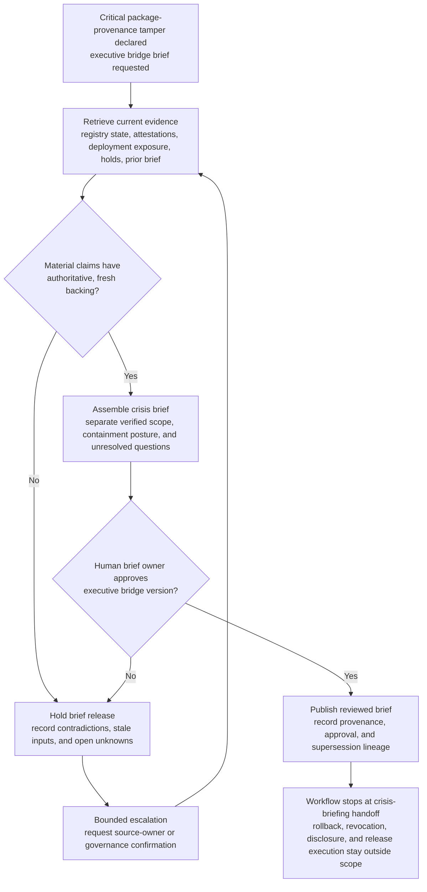

# Production package provenance tamper executive bridge crisis briefing evidence synthesis

## Linked pattern(s)

- `crisis-briefing-evidence-synthesis`

## Domain

Engineering.

## Scenario summary

Release security has already declared a critical package-provenance tamper case after corroborated evidence shows one production package lineage may have been republished or distributed with provenance that no longer matches the approved build and signing trail. Before anyone recommends rollback, revocation, customer notification, root-cause hypotheses, or release execution steps, an executive bridge needs one source-backed crisis brief that compresses verified affected artifact scope, publication and deployment exposure, attestation anomalies, current containment and release-hold posture, internal or customer release-impact posture, and unresolved unknowns. The useful output is a provenance-preserving engineering crisis brief that separates authoritative registry, attestation, deployment, and release-governance facts from lower-authority bridge commentary or stale case notes so human leaders can coordinate from one inspectable situation picture.

## Target systems / source systems

- Executive bridge workspace where reviewed crisis briefs, superseded updates, owner acknowledgements, and restricted annex links are stored
- Production package registry, internal artifact repository, and mirror telemetry systems showing published versions, immutable digests, republish history, replication state, and package withdrawal holds
- Provenance, attestation, and signing-verification stores holding build-workflow identity claims, in-toto or SLSA attestations, signature checks, and digest-to-build lineage for the affected package family
- Deployment inventory, release catalog, and environment-state systems exposing which services, clusters, or customer-delivered artifacts currently reference the suspect package versions
- Release-governance, emergency hold, and exception-tracking systems recording current publication freezes, deployment pauses, approved containment checkpoints, and blocked downstream actions
- Prior executive bridge briefs, unresolved-question tracker, and correction log used to preserve continuity, freshness, and supersession lineage across rapid updates

## Why this instance matters

This grounds the pattern in an engineering crisis where leadership needs one disciplined bridge brief about software supply-chain exposure, not another corroboration pass or a protected packet for deciding who owns the response. Severe provenance tamper events quickly create conflicting narratives across registries, attestation stores, deployment inventories, and release-hold records, while downstream choices about rollback, disclosure, or revocation remain outside this workflow. The instance shows why a bounded crisis-briefing synthesis pattern matters after declaration: executives need fast cross-source compression with explicit provenance, freshness, and open questions before they steer human-led containment and communication work elsewhere.

## Likely architecture choices

- An orchestrated multi-agent workflow can separate artifact-scope retrieval, attestation and provenance verification, deployment-exposure assembly, and final bridge-brief composition while maintaining one shared crisis-state ledger.
- Human-in-the-loop review should remain mandatory for each executive bridge brief because affected-package scope, deployment-exposure wording, and containment-posture statements can materially influence downstream release, trust, and customer decisions.
- The workflow should preserve claim-level provenance and freshness markers that distinguish authoritative registry and attestation evidence, approved release-governance state, and lower-authority bridge observations awaiting confirmation.
- Retrieval should stay inside approved release-security, registry, deployment, and governance systems, and the synthesis should stop at reviewer-approved briefing handoff rather than recommending revocation, rollback, package removal, root-cause explanation, or external communication.

## Governance notes

- Authoritative registry digests, attestation verification results, deployment inventory records, and approved release-hold updates should outrank copied chat excerpts, ad hoc spreadsheets, or speculative engineering commentary when sources disagree.
- Each briefing revision should name the current human brief owner, show the source timestamp for every material exposure or containment claim, and preserve supersession links so bridge participants can see exactly what changed since the prior brief.
- Customer names, internal repository paths, privileged runner details, and sensitive signing-environment evidence should be minimized in the broad brief, with restricted annex references used only for narrowly scoped reviewers.
- Open questions such as uncertain downstream package inheritance, incomplete mirror withdrawal state, unresolved attestation gaps, or unverified customer artifact consumption should remain explicit instead of being flattened into confident blast-radius or containment claims.
- The workflow must end at reviewed crisis-briefing handoff and evidence-gap visibility, not drift into authority selection, recommendation drafting, release execution, revocation sequencing, protected packet maintenance, or forensic causality claims.

## Evaluation considerations

- Median time from declared package-provenance tamper case to reviewer-approved executive bridge brief with complete provenance, freshness, and supersession trace
- Percentage of material artifact-scope, publication-exposure, deployment-exposure, attestation-anomaly, and containment-posture statements backed by inspectable authoritative sources
- Reviewer correction rate for source-precedence handling, stale exposure reuse, or open-question visibility across successive executive bridge briefs
- Rate at which unresolved customer-release-impact, mirror-withdrawal completeness, or attestation-lineage ambiguity is surfaced explicitly before downstream release, disclosure, or containment decisions are made
