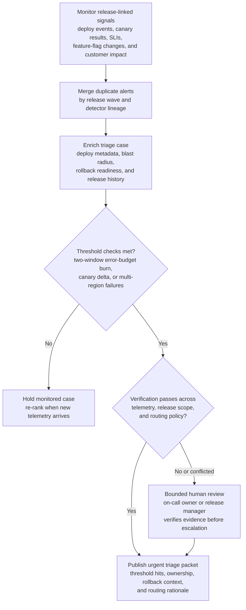

# Production release regression alert triage

## Linked pattern(s)

- `risk-alert-triage`

## Domain

Engineering.

## Scenario summary

A platform reliability team continuously watches deployment events, canary analysis results, service-level indicators, feature-flag changes, and customer-impact signals to detect risky production regressions shortly after a release lands. The workflow must collapse duplicate alerts tied to the same release wave, enrich each alert with deploy metadata, blast-radius estimates, rollback readiness, and prior release history, and then prioritize which cases need immediate human review. A case should move to the urgent queue when, for example, a release shows error-budget burn above the defined threshold for two consecutive evaluation windows, p95 latency degradation beyond the allowed canary delta for a tier-one service, or concurrent authentication and checkout failures across more than one region. The goal is to create an evidence-backed triage packet for the on-call engineering owner, release manager, or incident lead, not to decide root cause, execute rollback, or declare an incident automatically.

## Target systems / source systems

- CI/CD and deployment-control systems with release ids, rollout stages, approver records, feature-flag changes, and rollback artifacts
- Observability platforms carrying service-level indicators, canary-comparison outputs, trace summaries, error-rate changes, saturation metrics, and alert history
- Service catalog and dependency graph with criticality tiers, owning teams, downstream dependencies, customer-impact profiles, and maintenance windows
- Change-management and incident-management systems with prior release exceptions, active incidents, suppression windows, and escalation paths
- Support and status-signal feeds showing correlated customer complaints, synthetic-check failures, and region-specific degradation indicators
- Audit and evidence stores preserving raw alert lineage, deduplication decisions, threshold versions, routing rationale, and human escalation approvals

## Why this instance matters

This grounds `risk-alert-triage` in engineering operations where the hard problem is not discovering one bad metric in isolation, but continuously deciding which release-linked alert clusters deserve rapid human attention before the signal stream becomes noisy. A weak workflow would either flood responders with duplicate detector output from the same rollout or under-rank the one regression pattern that threatens a broad customer-facing service. The instance stays inside monitor/detect/triage because the agentic work is continuous watching, de-duplication, enrichment, prioritization, and escalation packaging, while rollback approval, root-cause investigation, incident command, and customer communication remain downstream human-controlled work.

## Likely architecture choices

- Event-driven monitoring should continuously score deployment and telemetry events, then reopen, merge, or re-rank alert clusters as rollout stages progress and new evidence arrives.
- A tool-using single agent can correlate deploy metadata with SLI regressions, suppress duplicate detector chatter from the same release, attach ownership and rollback context, and publish a prioritized queue with explicit threshold hits.
- Human-in-the-loop review should remain mandatory for alerts that could trigger rollback, feature disablement, incident declaration, or customer-facing status changes.
- Approval-gated escalation is the right boundary because the workflow can recommend urgent routing to a release manager, service owner, or incident commander, but it should not independently halt rollout waves or commit to external impact statements.

## Governance notes

- Triage packets should show which thresholds fired, which raw alerts were merged, what deployment or feature changes were in scope, and why the case entered a given severity band.
- Threshold, suppression, and routing-policy changes should be versioned and reviewed because tuning decisions directly affect false-negative risk during production changes.
- Reversibility should be explicit: queue ordering, merge decisions, and severity labels can be recalculated as more telemetry arrives, but a delayed human review window during an active regression may make customer impact harder to reverse.
- Privacy and security controls should minimize exposure of request payload fragments, customer identifiers, secrets, and privileged infrastructure details in broad queue views while retaining traceable evidence in restricted engineering systems.
- Manual approvals should remain required before rollback, feature-flag shutdown, traffic shifting, public status updates, or formal incident escalation, and overrides should be immutably logged for later audit.

## Evaluation considerations

- Recall of historically material release regressions that should have reached rapid human review
- Reduction in duplicate responder work from merged release-linked alert clusters without lowering capture of true customer-impacting regressions
- Median time from first relevant deployment or telemetry signal to a triage packet containing threshold evidence, blast-radius context, and routing rationale
- Reviewer override rate for alerts that were over-ranked because of noisy canary output or under-ranked because cross-service dependency impact was missed
- Auditability of suppression, merge, threshold-version, and escalation decisions during post-incident review, release-governance review, or control testing
