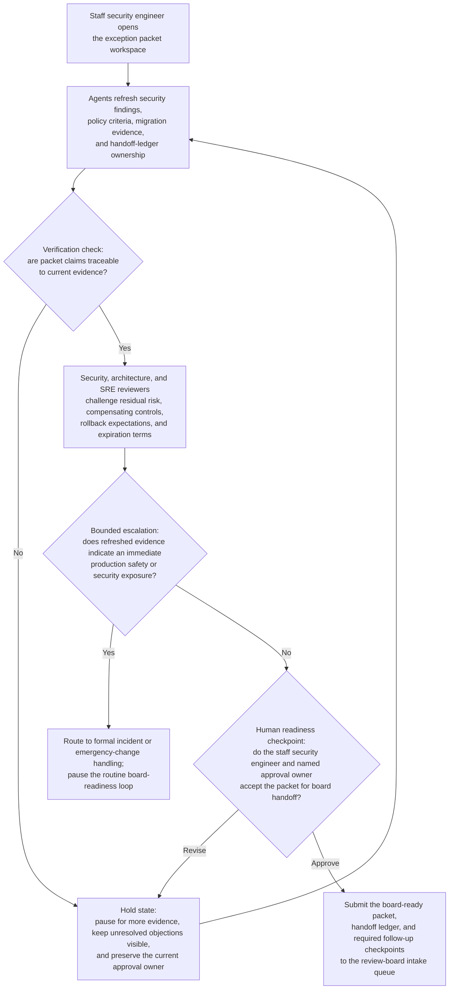
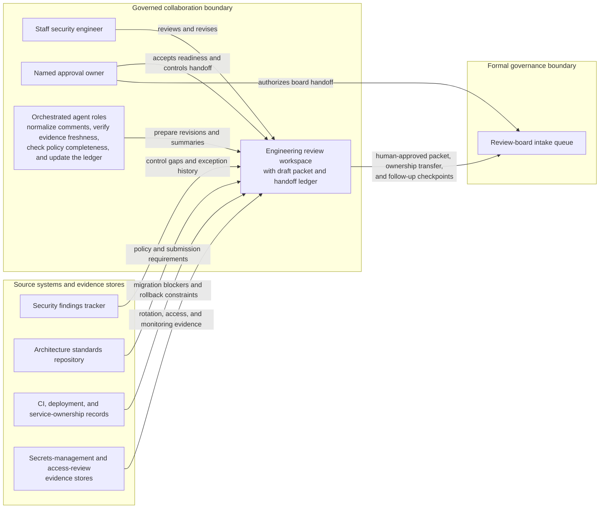

# Production shared credential exception review-board readiness loop

## Linked pattern(s)

- `approval-centered-collaboration`

## Domain

Engineering.

## Scenario summary

A staff security engineer is coordinating a formal exception package because a revenue-critical integration service still relies on a shared production credential in a legacy broker path that cannot be fully replaced before the next platform hardening milestone. The engineer uses an approval-centered collaboration workspace with agent support to iteratively reconcile security findings, architecture-review objections, SRE rollback expectations, and evidence about the migration plan into a board-ready exception packet. As reviewers push back on residual-risk language, compensating-control sufficiency, expiration dates, and evidence quality, the agents help refresh source material, preserve unresolved objections, rewrite sections with claim-to-source traceability, and maintain an explicit handoff ledger showing who currently owns the next approval checkpoint. The human security engineer and designated approval owner remain responsible for deciding whether the packet is actually ready for review-board handoff, whether any objection is acceptable to carry forward, and whether the request should pause for more evidence instead of moving into formal adjudication.

## Target systems / source systems

- Governed engineering review workspace with the draft exception packet, reviewer comments, approval-readiness status, and handoff ledger
- Security findings tracker with open control gaps, exception-history records, and compensating-control reviews
- Architecture standards repository with credential-management policy, exception criteria, and review-board submission requirements
- CI, deployment, and service-ownership records showing migration blockers, rollback constraints, and dependency timelines
- Secrets-management and access-review evidence stores containing rotation history, access scope, and monitoring coverage
- Review-board intake queue where the final human-approved package, ownership transfer, and required follow-up checkpoints are recorded

## Why this instance matters

This grounds the pattern in an engineering workflow where the core challenge is not drafting an exception memo once, but repeatedly negotiating whether the package is approval-ready as security, architecture, and reliability reviewers raise bounded objections. The instance stays on the collaboration boundary: agents help preserve reviewer dissent, refresh evidence, and clarify handoff readiness, but they do not decide whether the board should grant the exception or execute any remediation. It highlights why explicit ownership, objection visibility, and evidence negotiation matter when a polished packet could otherwise imply more consensus or control maturity than the record supports.

## Likely architecture choices

- Human-in-the-loop collaboration should remain primary because residual-risk acceptance, compensating-control credibility, and board-readiness handoff require named engineering and security ownership.
- An orchestrated multi-agent setup fits well when separate agent roles normalize reviewer comments, verify evidence freshness, check policy completeness, and update the shared handoff ledger without collapsing disagreement.
- Agents may prepare revised packet sections, evidence-response tables, and readiness summaries, but routing the package into formal board review or changing the final approval owner should remain explicitly human-controlled.

## Governance notes

- The shared artifact should distinguish raw security findings, quoted policy requirements, reviewer objections, agent-drafted revision proposals, and human-accepted packet language so the next approver can inspect where interpretation entered the record.
- Every material readiness claim should link to inspectable evidence such as control-review tickets, rotation logs, migration-plan milestones, rollback test records, or architecture-standard sections; unsupported or stale assertions should block the readiness recommendation.
- Reviewer objections about expiration date, blast radius, monitoring sufficiency, or rollback feasibility should remain visible in the packet and handoff ledger unless a human reviewer explicitly accepts the residual risk for board presentation.
- The handoff ledger should name the current approval owner, required pre-board reviewers, unresolved blockers, and the exact condition that must be met before the packet is handed to the review board, preventing silent progression on an incomplete record.
- If refreshed evidence suggests the shared credential creates an immediate production safety or security exposure, the workflow should branch into formal incident or emergency change handling instead of continuing a routine approval-readiness loop.

## Evaluation considerations

- Time to produce an internal-review-ready exception packet that preserves reviewer objections, evidence lineage, and explicit ownership of the next approval handoff
- Reviewer correction rate for sections where agent-assisted revisions overstated control effectiveness, minimized unresolved objections, or implied board-readiness before required evidence was complete
- Reliability of the handoff ledger, including whether approval owner, pending reviewers, blocked issues, and accepted residual risks stay synchronized with the latest packet revision
- Frequency with which formal board intake rejects or bounces the packet due to hidden disagreement, stale evidence, or unclear ownership after the collaboration loop said it was ready
