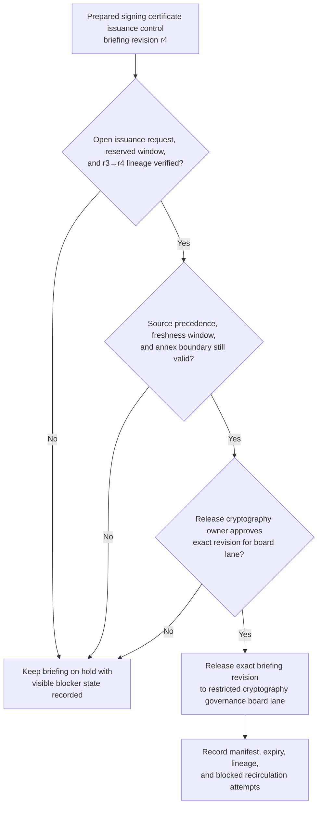
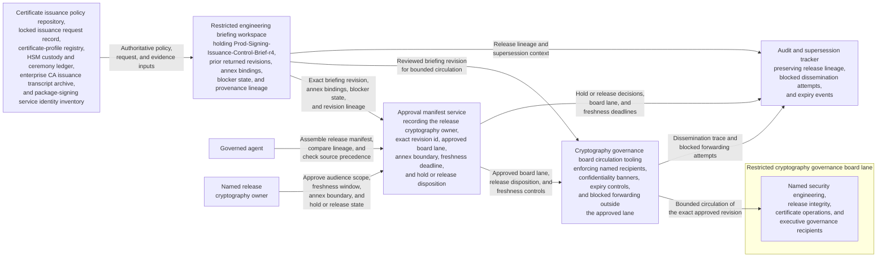

# Production signing certificate issuance control briefing revision approved for cryptography governance board circulation

## Linked pattern(s)

- `approval-gated-briefing-release`

## Domain

Engineering.

## Scenario summary

An engineering cryptography-governance workflow has already synthesized one revision of a production signing certificate issuance control briefing, `Prod-Signing-Issuance-Control-Brief-r4`, after a planned renewal for the package-signing service surfaced conflicting certificate-profile bindings, incomplete HSM quorum-custody attestations, unresolved subject-alt-name scope caveats, and a delayed intermediate-chain publication acknowledgment. The release review uses explicit source precedence: certificate issuance policy `PKI-ISS-09` and the locked issuance request record with CSR fingerprint `csr-prod-sign-2026-03-r2` outrank the production certificate-profile registry, HSM custody and ceremony ledger, enterprise CA issuance transcript, package-signing service identity inventory, and prior approved briefing revisions, which in turn outrank reviewer annotations and working notes already cited in the prepared briefing revision. Prerequisite state requires the issuance request to remain open, the replacement window to remain reserved, the restricted cryptography governance board lane to be provisioned, and the returned `r3` lineage to be linked before circulation can proceed. Visible blockers include a stale quorum-attestation timestamp for one custody token set, an unresolved SAN scope mismatch for the artifact notarization endpoint, a missing acknowledgment that the new intermediate chain has been published to the release-verification mirror, and an unsigned CA transcript seal for one recovery-region issuance event. Before that exact revision is circulated into the restricted cryptography governance board lane, a named release cryptography owner must approve the audience scope, freshness window, annex boundary, and hold-versus-release state so board readers receive the reviewed control briefing rather than a stale draft, a broadened copy, or a version with broken lineage. The workflow stops at governed release of that briefing revision; it does not approve certificate issuance, activate new signing material, rotate keys, schedule a ceremony, authorize artifact publication, or execute downstream release actions.

## Target systems / source systems

- Restricted engineering briefing workspace storing `Prod-Signing-Issuance-Control-Brief-r4`, prior returned revisions, annex bindings, blocker state, and provenance lineage
- Certificate issuance policy repository, locked issuance request record, production certificate-profile registry, HSM custody and ceremony ledger, enterprise CA issuance transcript archive, and package-signing service identity inventory already cited by the prepared briefing revision
- Cryptography governance board circulation tooling enforcing named security engineering, release integrity, certificate operations, and executive governance recipients, confidentiality banners, expiry controls, and blocked forwarding outside the approved lane
- Approval manifest service recording the release cryptography owner, exact revision id, approved board lane, annex boundary, freshness deadline, and explicit hold or release disposition
- Audit and supersession tracker preserving release lineage, blocked dissemination attempts, and expiry events when a newer custody attestation, certificate-profile correction, or CA transcript seal appears before circulation

## Why this instance matters

This grounds the pattern in engineering with a cryptography-governance scenario that is materially distinct from launch-risk and rollback-readiness briefings while preserving the same release-control boundary. Production signing certificate issuance briefings often gather high-consequence control context that changes when one custody attestation, SAN binding, or trust-chain publication step moves by even one revision. The example shows that the hard governance step is approving bounded circulation of one already-synthesized briefing revision into a restricted technical governance lane, not deciding issuance, trust acceptance, or any downstream release action.

## Likely architecture choices

- Approval-gated execution fits because the issuance control briefing remains held until the release cryptography owner approves one exact revision for the restricted cryptography governance board lane.
- Human-in-the-loop review is necessary because only accountable engineering leadership should accept residual custody and trust-chain caveats, confirm annex scope, and authorize circulation of sensitive production certificate context.
- A governed agent can assemble the release manifest, compare lineage, enforce source precedence checks, and block stale reuse or forwarding, but it should not approve issuance, resolve certificate-profile disputes, trigger PKI changes, or launch downstream signing or release workflows.

## Governance notes

- Approval should bind to one immutable briefing revision, one named cryptography governance board lane, one freshness deadline, one explicit annex boundary, and the declared source-precedence stack so later edits or detached notes cannot inherit permission silently.
- The released brief should preserve unresolved quorum-attestation drift, SAN scope uncertainty, intermediate-chain publication gaps, and missing CA transcript seal state rather than smoothing them into a false issuance-ready narrative.
- If a new custody attestation, certificate-profile correction, intermediate-publication acknowledgment, or CA transcript seal appears during approval review, the pending revision should remain on hold and be superseded rather than circulated under stale approval.
- Audit records should preserve the released or held revision id, approver identity, board-recipient scope, expiry timing, blocker state, lineage from `r3` to `r4`, and any blocked forwarding attempts to broader platform engineering, certificate operations, PKI operations, or release delivery teams.
- Named owner accountability sits with Rohan Iyer, Director of Release Cryptography Governance, for release integrity, revision lineage, and bounded visibility rather than certificate issuance approval, ceremony execution, key activation, or downstream release authorization.

## Evaluation considerations

- Percentage of cryptography governance board circulations where the released briefing revision id, annex boundary, source-precedence metadata, and manifest state align exactly without later correction
- Rate at which stale, superseded, expired, or out-of-scope signing certificate issuance control briefings are blocked before board visibility
- Time required to move from briefing-ready status to approved bounded circulation when issuance request state, custody evidence, and lineage are already complete
- Reviewer correction rate for missing blockers, wrong audience scope, broken lineage, or blocked-forwarding failures after the board receives the released briefing
