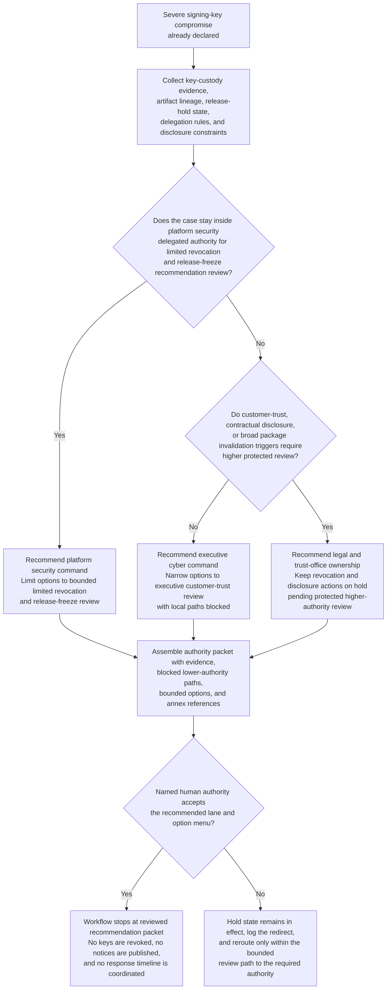
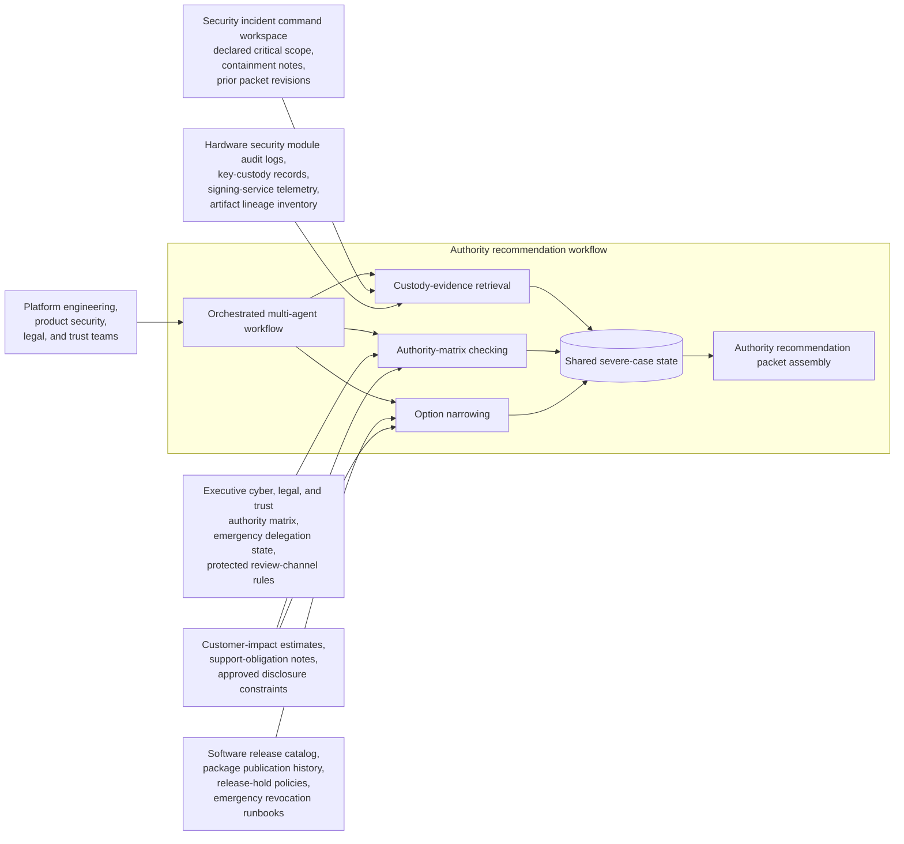

# Production signing-key compromise authority recommendation

## Linked pattern(s)

- `critical-escalation-authority-recommendation`

## Domain

Engineering.

## Scenario summary

Security leadership has already declared a severe incident after evidence suggests the production artifact-signing key used for desktop agents and internal service packages may have been exposed outside the approved hardware boundary. Platform engineering, product security, legal, and trust teams now need a governed recommendation about which human authority should decide the next step: limited revocation and release freeze inside platform security command, escalation to executive cyber command for customer-trust review, or immediate legal and trust-office ownership because contractual disclosure and broad package invalidation may be implicated. The workflow must narrow the decision-ready option set and assemble the authority packet without revoking keys, publishing notices, or coordinating the response timeline itself.

## Target systems / source systems

- Security incident command workspace with the declared critical scope, current containment notes, and prior packet revisions
- Hardware security module audit logs, key-custody records, signing-service telemetry, and artifact lineage inventory
- Software release catalog, package publication history, release-hold policies, and emergency revocation runbooks
- Executive cyber, legal, and trust authority matrix with emergency delegation state and protected review-channel rules
- Customer-impact estimates, support-obligation notes, and approved disclosure constraints for affected products

## Why this instance matters

This grounds the critical recommendation pattern in engineering without drifting into incident briefing, command-window coordination, or key-rotation execution. The hard problem is deciding who must own the severe choice and what bounded options they should see when customer trust, release integrity, and disclosure irreversibility all matter more than local technical preference.

## Likely architecture choices

- An orchestrated multi-agent workflow can separate custody-evidence retrieval, authority-matrix checking, option narrowing, and packet assembly while preserving one shared severe-case state.
- Human-in-the-loop review is mandatory because the workflow should recommend the correct decision owner and bounded option set, not revoke the key, freeze release systems, or authorize customer communication.
- Human-directed autonomy fits because executive cyber, legal, and trust leaders must explicitly accept the authority lane before any irreversible revocation or disclosure action is considered.

## Governance notes

- The output should distinguish viable authority lanes, blocked lower-authority paths, and option sets that remain inside versus outside the current delegated review boundary.
- Any narrowed option set should preserve reversibility notes about artifact invalidation, customer notification, and release-freeze scope instead of collapsing them into a single preferred technical action.
- Sensitive key-custody evidence, product exposure detail, and disclosure constraints should remain inside approved security and trust review channels, with broader packets limited to the minimum needed for authority selection.
- Recommendation packets should preserve evidence lineage, delegation state, legal constraints, and human redirects so later review can reconstruct why one authority path was chosen.

## Evaluation considerations

- Time from severe compromise declaration to a reviewed packet naming the correct human authority and bounded decision options
- Reviewer agreement that blocked lower-authority paths and irreversibility constraints were surfaced before any revocation or disclosure step
- Quality of evidence linking key custody, artifact lineage, customer impact, and delegation rules to the authority recommendation
- Stability of the recommended authority lane when new custody evidence or disclosure constraints arrive during the critical window
