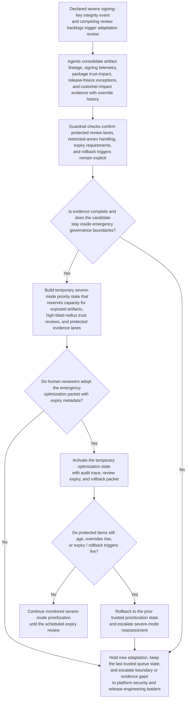
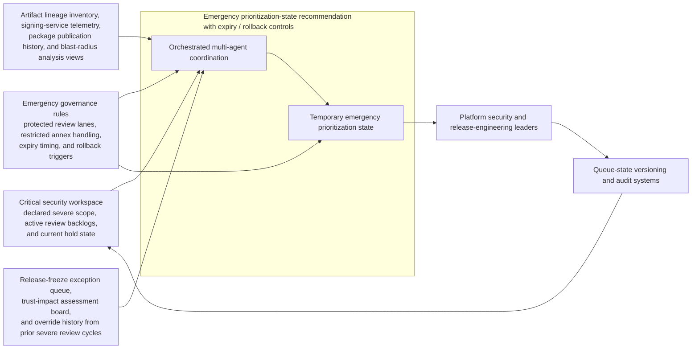

# Production signing-key integrity review priority adaptation

## Linked pattern(s)

- `critical-protected-priority-adaptation`

## Domain

Engineering.

## Scenario summary

Security leadership has already declared a severe software-integrity event after evidence suggests the production artifact-signing key may have been exposed outside the approved hardware boundary. Several existing review surfaces are now competing for the same limited specialist capacity: artifact lineage inspection, package trust-impact review, release-freeze exception review, and customer-impact evidence validation. Normal review ordering keeps surfacing locally noisy build issues and lower-risk package checks while exposed-platform artifacts, high-blast-radius trust assessments, and restricted-annex evidence reviews are being pulled forward manually. The workflow must recommend a temporary emergency optimization state that protects the highest-consequence integrity review lanes, adds explicit expiry and rollback controls, and improves scarce-reviewer allocation without selecting the decision authority, sequencing the incident command timeline, revoking keys, or publishing any customer communication.

## Target systems / source systems

- Critical security workspace with the declared severe scope, active review backlogs, and current hold state
- Artifact lineage inventory, signing-service telemetry, package publication history, and blast-radius analysis views
- Release-freeze exception queue, trust-impact assessment board, and override history from prior severe review cycles
- Emergency governance rules covering protected review lanes, restricted annex handling, expiry timing, and rollback triggers
- Queue-state versioning and audit systems used by platform security and release-engineering leaders to adopt or revert temporary prioritization logic

## Why this instance matters

This grounds the pattern in engineering without drifting into authority recommendation, command-window resequencing, or live remediation. The hard problem is how to adapt existing review and routing logic during a severe integrity event so exposed artifacts, high-trust-impact evidence, and protected review channels keep priority when specialist capacity is scarce. The workflow remains in optimize/adapt territory because it ends at a human-adopted temporary optimization state with expiry and rollback metadata rather than operational action.

## Likely architecture choices

- Orchestrated multi-agent coordination fits because separate roles can analyze override clusters, validate protected review classes, simulate severe-mode queue states, and package rollback controls over one shared critical-case state.
- Human-in-the-loop review is mandatory because platform security and release-engineering leaders must explicitly adopt, extend, or reject the emergency prioritization state before it influences live queues.
- Human-directed autonomy keeps the boundary clean: the workflow can recommend protected-lane capacity reservations and temporary urgency weights, but it must not revoke keys, freeze releases, or choose the incident authority lane.

## Governance notes

- Exposed signing-artifact review, restricted trust-impact evidence, and blast-radius analysis should remain protected lanes that ordinary severe-mode tuning cannot weaken for convenience.
- Every adaptation package should show which lower-noise review items are temporarily deferred and why that trade-off remains acceptable during the severe window.
- Auditability should preserve the baseline and candidate severe-mode states, override clusters, expiry reviews, extension decisions, and rollback triggers for later security and trust review.
- Sensitive artifact, customer-impact, and custody evidence should remain in restricted annexes when the main adaptation packet can justify priority protection without broad raw-detail exposure.
- The workflow must not select the deciding authority, plan the response sequence, or trigger remediation; it only recommends temporary optimization-state changes for existing review surfaces.

## Evaluation considerations

- Reduction in manual overrides and aging for exposed-artifact, trust-impact, and protected-review items after the temporary state is adopted
- Speed from severe event declaration to a reviewed adaptation packet with explicit expiry and rollback controls
- Rate at which emergency tuning expires or rolls back on schedule instead of persisting as an unreviewed baseline
- Evidence that lower-visibility but protected integrity-review work remains surfaced even when louder local failures continue entering the queues
