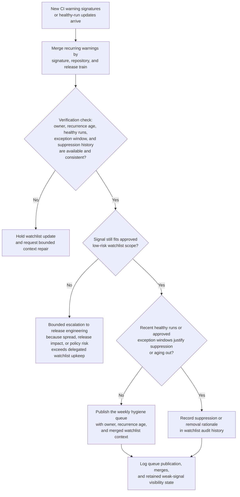

# Recurring CI warning watchlist upkeep

## Linked pattern(s)

- `explainable-watchlist-maintenance`

## Domain

Engineering.

## Scenario summary

A release-engineering team monitors recurring non-blocking CI warning signatures across internal services, SDKs, and build pipelines: deprecated compiler flags, flaky-but-retryable integration checks, stale dependency notices, and repeated packaging warnings that do not yet block releases or warrant incident review. The workflow must collapse duplicate warning signatures by repository and release train, enrich each watchlist item with owner, recurrence age, recent healthy runs, known exception windows, and prior suppression history, and then publish a routine release-hygiene queue for weekly owner attention. The goal is to keep persistent weak signals visible long enough for engineering teams to clean them up before they harden into outages, broken releases, or review debt, not to declare incidents, change build policy, or trigger remediation automatically.

## Target systems / source systems

- CI and build-observability systems with warning signatures, retry history, run outcomes, and release-train labels
- Repository ownership catalogs, dependency metadata, and approved deprecation exception registers
- Release-engineering hygiene board or backlog used for weekly cleanup review
- Searchable audit store preserving watchlist merges, suppressions, removals, and queue publication history
- Policy configuration source defining which warning classes may remain in low-risk watchlist scope and when they must escalate

## Why this instance matters

This grounds `explainable-watchlist-maintenance` in engineering work where many recurring signals are too weak for anomaly review or alert triage but still worth keeping visible. Teams often oscillate between ignoring harmless-looking warnings and overreacting to every repeat event, creating either silent decay or noisy busywork. The instance stays inside monitor/detect/triage because the agentic work is continuous watchlist upkeep, bounded suppression, recurrence tracking, and low-urgency queueing rather than root-cause investigation, release gating, or automated remediation.

## Likely architecture choices

- Event-driven monitoring fits because watchlist state should refresh whenever new CI runs emit recurring warning signatures or healthy runs show that a stale item can age out.
- A tool-using single agent can correlate warning signatures across repositories, check release-train context and approved exception windows, and maintain one explainable hygiene watchlist.
- Exception-gated autonomy is appropriate because routine low-stakes watchlist updates can happen automatically, while cross-repository spread, protected release windows, or signals that start affecting blocking checks should escalate out of delegated scope.
- Downstream decisions such as changing release policy, suppressing a warning class permanently, opening an incident, or assigning remediation commitments should remain human-owned workflows.

## Governance notes

- Watchlist entries should distinguish routine weak-signal recurrence from signals that now affect release safety, compliance controls, or customer-impacting systems so low-risk upkeep does not hide meaningful escalation needs.
- Repository names, branch metadata, and internal dependency details should be limited to the minimum necessary for owner routing and auditability in shared hygiene views.
- Reversibility should remain explicit: watchlist entries, merges, and suppressions can be recomputed from run history, but missed escalation of a repeatedly worsening warning pattern may be only partially recoverable once a release window closes.
- Audit logs should retain warning signatures, recurrence thresholds, suppression rationale, manual overrides, and queue publication history so release-engineering leads can review whether the watchlist is surfacing the right weak signals.

## Evaluation considerations

- Percentage of recurring CI warning patterns that remain visible long enough for weekly cleanup without generating incident-style alert fatigue
- Reduction in duplicate hygiene items through merged warning-signature watchlist entries without hiding meaningful cross-repository spread
- Median time from a recurring warning pattern emerging to an explainable watchlist item with owner, age, and suppression context
- Rate at which watchlist items that later became blocking or release-relevant were escalated before they aged out invisibly
- Trust of release-engineering owners in the watchlist, measured through manual override and stale-item removal rates
