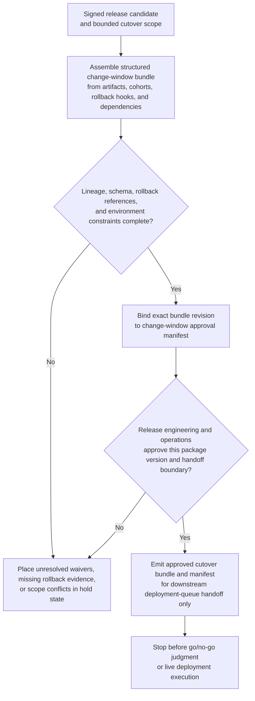

# Release candidate cutover bundle approved for change-window handoff

## Linked pattern(s)

- `approval-gated-transformation-release`

## Domain

Engineering.

## Scenario summary

Release engineering has a signed release candidate for a payments platform update, but the downstream deployment workflow expects one controlled cutover bundle rather than raw artifacts scattered across CI, change management, feature-flag tooling, and rollback documentation. The transformation workflow collects the authoritative release assets, rollout cohort definitions, rollback hooks, dependency manifests, environment constraints, and hold-state placeholders into a structured change-window package, then binds that package to an approval manifest that specifies the exact deployment queue and time window it may enter. The workflow must stop once the transformed bundle and manifest are approved for downstream handoff, without issuing the go/no-go judgment itself or performing the actual deployment.

## Target systems / source systems

- Artifact registry, provenance store, and CI systems containing the signed release assets and dependency manifests
- Change-management, rollout-planning, feature-flag, and rollback-reference systems defining the bounded cutover scope
- Release-package staging store and manifest service used to assemble the structured change-window bundle
- Approval tooling used by release engineering and operations reviewers to sign the exact package version and downstream handoff boundary
- Hold and exception queue for unresolved dependency waivers, missing rollback references, or scope conflicts before any deployment workflow receives the package

## Why this instance matters

This grounds the pattern in engineering work where the value lies in transforming a sprawling release-preparation state into one downstream-ready operational package with explicit approval lineage. Teams often need a governed package that deployment tooling and reviewers can trust without reopening every underlying system, yet that package is still only a prerequisite for later verification or execution steps. The instance shows how transform-process can own the release-bound representation and manifest without drifting into release recommendation, readiness verification, or live cutover action.

## Likely architecture choices

- Approval-gated execution fits because the transformed cutover bundle is technically ready but cannot cross into the deployment queue until the manifest is explicitly signed for one change window.
- Human reviewers should remain in the normal loop to confirm held dependencies, rollback completeness, and the exact downstream handoff boundary before the bundle is marked approved.
- The workflow should emit only the structured cutover package, lineage trace, hold register, and approval manifest rather than a readiness verdict, deployment command, or rollback execution.
- Approved rendering rules may normalize component names, cohort identifiers, and environment labels, but unsupported inference about runtime safety or business priority should remain outside the package.

## Governance notes

- Every consequential field, especially artifact version, deployment cohort, rollback pointer, dependency waiver, and environment scope, should retain lineage to authoritative release systems and the package version that was approved.
- The manifest should bind approval to one exact bundle revision and one deployment queue boundary so later changes to the package cannot inherit stale approval implicitly.
- The workflow should hold fields when rollback evidence is missing, an artifact supersession is unresolved, or deployment scope drifts during package review.
- Release engineering and operations owners must approve any schema or hold-rule changes; this workflow ends before release readiness adjudication or deployment execution.

## Evaluation considerations

- Percentage of approved change-window bundles accepted by downstream deployment-preparation workflows without reopening raw release systems
- Rate of post-approval corrections caused by bundle-version drift, hidden holds, or incomplete lineage
- Quality of manifest binding between the approved package version, signer set, and downstream queue boundary
- Reliability of package supersession behavior when artifacts are rebuilt, rollout cohorts change, or one held dependency waiver is resolved late
