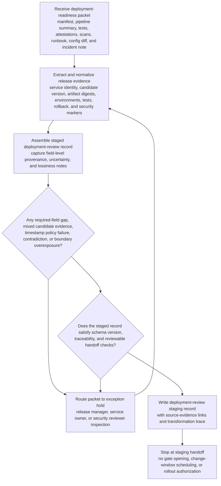
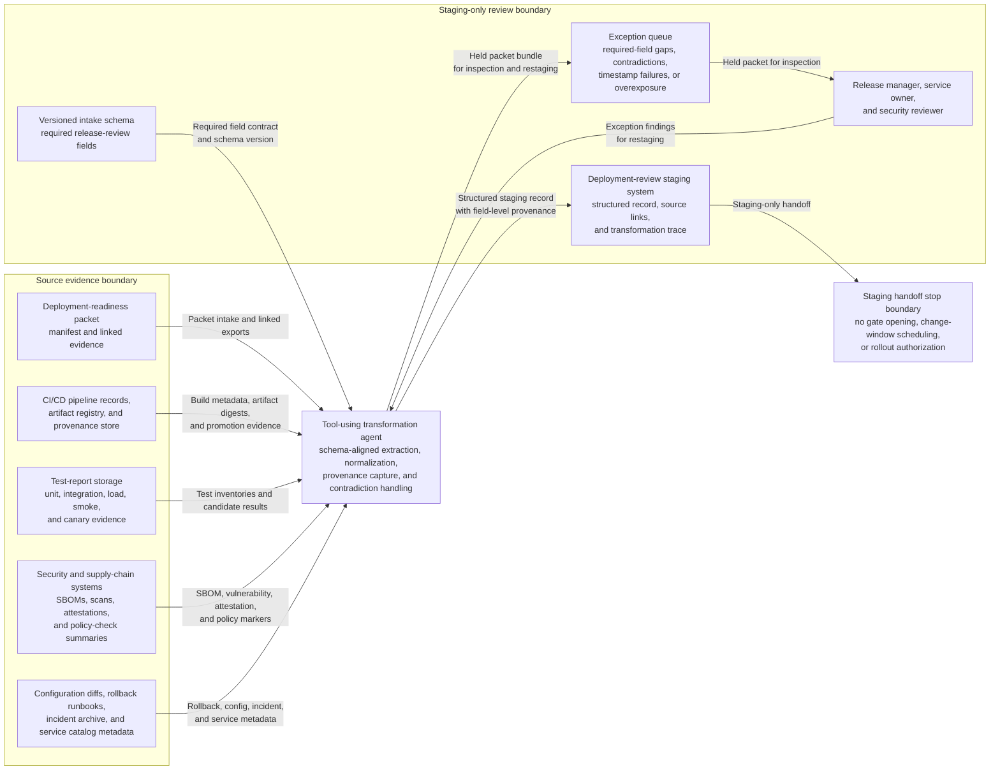

# Release candidate evidence packet to deployment review staging record handoff

## Linked pattern(s)

- `document-to-structured-data-handoff`

## Domain

Engineering.

## Scenario summary

A release engineering team receives a deployment-readiness packet for a customer-facing billing service that is scheduled to enter the organization’s governed production-review queue. The packet combines the release manifest, CI pipeline summary, integration and canary test exports, artifact provenance attestations, SBOM and vulnerability-scan results, rollback runbook excerpts, environment-specific configuration diff summaries, and a sanitized incident-history note covering the service’s last failed rollout. Before any approver opens a release gate, schedules a change window, or authorizes rollout, the workflow must transform that heterogeneous packet into a structured deployment-review staging record with required fields for service and repository identity, release candidate version, build and artifact digests, target environment set, test-result inventory, dependency-change flags, rollback artifact status, security-review markers, exception flags, and source-evidence links while preserving contradictions, missing evidence, and low-confidence mappings.

## Target systems / source systems

- Release-governance or deployment-review staging system with a versioned intake schema for production-bound release candidates
- CI/CD pipeline records, artifact registry, provenance-attestation store, and release-manifest repository holding build outputs and promotion metadata
- Test-report storage for unit, integration, load, smoke, and canary evidence attached to the candidate packet
- Security and supply-chain systems providing SBOM snapshots, vulnerability scan outputs, signed artifact attestations, and policy-check summaries
- Configuration-diff summaries, rollback runbooks, incident review archive, and service catalog metadata used for normalization and provenance only
- Exception queue for release manager, service owner, or security reviewer inspection before the staged record can enter any approval or scheduling workflow

## Why this instance matters

This grounds the transform pattern in an engineering workflow where the useful deliverable is a trustworthy staged release-review record rather than a deployment decision, risk recommendation, or automated promotion. Real release packets are assembled from CI systems, artifact stores, test dashboards, security tools, and human-authored notes that do not share one schema or one authority level. Downstream reviewers need a consistent, provenance-rich record they can inspect quickly without rereading raw exports, while still seeing which required release facts are missing, contradictory, or too lossy to trust. The instance shows why engineering organizations need schema-aware transformation before governed release review begins.

## Likely architecture choices

- A tool-using single agent can collect the packet, extract candidate release fields, normalize service identifiers and artifact metadata against approved registries, and emit a structured deployment-review staging record plus transformation trace.
- The workflow should write only to a reviewable staging area and must stop before creating a change ticket, moving artifacts to a production promotion lane, notifying downstream responders, or recording approval outcomes.
- Approved reference data may standardize service names, repository identifiers, environment labels, artifact types, test-suite identifiers, and vulnerability-severity taxonomies, but unsupported inference about rollout safety, waived defects, or whether missing evidence is acceptable should force exception routing.
- Human review remains necessary when provenance attestations do not match the release manifest, test exports disagree on the candidate version, rollback documentation references a different environment, configuration diff summaries imply unreviewed secret changes, or incident-history notes include unsupported conclusions about release risk.

## Governance notes

- Every consequential field should retain provenance to the exact manifest section, pipeline run, attestation, scan report, test export, runbook excerpt, configuration summary, or service-catalog entry that supports it, especially for release version, artifact digest, target environment, test status, rollback readiness, and security flags.
- The workflow should route exceptions instead of handing off when required schema fields are unresolved, when the packet mixes evidence from multiple release candidates, when attestation or scan timestamps fall outside policy, or when source materials indicate secrets, customer data, or internal incident details beyond the approved release-review boundary.
- Lossy normalization, such as collapsing nuanced test outcomes into a controlled status taxonomy or converting free-form rollout notes into standardized exception fields, should be explicit in the transformation trace rather than hidden behind a complete-looking staging record.
- Privacy and security controls should minimize copied excerpts from incident artifacts, configuration summaries, and security findings so the staging record carries only the fragments needed for review, traceability, and correction.
- Human release managers, service owners, and security reviewers — not the transformation workflow — must decide whether the candidate can enter formal approval, whether any exception is acceptable, and whether rollout prerequisites are truly satisfied.

## Evaluation considerations

- Percentage of staged deployment-review records accepted by downstream reviewers without manual reconstruction of service identity, artifact provenance, test inventory, or rollback-readiness fields
- Rate of contradictory, stale, incomplete, or overexposed release packets correctly diverted to exception review before any approval, scheduling, or rollout workflow starts
- Completeness of field-level provenance, schema-version capture, and uncertainty tagging for release version, artifact digest, environment scope, test evidence, and security markers during audit or rollback preparation
- Reliability of the handoff when pipeline summaries are missing sections, scan schemas change, release packets contain mixed candidate versions, or the deployment-review intake contract adds a new required field
