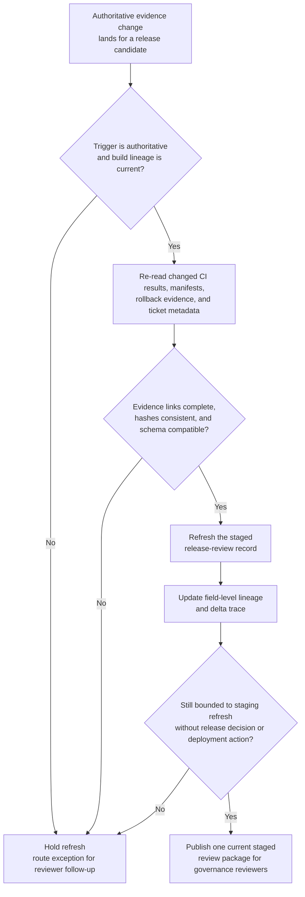
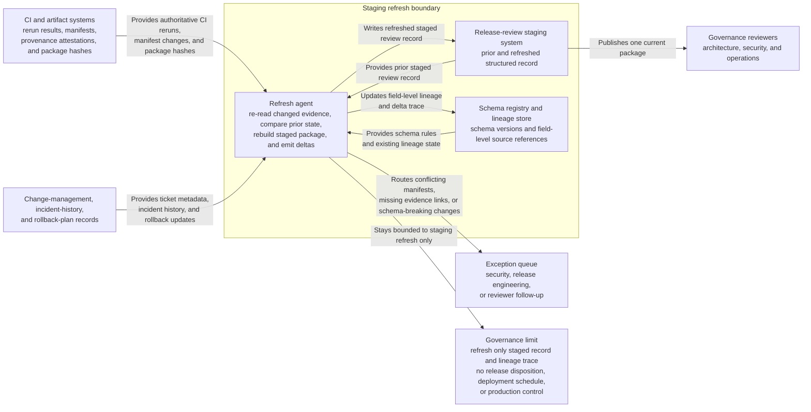

# Release candidate review staging record refresh after evidence change

## Linked pattern(s)

- `change-triggered-representation-refresh`

## Domain

Engineering.

## Scenario summary

A platform release review program keeps a structured staging record for each release candidate so architecture, security, and operations reviewers can inspect one current package instead of chasing artifacts across CI, ticketing, and deployment planning systems. After the first record is created, upstream state keeps moving: flaky tests are rerun, rollout notes are revised, dependency manifests are regenerated, rollback evidence is attached, and change-ticket metadata is corrected. When one of those authoritative source changes lands, the workflow should refresh the staged release-review record, update the field-level lineage and delta trace, and route exceptions whenever conflicting manifests, missing evidence links, or schema-breaking changes would make the refreshed package misleading.

## Target systems / source systems

- Release-review staging system holding the structured record consumed by governance reviewers
- CI and artifact systems emitting authoritative rerun results, build manifests, provenance attestations, and package hashes
- Change-management, incident-history, and rollback-plan records used to populate review fields
- Schema registry and lineage store for release-review package versions and field-level source references
- Exception queue for security, release engineering, or reviewer follow-up before the candidate package is treated as current

## Why this instance matters

This grounds the pattern in engineering work where the real need is not another human-readable status brief but a current structured review package that stays aligned with changing release evidence. Reviewers need one downstream-safe record with explicit deltas, not a trail of manual edits scattered across pipelines and tickets. The instance shows how event-triggered refresh can stay inside transform scope by rematerializing staging data while stopping short of release approval, go/no-go recommendation, or deployment execution.

## Likely architecture choices

- Event-driven monitoring should trigger refresh when authoritative CI reruns, manifest updates, or change-ticket corrections affect fields carried in the staged review record.
- A tool-using single agent can usually re-read the changed evidence bundle, compare it to the previous staged version, rebuild the structured package, and emit a reviewer-facing delta trace.
- Automatic refresh is appropriate for in-policy source changes, but conflicting artifact hashes, incompatible schema updates, or ambiguous rollback evidence should route to exception review.
- The workflow should update only the staging record and lineage trace, not any release disposition, deployment schedule, or production control.

## Governance notes

- Every consequential staged field, especially dependency version, test status, rollback evidence, environment target, and approval prerequisite, should retain prior and current source references.
- Refresh should be blocked when a source event comes from a draft pipeline, an untrusted artifact mirror, or a superseded build lineage chain.
- The delta trace should distinguish overwritten evidence from unchanged carry-forward values so reviewers can tell what actually changed between release-review snapshots.
- Release engineering and security owners should review recurring exception classes before new auto-overwrite rules are introduced.

## Evaluation considerations

- Percentage of authoritative evidence changes that produce one current structured review record without duplicate or conflicting staged versions
- Rate of manifest conflicts, missing rollback evidence, or schema mismatches correctly diverted to reviewer exceptions instead of silently refreshed
- Reviewer ability to understand what changed from one staged record version to the next without reopening the full raw artifact bundle
- Stability of refresh behavior when CI reruns arrive out of order, build metadata is corrected late, or the review schema adds a required field
