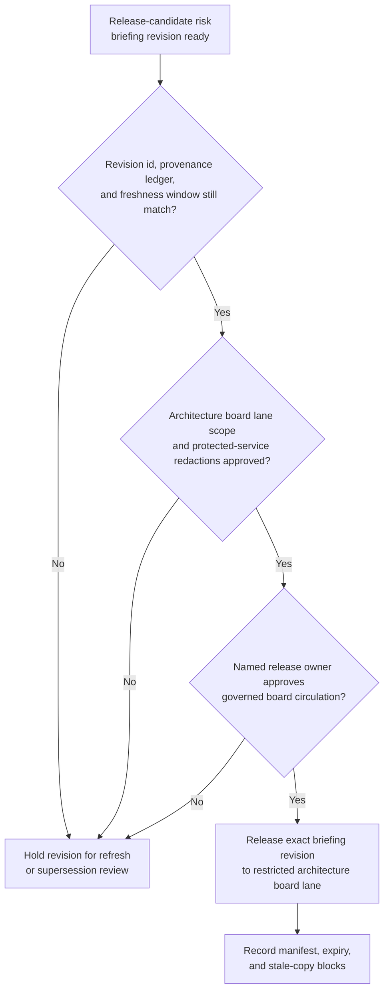
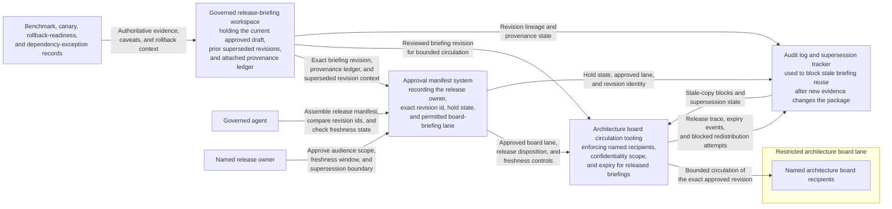

# Release-candidate risk briefing revision approved for architecture board circulation

## Linked pattern(s)

- `approval-gated-briefing-release`

## Domain

Engineering.

## Scenario summary

A release engineering analyst has already synthesized one revision of a release-candidate risk briefing covering recent benchmark regressions, unresolved dependency caveats, rollback evidence, protected-service exceptions, and open reviewer questions for a major platform launch. Before that exact revision is circulated into the restricted architecture board lane, a named release owner must approve the audience scope, freshness window, and supersession boundary so the board sees the approved context package rather than a stale or partially redacted copy. The workflow stops at governed release of that exact briefing revision; it does not rescore the release, decide launch go/no-go, schedule the change window, or execute deployment steps.

## Target systems / source systems

- Governed release-briefing workspace holding the current approved draft, prior superseded revisions, and attached provenance ledger
- Benchmark, canary, rollback-readiness, and dependency-exception records already referenced by the synthesized risk briefing
- Architecture board circulation tooling that enforces named recipients, confidentiality scope, and expiry for released briefings
- Approval manifest system recording the release owner, exact revision id, hold state, and permitted board-briefing lane
- Audit log and supersession tracker used to block stale briefing reuse after new evidence changes the package

## Why this instance matters

This grounds the pattern in engineering where the hard problem is not creating the risk briefing from scratch, but governing visibility of the exact synthesized revision that leaders are allowed to inspect. Large launches often generate multiple near-current drafts, last-minute redactions, and changing caveat language, so release discipline must bind to one reviewed briefing version instead of to a vague permission to brief. The example keeps the family boundary clear by stopping at controlled circulation of context rather than drifting into readiness recommendation or production execution.

## Likely architecture choices

- Approval-gated execution fits because the briefing remains held until the release owner approves one exact revision for the restricted architecture board lane.
- Human-in-the-loop review remains necessary because only accountable release leadership should accept residual uncertainty, confirm redactions, and authorize circulation of high-consequence launch context.
- A governed agent can assemble the release manifest, compare revision ids, and block superseded copies, but it should not rewrite the risk judgment or broaden distribution beyond the approved board audience.

## Governance notes

- Approval should bind to one immutable briefing revision, one named architecture board lane, and one freshness deadline so later edits cannot inherit permission silently.
- The released brief should keep unresolved benchmark variance, rollback caveats, and dependency exceptions visible rather than smoothing them into launch-ready language.
- If a new canary regression or security redaction arrives during approval review, the current revision should be held and superseded rather than circulated under stale approval.
- Audit records should preserve the released and prior revision ids, approver identity, board-recipient scope, expiry timing, and any blocked redistribution attempts.

## Evaluation considerations

- Percentage of board circulations where the released revision id, audience scope, and manifest metadata match exactly without later correction
- Rate at which superseded or stale release-risk briefings are blocked before they reach architecture board readers
- Time required to move from briefing-ready status to approved bounded circulation when provenance, caveats, and redactions are already complete
- Reviewer correction rate for missing caveats, wrong audience scope, or stale-state handling after the board receives the released briefing
