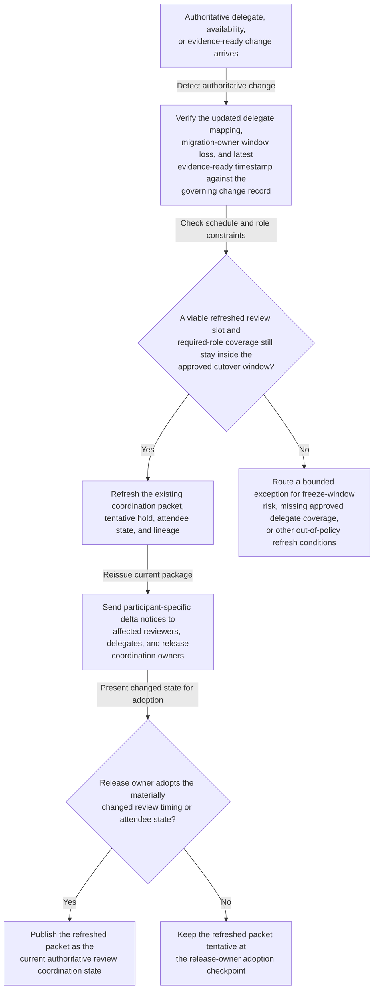
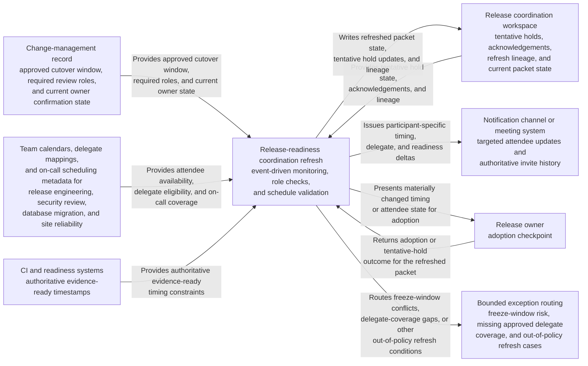

# Release-readiness review coordination refresh after approver window change

## Linked pattern(s)

- `authoritative-change-coordination-refresh`

## Domain

Engineering.

## Scenario summary

A release-readiness review for a customer-facing identity service already has a coordination packet, tentative hold, required-attendee list, and evidence-ready checkpoint linked to the governing change record. After that package is issued, authoritative schedule conditions shift: the security reviewer’s approved delegate mapping changes, the database migration owner loses the original review window because of an incident bridge, and updated test-evidence timing pushes the earliest valid review start later in the same day. The workflow should refresh the existing coordination package, issue participant-specific delta notices, and hold the changed schedule state at an explicit release-owner adoption checkpoint rather than rebuilding the whole cutover plan, deciding go/no-go, or touching the deployment itself.

## Target systems / source systems

- Change-management record with the approved cutover window, required review roles, and current owner confirmation state
- Team calendars, delegate mappings, and on-call scheduling metadata for release engineering, security review, database migration, and site reliability
- CI and readiness systems publishing authoritative evidence-ready timestamps that constrain when the review can occur
- Release coordination workspace where tentative holds, acknowledgements, and refresh lineage are tracked
- Notification channel or meeting system that can reissue targeted attendee updates without silently replacing the authoritative invite

## Why this instance matters

This grounds the pattern in engineering work where the main need is not initial slot-finding but keeping an existing review checkpoint synchronized with authoritative availability and readiness changes. The value comes from preserving one current coordination artifact, one clear delta history, and explicit human adoption of consequential changes so required reviewers stay aligned during a narrow release window. It stays out of recommendation and execution scope because the workflow does not judge whether the release is safe, replan the whole cutover sequence, or launch production changes.

## Likely architecture choices

- Event-driven monitoring should react only to approved delegate-state updates, authoritative evidence-ready changes, and governed calendar updates that affect the issued review checkpoint.
- Exception-gated autonomy fits because the workflow can refresh the packet, revise the tentative hold, and notify affected participants automatically when changes stay inside the approved cutover window and role boundaries.
- The release owner should adopt any changed meeting time, required-attendee substitution, or freeze-window edge case before the refreshed packet becomes authoritative.
- The workflow should preserve append-only lineage showing which event changed the packet, who received notices, and whether acknowledgements remain outstanding.

## Governance notes

- Required roles and allowable delegates should be explicit before any automatic refresh occurs: release manager, service owner, security reviewer, database migration owner, and site reliability lead.
- Calendar and role access should stay limited to free-busy, delegate eligibility, and schedule-policy metadata rather than private event contents or unrelated incident details.
- Refresh should not silently convert a tentative change into a final meeting commitment; consequential updates stay pending until the release owner adopts them.
- Notification logic should target only affected participants and reviewers rather than rebroadcasting sensitive release context to broad channels.
- The workflow should escalate instead of refreshing authoritatively when the only viable updated slot crosses a protected freeze boundary or a required role loses all approved delegate coverage.

## Evaluation considerations

- Time from authoritative availability or evidence-ready change to a refreshed coordination packet with clear adoption status
- Rate of required-attendee or timing changes correctly held for release-owner adoption before the invite becomes authoritative
- Participant ability to tell what changed between the prior and current review packet without reconstructing the full release thread manually
- Stability of the refresh loop during clustered release-day updates, delegate changes, or repeated evidence timestamp corrections
