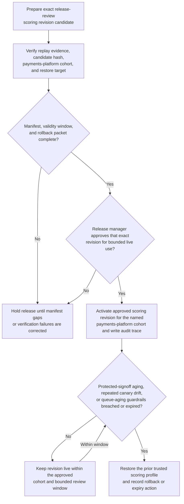
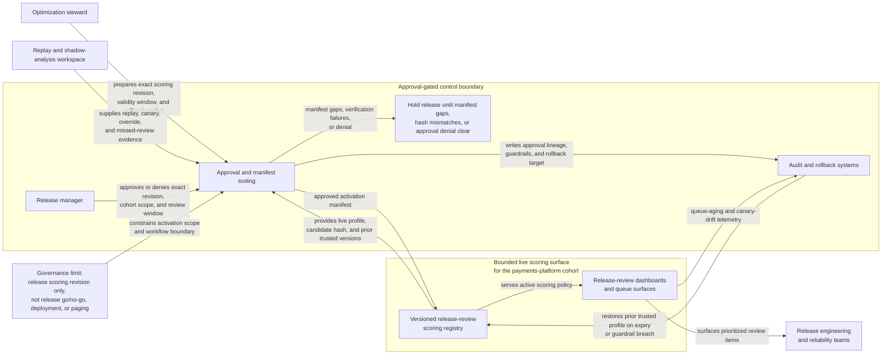

# Release-review scoring revision approved for live use

## Linked pattern(s)

- `approval-gated-optimization-state-release`

## Domain

Engineering.

## Scenario summary

Release engineering and reliability teams use a scoring policy to decide which build regressions, dependency anomalies, canary findings, and rollout caveats are surfaced to the human release-review queue first. After several weeks of replay and shadow evaluation, an optimization steward has prepared one exact scoring-policy revision that better weights blast radius, signing-surface impact, and repeated canary drift for one payments-platform cohort. The workflow must release that exact revision into bounded live use only after a release manager approves the manifest, validity window, and rollback packet, while keeping the boundary clear: this pattern activates the reviewed optimization-state revision itself, but it does not approve the release, execute the production deployment, or page responders.

## Target systems / source systems

- Versioned release-review scoring registry holding the current live profile, candidate revision hash, and prior trusted versions
- Replay and shadow-analysis workspace with regression history, canary outcomes, release-board overrides, and missed-review evidence
- Approval and manifest tooling used by release engineering leadership to authorize one bounded live scoring revision
- Audit and rollback systems that can restore the previous scoring profile if protected-signoff misses or queue-aging guardrails worsen
- Release-review dashboards and queue surfaces that consume the active scoring policy after approval

## Why this instance matters

This grounds the pattern in engineering where the released artifact is clearly an optimize/adapt object: one exact scoring-policy revision governing future review order and emphasis. The hard problem is not recommending a better scoring idea in the abstract and not executing a release or incident response sequence; it is binding human approval, validity timing, rollback readiness, and lineage to the exact optimization revision that becomes live. That keeps the instance family-safe while still showing why approval-gated live release can belong in optimize/adapt.

## Likely architecture choices

- Approval-gated execution fits because the scoring revision is technically ready to activate, but the live switch remains blocked until a named release manager approves that exact version and bounded cohort scope.
- Human-in-the-loop review remains normal because release leadership must accept the trade-off of noisier or quieter review routing and confirm the validity window, guardrails, and rollback target before activation.
- A governed agent can assemble the manifest, compare revision hashes, verify replay evidence, and write the audit trace, but it should not broaden the cohort, reuse stale approval, or turn the scoring release into deployment execution.

## Governance notes

- Approval must bind to the exact scoring revision hash, one defined service cohort, and one limited review window so a later tuning edit cannot inherit stale permission.
- The release packet should preserve replay evidence on protected signoff classes, missed-regression rates, and false-positive burden rather than summarizing everything into one blended score.
- Expiry should be explicit: if the revision is not renewed after the bounded window or if protected review misses rise, the prior trusted scoring profile should be restored automatically.
- Audit records should capture the live and prior revision ids, release approver, validity window, rollback trigger values, and any subsequent extension or rollback decision.
- The workflow must not choose release go/no-go, schedule deployment steps, or execute production changes; it only releases the optimization-state revision used by the human release-review surface.

## Evaluation considerations

- Reduction in manual release-board overrides and missed high-blast-radius review items during the bounded live window
- Accuracy of manifest binding between the approved scoring revision, replay evidence, and activated cohort scope
- Reliability and speed of rollback when protected-signoff aging, canary misses, or false-negative indicators breach the approved guardrails
- Rate at which temporary scoring revisions expire or are renewed on schedule instead of quietly persisting as baseline review policy
