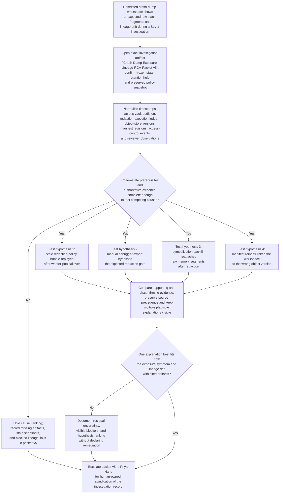

# Restricted production crash-dump redaction exposure root-cause investigation

## Linked pattern(s)

- `incident-root-cause-analysis`

## Domain

Engineering.

## Scenario summary

During a severity-one production reliability incident, a restricted debugging lane receives a crash-dump evidence package that should contain only approved redacted memory regions and symbolized stack context. Minutes later, privacy engineering detects that one attachment in the restricted workspace contains raw stack fragments and session-token residue that were absent from the first reviewed package manifest, while the crash-dump lineage record also shows a mismatch between the redacted package hash, the object-store version now linked to the workspace, and the policy bundle digest that should have governed sanitization. The engineering organization must determine which evidence-backed explanation best accounts for both the sensitive-data exposure and the lineage drift without assuming the problem was only a viewer glitch or a simple operator mistake. Plausible competing causes include a stale redaction-policy bundle replayed by one worker pool after a region failover, a manual debugger export that bypassed the expected redaction gate during a live-control override, a symbolization backfill job that reattached raw memory segments to the already-redacted package, or an evidence-manifest reindex event that linked the restricted workspace to the wrong object version after quarantine promotion. The investigation stays bounded to one exact governed artifact, `Crash-Dump-Exposure-Lineage-RCA-Packet-v5`, owned by Priya Nand, Director of Restricted Debugging Integrity, and ends at a ranked explanation set with explicit uncertainty rather than exposure declaration, customer or regulator communication, debugger-access restoration, policy rewrite, remediation execution, deployment, or other downstream action.

**Prerequisite state that must be confirmed before narrowing hypotheses:**
- The affected crash-dump identifiers, restricted workspace id, and incident window are frozen so no new attachments, exports, or workspace relinks can enter scope without citation.
- Read-only investigation mode is active on the crash-dump vault, redaction pipeline workspace, and evidence-manifest store, except for append-only packet updates in `Crash-Dump-Exposure-Lineage-RCA-Packet-v5`.
- Object-retention hold and audit-log preservation are active for all raw and redacted dump objects, symbolization artifacts, and manifest revisions in the incident window.
- The approved redaction-policy bundle snapshot, worker-image digest set, and prior packet revision `Crash-Dump-Exposure-Lineage-RCA-Packet-v4` are preserved and timestamped.
- The current restricted-workspace export, access-control snapshot, and reviewer-observation ledger have been captured so later UI or permission changes do not rewrite the investigation baseline.

## Target systems / source systems

**Authoritative (highest precedence):**
- Crash-dump vault audit ledger for the affected dump set, including raw-object creation, quarantine transitions, redacted-object publication, access grants, export actions, and immutable actor timestamps
- Redaction-pipeline execution ledger and worker attestation records, including policy-bundle digest, worker-image digest, sanitizer stage outputs, symbolization job ids, and append-only step lineage
- Evidence-manifest and object-store version history for the restricted workspace package, including manifest revisions, object-version identifiers, attachment hashes, delete markers, and retention-hold state
- Approved redaction-policy bundle snapshot and restricted-debugging control-state record captured for the incident window

**Operational and contextual (secondary precedence):**
- Restricted privacy-engineering workspace views, reviewer-observation ledger, and prior packet revision `Crash-Dump-Exposure-Lineage-RCA-Packet-v4`
- Access-proxy telemetry, worker-pool health dashboards, failover alerts, symbol server job traces, and manifest reindex queue telemetry
- Responder bridge notes from privacy engineering, production reliability, and crash forensics staff documenting what they observed before and after the discrepancy surfaced

**Excluded from authoritative use without explicit promotion:**
- Screenshots or copied dump fragments that are not linked to the vault audit ledger, object-version history, or manifest revision record
- Informal chat claims about what the package contained unless they match reviewer-observation entries or immutable access events
- Later remediation tickets, policy edits, access-restoration steps, or customer-notification drafts created after the frozen investigation window

## Why this instance matters

This grounds `incident-root-cause-analysis` in engineering through a high-governance debugging incident where the investigation problem is not generic service latency or a simple missing log, but the need to explain how sensitive crash evidence appeared in a restricted workspace while package lineage simultaneously drifted across multiple authoritative systems. The instance is structurally distinct from the existing payments latency investigation because it centers one exact RCA packet revision, explicit source precedence between vault, execution, manifest, and policy records, frozen investigative control state before hypothesis narrowing, visible blockers that can stop causal ranking, and revision-aware lineage from `v4` to `v5`. It is also distinct from neighboring engineering collaboration, readiness, browser-submission, synthesis, and runbook examples because the workflow stays inside evidence-backed causal diagnosis only, ending before privacy adjudication, debugger access decisions, remediation planning, or live operational change.

## Likely architecture choices

- An orchestrated multi-agent flow can separate vault-audit retrieval, redaction-lineage reconstruction, manifest-version comparison, and hypothesis verification while preserving one shared RCA packet.
- Shared case memory should retain source-precedence decisions, frozen-state checks, blocker status, rejected explanations, and packet lineage from `v4` to `v5` so later reviewers can inspect how the investigation evolved.
- Human-in-the-loop review remains mandatory before any explanation is treated as the primary cause because the packet may affect restricted-debugging governance, privacy handling, and downstream containment or disclosure decisions.
- Read-only integrations should be preferred for crash-dump vault, redaction pipeline, manifest store, and access-control evidence collection so the investigation does not mutate the state it is attempting to explain.

## Governance notes

- The investigation record should cite the exact authoritative artifact behind each claim and state clearly when reviewer observations or dashboard views conflict with vault, pipeline, manifest, or policy records rather than smoothing those conflicts away.
- Source precedence must remain explicit: vault audit history, redaction-execution lineage, object-version history, and the captured policy snapshot outrank workspace views, health dashboards, job traces, and human notes; lower-precedence evidence can contextualize but not silently override the authoritative record.
- Visible blockers such as a missing worker-log shard, stale policy-bundle digest from one failover region, an unlinked manual export session, or absent reviewer-observation linkage should remain in packet `v5` instead of being normalized into a single-cause story.
- Revision-aware lineage should show what changed from `Crash-Dump-Exposure-Lineage-RCA-Packet-v4` to `v5`, including newly attached evidence links, demoted hypotheses, and still-open uncertainty, so later review can audit the reasoning path.
- Priya Nand remains the named human owner for the investigation packet; exposure declaration, customer or regulator communication, debugger-access restoration, policy changes, code fixes, and broader incident handling are separate downstream decisions that this workflow does not perform.
- Access to raw crash fragments, symbolization outputs, policy digests, and restricted-workspace evidence should remain limited to the approved privacy engineering and forensics investigation group during the RCA process.

## Evaluation considerations

- Time to first evidence-backed explanation that accounts for both the unexpected raw-data exposure and the package-lineage drift with cited authoritative artifacts
- Whether prerequisite frozen-state checks and source-precedence rules prevent the workflow from ranking causes before vault, execution, manifest, and policy snapshots are complete
- Agreement between the workflow's ranked hypothesis set and Priya Nand's final accepted investigation conclusion, including whether residual uncertainty was preserved when one cause could not be fully isolated
- Rate at which missing worker lineage, stale policy snapshots, unsupported observer claims, or ambiguous manifest relinks surface as explicit blockers rather than being normalized into overconfident conclusions
- Inspectability of packet lineage from `v4` to `v5`, including which hypotheses were strengthened, weakened, or left open as new evidence was reconciled
