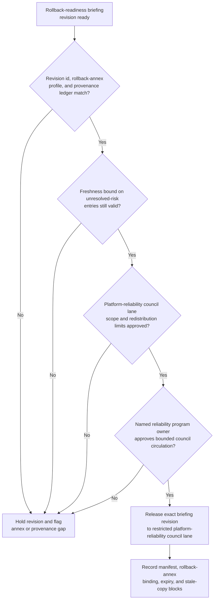

# Rollback readiness briefing revision approved for platform reliability council lane

## Linked pattern(s)

- `approval-gated-briefing-release`

## Domain

Engineering.

## Scenario summary

A platform reliability engineer has already synthesized one revision of a rollback-readiness briefing that covers rollback-annex completeness, per-service reversion evidence, freshness-bound unresolved-risk items, dependency-state snapshots, and open rollback-blocking questions remaining after a partial production incident. Before that exact revision is circulated into the restricted platform-reliability council lane, a named reliability program owner must approve the rollback-annex attachment profile, audience scope, freshness window, and hold state so council readers receive the reviewed rollback-readiness packet rather than an outdated copy, an overscoped version, or a revision whose unresolved-risk entries have since changed. The workflow stops at governed release of that exact briefing revision; it does not adjudicate rollback approval, trigger reversion scripts, authorize rollback execution, or schedule the recovery window.

## Target systems / source systems

- Governed reliability briefing workspace holding the current approved rollback-readiness draft, prior superseded revisions, and the attached rollback-annex version manifest
- Per-service rollback runbooks, reversion checkpoints, dependency-state snapshots, and incident-evidence records already referenced by the synthesized briefing revision
- Unresolved-risk register capturing rollback-blocking questions with the timestamp bounds attached to each open item
- Platform-reliability council circulation tooling enforcing named recipients, internal-use controls, expiry windows, and blocked redistribution outside the approved council lane
- Approval manifest system recording the reliability program owner, exact briefing revision id, rollback-annex attachment profile, hold state, and permitted council-visibility lane
- Audit log and supersession tracker blocking stale briefing reuse when new reversion evidence, a changed dependency state, or a resolved rollback-blocking question arrives before council circulation

## Why this instance matters

This grounds the pattern in the specific engineering challenge of controlling visibility over rollback-readiness state: not deciding whether to roll back, but ensuring the exact synthesized rollback-readiness packet the council inspects is the version whose unresolved-risk entries, annex attachments, and freshness bounds a reliability owner has actually approved. Rollback-readiness context is especially susceptible to silent staleness because dependency states and rollback-blocking questions resolve or deteriorate quickly after an incident, so revision control and freshness-bound risk visibility matter more than in a stable launch-risk briefing. The example stays distinct from the architecture-board instance by centering rollback-annex completeness checks, per-item unresolved-risk freshness gates, and a platform-reliability council audience rather than pre-launch risk scoring and broad architecture review.

## Likely architecture choices

- Approval-gated execution fits because the rollback-readiness briefing remains held until the reliability program owner approves one exact revision, confirms the rollback-annex profile, and authorizes platform-reliability council circulation.
- Human-in-the-loop review is necessary because only accountable reliability leadership should accept residual rollback-blocking uncertainty, confirm which unresolved-risk entries are still open, and authorize a high-consequence context packet into a council lane.
- A governed agent can assemble the release manifest, compare revision ids against the rollback-annex version manifest, validate freshness timestamps on open risk items, and block older superseded revisions, but it should not rewrite rollback-risk judgments, resolve blocking questions autonomously, or extend distribution beyond the named council audience.

## Governance notes

- Approval should bind to one immutable briefing revision, one rollback-annex attachment profile, one named platform-reliability council lane, and one freshness deadline per unresolved-risk entry so later dependency-state changes or resolved blockers cannot silently promote a superseded packet.
- The released briefing must keep rollback-blocking questions, partial reversion evidence, and freshness-bound risk entries explicitly visible rather than collapsing them into a rollback-ready summary that understates residual uncertainty.
- If a dependency-state snapshot, reversion checkpoint, or previously open rollback-blocking question changes materially during approval review, the pending revision should be held and superseded rather than circulated under stale approval.
- Redistribution of the rollback-readiness packet outside the platform-reliability council lane must require fresh approval; the rollback-annex and unresolved-risk register contain service-internal detail that should not implicitly flow to broader audiences through forwarding or reuse.
- Audit records must preserve the released and prior revision ids, rollback-annex profile, approver identity, council-recipient scope, per-item freshness timestamps, expiry state, and any blocked redistribution or reuse attempts.

## Evaluation considerations

- Percentage of platform-reliability council circulations where the released rollback-readiness revision id, rollback-annex profile, and manifest metadata align exactly without later correction
- Rate at which superseded, stale-freshness, or out-of-scope rollback-readiness briefings are blocked before council visibility, particularly when dependency states change between synthesis and release
- Time required to move from briefing-ready status to approved bounded council circulation when rollback-annex completeness, unresolved-risk freshness, and provenance are already confirmed
- Reviewer correction rate for stale unresolved-risk entries, incomplete rollback-annex attachments, or wrong audience scope after the council receives the released briefing
- Frequency with which the hold path is triggered because a rollback-blocking question was resolved or worsened between synthesis and release review, confirming the freshness-gate is functioning rather than being bypassed
