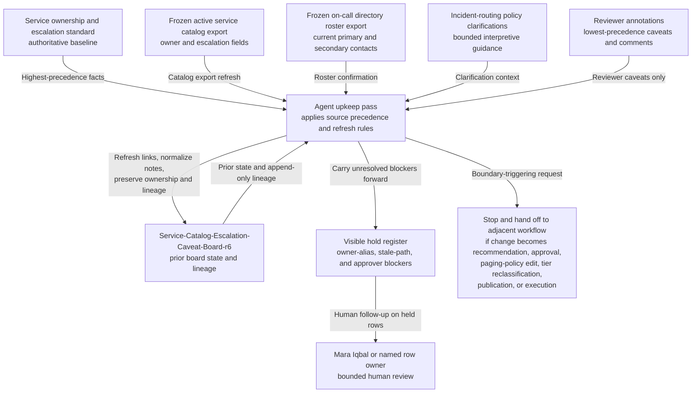

# Service catalog escalation metadata caveat board shared workbench upkeep

## Linked pattern(s)

- `shared-workbench-orchestration`

## Domain

Engineering.

## Scenario summary

A platform service-governance team maintains one internal escalation-metadata caveat board, `Service-Catalog-Escalation-Caveat-Board-r6`, while service owners, incident command stewards, reliability reviewers, and developer productivity partners keep small metadata corrections flowing for services whose catalog ownership and escalation records need bounded upkeep before the next audit window. The board already carries prerequisite frozen snapshot state for each row: the active service ownership and escalation standard baseline, a frozen active service catalog export timestamp, a frozen on-call directory roster export, the current incident-routing policy clarification bundle, prior board lineage from `r3` through `r5`, visible blocker fields, and named human ownership under Engineering Service Governance Steward Mara Iqbal plus each service row's accountable owner. As small updates arrive, the agent keeps that bounded workbench synchronized by applying explicit source precedence from the service ownership and escalation standard first, then the active service catalog export, then the on-call directory, then incident-routing policy clarifications, and finally lower-precedence reviewer annotations; refreshing source links; normalizing duplicate caveat notes; updating confirmed ownership-alias mappings; and carrying unresolved owner-alias, stale-escalation-path, missing-approver, and routing-scope questions forward in a visible hold register. Humans remain responsible for deciding whether an ownership transfer is accepted, changing paging policy, approving escalation-path rewrites, reclassifying service tier, notifying responders, or moving any row into recommendation, approval, publication, execution, or other downstream operational action.

## Target systems / source systems

- `Service-Catalog-Escalation-Caveat-Board-r6`, an internal shared caveat board with service rows, prerequisite-state columns, blocker tags, source-precedence markers, owner fields, and append-only revision history
- Service ownership and escalation standard repository containing the authoritative owner-role taxonomy, required escalation metadata fields, approval expectations, alias-resolution rules, and superseding standard revisions
- Active service catalog export snapshot showing current service ids, owning teams, escalation metadata, service-tier labels, and last synchronized catalog timestamps used for bounded board upkeep
- On-call directory roster export snapshot publishing current primary, secondary, and managerial contacts plus escalation-chain identifiers referenced by board rows without outranking the ownership standard or catalog export
- Incident-routing policy clarification register containing approved clarification notes for ambiguous routing cases, temporary interpretation guidance, and linkable policy caveats that remain lower precedence than the standard, catalog, and roster snapshots
- Engineering reviewer annotation surface where service owners, reliability reviewers, incident command stewards, and developer productivity partners add small edits, caveats, alias notes, and ownership handoff comments with the lowest source precedence

## Why this instance matters

This grounds the pattern in an engineering governance surface where the maintained artifact is one internal caveat board for service-catalog escalation metadata upkeep rather than an ownership-transfer proposal, paging-policy decision, escalation redesign, or audit sign-off packet. The useful work is keeping prerequisite frozen source state, explicit source precedence, blocker visibility, append-only lineage, and named ownership synchronized as many small metadata updates arrive from standards, catalog, on-call, routing, and reviewer channels. That keeps the collaboration centered on one inspectable internal workbench and preserves a clean boundary before recommendation, approval, publication, execution, service-tier change, or live incident-routing action begins.

## Likely architecture choices

- Event-driven monitoring fits because upkeep should react when the ownership standard, catalog export, on-call roster snapshot, policy clarification bundle, or reviewer notes change.
- A tool-using single agent can refresh source links, reconcile row metadata, normalize duplicate caveat wording, and keep blocker plus lineage fields synchronized inside one bounded board.
- Human-in-the-loop review remains necessary when an update would reinterpret the ownership standard, clear a blocker tied to an unconfirmed approver, or make a row sound like an approved paging-policy or service-tier change.
- Bounded delegation works because Mara Iqbal and the service-governance team can predefine allowable field updates, source-precedence rules, alias-resolution markers, and hold conditions without delegating recommendation, approval, publication, policy editing, or execution authority.

## Governance notes

- The board should encode explicit source precedence in order: service ownership and escalation standard, frozen active service catalog export, frozen on-call directory roster export, incident-routing policy clarifications, and only then lower-precedence reviewer annotations, so routine upkeep never implies that a comment overrides authoritative ownership or escalation requirements.
- Each row should retain inspectable provenance for the active standard revision, frozen catalog export timestamp, frozen on-call roster export timestamp, applied routing clarification reference, prior board revision lineage from `r3` through `r6`, accepted owner-alias mapping, and named accountable owner before a blocker is cleared or a caveat is removed.
- Visible blockers should remain explicit for owner-alias mismatches, stale escalation paths, missing approvers, unresolved catalog-versus-roster conflicts, and policy-clarification scope questions rather than being normalized away during board cleanup.
- The agent may normalize structure, merge duplicate caveat notes, refresh links, and update confirmed owner fields after a validated alias match, but it should not approve ownership transfers, rewrite paging policy, reclassify service tier, notify responders, change live routing behavior, or remove a hold that Mara Iqbal or a named row owner still considers open.
- If a requested update would publish corrected escalation metadata externally, trigger pager changes, alter service criticality, create an approval packet, or launch downstream operational work, the workflow should stop and hand off to the appropriate adjacent pattern.

## Evaluation considerations

- Percentage of board refreshes that preserve correct source precedence, prerequisite frozen snapshot references, named owner assignments, and unresolved-blocker visibility across repeated upkeep cycles
- Reviewer correction rate for normalized caveat text, refreshed catalog or roster references, alias-resolution updates, or automatically maintained blocker markers
- Rate at which recommendation-like, approval-like, paging-policy-adjacent, tier-reclassification-adjacent, publication-adjacent, or execution-adjacent edits are held for human review instead of being silently folded into the internal caveat board
- Usefulness of the maintained workbench for helping service governance, reliability, and incident-routing collaborators resume escalation-metadata upkeep without reconstructing stale lineage, prerequisite source state, or blocker context by hand
