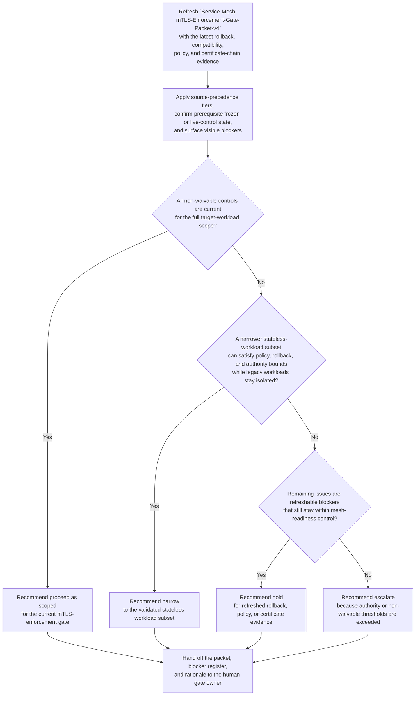

# Service mesh mTLS enforcement cutover readiness gate disposition recommendation

## Linked pattern(s)

- `readiness-gate-disposition-recommendation`

## Domain

Engineering.

## Scenario summary

A platform security readiness board is re-evaluating whether the governed packet `Service-Mesh-mTLS-Enforcement-Gate-Packet-v4` is ready to pass its production mTLS-enforcement cutover gate before the platform-wide plaintext-retirement checkpoint for east-west service traffic. Since the previous packet revision, rollback drill evidence for the legacy gRPC settlement adapter path has aged beyond the fourteen-day freshness window, the frozen workload-compatibility inventory still shows unresolved sidecar behavior for a bounded subset of stateful workloads, the east-west authorization acknowledgment for the data-platform namespace remains unsigned, and two temporary certificate-chain exceptions will expire before the proposed checkpoint. A narrower recommendation limited to the validated stateless payments, identity, and edge-routing workloads may still be feasible. The workflow must recommend whether engineering should proceed as scoped, hold for refreshed evidence and blocker closure, narrow the cutover to the validated workload subset, or escalate because rollback confidence, compatibility uncertainty, policy-acknowledgment gaps, or delegated gate-authority thresholds no longer fit local control before any enforcement flag is flipped, deployment order is set, traffic policy is changed, or live mTLS execution begins. Accountability for packet quality remains with Hana Okafor, Director of Service Mesh Readiness, rather than deployment approval, workload-scope adjudication, scheduling, or execution.

**Prerequisite state that must be confirmed before a disposition can be narrowed or advanced:**
- The in-scope workload list is frozen in `mesh-enforcement-targets-2026-04-18.csv` and matches the service catalog export attached to packet `Service-Mesh-mTLS-Enforcement-Gate-Packet-v4`.
- The canary telemetry window `mesh-mtls-canary-2026-04-11T00Z-2026-04-13T00Z` is captured, sealed read-only, and mapped to the exact workloads proposed for the gate.
- Current rollback rehearsal evidence for the Envoy policy-reversal path and legacy sidecar bypass path is present, versioned, and still inside the policy freshness limit unless explicitly surfaced as a blocker.
- Delegated authority snapshot `Mesh-Gate-Authority-Snapshot-2026-04-12` is attached and confirms which proceed, hold, narrow, or escalation paths Hana Okafor may package for the human gate owner.
- The temporary certificate-chain exception register and east-west authorization-policy baseline are pinned to the active review window so later edits cannot silently change the packet basis.

## Target systems / source systems

**Authoritative (highest precedence):**
- `Service-Mesh-mTLS-Enforcement-Gate-Packet-v4`, prior packet revision `Service-Mesh-mTLS-Enforcement-Gate-Packet-v3`, the delegated authority snapshot, and the signed gate definition for the `platform transport-security review lane`
- The frozen target-workload inventory, current service catalog ownership export, and workload compatibility ledger covering sidecar mode, ambient readiness, and exception status by namespace
- Rollback rehearsal evidence for policy reversal and legacy sidecar bypass, captured canary telemetry for the named review window, and the current east-west authorization-policy baseline
- The certificate-chain exception register, mesh trust-domain policy thresholds, and signed security-control standard governing required mTLS coverage

**Operational and contextual (secondary precedence):**
- Namespace readiness dashboards, synthetic check summaries, dependency topology views, and control-plane health panels used to interpret current packet evidence
- Reviewer annotations from platform security, traffic management, and workload owners attached to packet `v3` and the working draft for `v4`
- The change-calendar checkpoint record and prior gate-review notes that explain why the current packet returned for refresh

**Excluded from authoritative use without explicit promotion:**
- Daily migration standup notes, informal Slack threads, or screenshots that are not linked back to the packet, compatibility ledger, or rollback evidence store
- Verbal assurances from workload owners that a namespace is "probably safe" unless that claim appears in the frozen compatibility inventory or signed reviewer annotation
- Draft deployment runbooks, scheduling proposals, or rollout sequencing suggestions created for downstream cutover execution

## Why this instance matters

This instance grounds `readiness-gate-disposition-recommendation` in engineering through one exact service-mesh enforcement gate packet rather than through synthesis, collaborative upkeep, release execution, or approval submission. The hard problem is not deciding the deployment order or forcing a cutover plan; it is refreshing one governed readiness judgment as rollback proof, workload compatibility evidence, policy acknowledgment state, and certificate exceptions shift around a known gate. The example is structurally distinct from the earlier payments cutover lane because the readiness question turns on transport-security enforcement over a frozen workload inventory, live canary telemetry, and explicit policy acknowledgments rather than schema compatibility or merchant segmentation.

## Likely architecture choices

- Event-driven monitoring fits because rollback-evidence expiry, compatibility-ledger changes, policy acknowledgment updates, and certificate-exception deadlines should trigger a refreshed gate recommendation immediately.
- Human-in-the-loop review is mandatory because the workflow should advise on proceed, hold, narrow, or escalate posture, not approve the cutover, redefine workload scope, schedule the checkpoint, or start enforcement.
- Read-only integration with service catalog, mesh policy, observability, and security-governance systems is preferable so the agent cannot silently convert a recommendation packet into a live traffic-policy change.

## Governance notes

- The workflow should stay centered on one inspectable artifact, `Service-Mesh-mTLS-Enforcement-Gate-Packet-v4`, with recommendation lineage preserved back to `Service-Mesh-mTLS-Enforcement-Gate-Packet-v2` and `v3`, including accepted and rejected narrowing proposals plus the evidence delta that changed the recommended disposition.
- Source precedence must remain explicit: the signed gate packet, delegated authority snapshot, frozen workload inventory, rollback evidence, canary telemetry window, policy baseline, and certificate-exception register outrank readiness standups, namespace chat, or unverified owner commentary. Lower-precedence material can contextualize the packet but cannot silently override blockers.
- Prerequisite frozen or live-control state must stay visible in the packet, including the frozen target-workload list, sealed canary telemetry window, current rollback drill evidence, active authority snapshot, and pinned certificate-exception plus policy baselines for the review window.
- Visible blockers should remain concrete and named, including stale rollback proof for the legacy gRPC settlement adapter path, unresolved sidecar compatibility for the `payments-ledger-sync` and `orders-journal-writer` workloads, the unsigned east-west policy acknowledgment for the `data-platform` namespace, and certificate-chain exceptions `mesh-cert-exc-117` and `mesh-cert-exc-122` that expire before the checkpoint; any narrow recommendation must show exactly which namespaces and workloads stay out of scope.
- The human decision lane should remain concrete: Omar Bennett, Chair of the Platform Transport Security Gate, receives the packet for governed disposition review while Hana Okafor remains the named owner accountable for packet integrity, blocker visibility, and evidence freshness rather than the gate decision itself.
- The boundary must remain clear: the workflow does not approve the gate, adjudicate long-term workload scope, schedule the cutover, alter traffic policies, rotate certificates, or execute the enforcement change.

## Evaluation considerations

- Reviewer agreement with the recommended proceed, hold, narrow, or escalate disposition before any mTLS-enforcement flag change or policy promotion is authorized
- Rate at which stale rollback proof, unresolved compatibility gaps, unsigned policy acknowledgments, or expiring certificate exceptions are surfaced before the governed gate checkpoint
- Quality of traceability linking source-precedence tiers, prerequisite state, blocker visibility, revision lineage, and named ownership to the disposition recommendation
- Stability of recommendations when compatibility evidence, telemetry health, rollback freshness, or certificate-exception state changes during the final gate window
