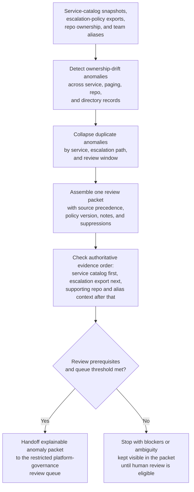

# Service ownership and escalation drift anomaly review

## Linked pattern(s)

- `anomaly-detection-review`

## Domain

Engineering.

## Scenario summary

A developer-platform governance team monitors service-catalog snapshots, on-call escalation-policy exports, repository `CODEOWNERS` changes, team-directory aliases, and service-to-repository mapping records to detect mid-severity ownership-drift anomalies before they harden into paging dead ends, unreviewed operational debt, or misrouted engineering obligations. The workflow must collapse duplicate anomalies tied to the same service, escalation path, and review window; assemble one exact anomaly review packet for the affected cluster; and enrich it with explicit source precedence, the current ownership-policy version, prior reviewer notes, and recent suppressions. In each packet, the approved service catalog remains authoritative for canonical service identity and declared owning team, the live escalation-policy export is the next source for reviewable paging coverage state, repository `CODEOWNERS` and team-directory aliases provide supporting context only when the higher-precedence records disagree, and free-form platform notes stay lowest-precedence evidence. A case should enter the review queue when, for example, several tier-two services lose a matching primary escalation target without a corresponding catalog update, one service family shows repeated divergence between `CODEOWNERS` and the active on-call policy after a team rename, or a batch of newly created services inherits a stale escalation alias that no longer resolves to an accountable team. The goal is an explainable anomaly review packet for platform governance leads, not to reassign service ownership, rewrite paging policy, edit `CODEOWNERS`, authorize staffing changes, or launch root-cause investigation automatically.

## Target systems / source systems

- Internal service-catalog systems with canonical service identifiers, declared owners, service tiers, lifecycle state, and approved ownership snapshots
- Incident-management and paging platforms with escalation-policy exports, responder schedules, fallback targets, acknowledgement history, and routing metadata
- Repository metadata sources with `CODEOWNERS`, service manifests, and service-to-repository mapping records used to connect code assets to governed service records
- Team-directory and org-alias sources with approved team names, merge history, and effective-date mappings for renamed or consolidated engineering groups
- Restricted platform-governance review queues and audit storage preserving anomaly lineage, duplicate suppression, packet revisions, reviewer dispositions, and routing history

## Why this instance matters

This grounds `anomaly-detection-review` in engineering work where the early-warning problem is catching drift between governed service ownership records and live escalation metadata before an urgent human handoff fails, but without treating every directory mismatch as an incident. A weak workflow would either flood platform reviewers with routine team-rename noise or miss the recurring anomaly pattern showing that accountable ownership has become ambiguous across catalog, paging, and repository surfaces. The instance stays inside monitor/detect/triage because the agentic work is anomaly detection, bounded context assembly, duplicate suppression, prioritization, and governed routing rather than ownership adjudication, staffing decisions, release response, or deeper investigation.

## Likely architecture choices

- Event-driven monitoring should continuously ingest service-catalog revisions, escalation-policy exports, repository ownership changes, and team-directory updates, then reopen or merge anomaly clusters as new context arrives.
- A tool-using single agent can correlate service identifiers across catalog, paging, repository, and directory systems; check the approved source-precedence order; and publish one bounded anomaly review packet with explicit uncertainty markers.
- Bounded delegation fits because routine mid-severity ownership-drift packets can route into a preapproved platform-governance review lane without case-by-case authorization, while higher-consequence cases still escalate to accountable humans before any operational ownership or paging change occurs.
- Ownership reassignment, escalation-policy editing, staffing decisions, incident routing changes, or root-cause investigation should remain outside the workflow and under explicit human control.

## Governance notes

- Each packet should state the prerequisite product and policy state explicitly: the current service-inventory baseline must be published, the ownership-governance policy version must be active for the review window, and the latest approved escalation-policy export must have completed before the anomaly is eligible for delegated review.
- Visible blockers and unresolved items should remain in the packet rather than being normalized away, including pending team-merger mappings, unresolved service-to-repository links, delayed roster syncs, archived repositories that still appear in ownership evidence, and any ambiguity about whether a service is still in supported lifecycle scope.
- Reversibility and lineage should remain explicit: packet contents, queue position, and duplicate-merge decisions can be recomputed from the same source snapshots and policy version, and each revision should preserve the anomaly-cluster identifier, consulted source timestamps, suppression rationale, and reviewer-note lineage.
- The packet should name one accountable human owner for review intake—Alex Romero, Director of Developer Platform Governance—and stop there rather than selecting a downstream decision authority or implying that the owner has already approved corrective action.
- Auditability and access control should preserve enough evidence to reconstruct why the anomaly was surfaced while minimizing exposure of internal roster details, direct paging targets, or team-change metadata outside the restricted governance lane.

## Evaluation considerations

- Recall of historically meaningful ownership-and-escalation drift anomalies that should have reached human review before paging failures or unowned service exceptions accumulated
- Reduction in duplicate reviewer work from merged service-and-window anomaly clusters without lowering capture of genuinely ambiguous ownership drift
- Median time from first ownership-versus-escalation divergence to a review packet containing source-precedence evidence, prerequisite policy state, blocker visibility, and routing rationale
- Reviewer override rate for anomaly packets that were over-ranked because benign team-renaming churn was misread or under-ranked because source precedence and unresolved ambiguity were not surfaced clearly enough
- Auditability of suppression, merge, packet-revision, and routing decisions during platform-governance controls review or service-ownership hygiene retrospectives
