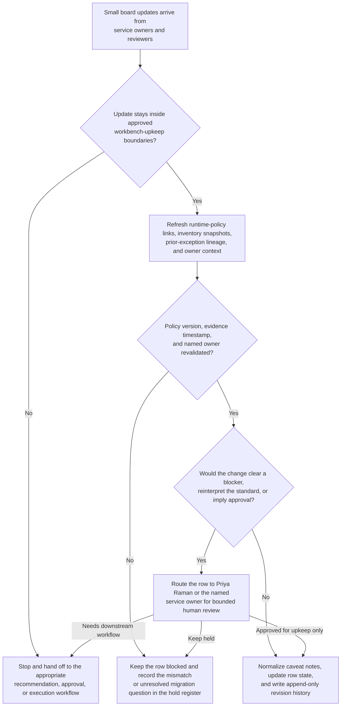
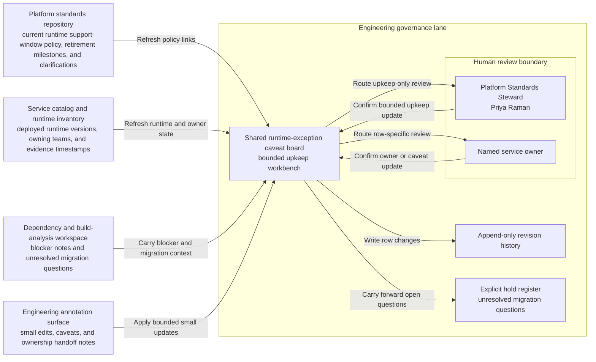

# Service runtime support-window exception caveat board shared workbench upkeep

## Linked pattern(s)

- `shared-workbench-orchestration`

## Domain

Engineering.

## Scenario summary

A platform standards team maintains an internal support-window exception caveat board while service owners, platform stewards, security reviewers, and reliability reviewers keep small updates flowing for services that have not yet moved onto the required runtime version before a governed platform-standard retirement date. The board already has prerequisite state for each row: the current platform-standard version, the latest runtime-inventory snapshot, any prior exception record link, the last evidence-refresh timestamp, visible blocker fields, and named human ownership under Platform Standards Steward Priya Raman plus each service row's accountable owner. As comments and source updates arrive, the agent keeps that bounded workbench synchronized by refreshing policy and inventory links, normalizing duplicate caveat notes, updating ownership changes after team handoffs, and carrying unresolved migration questions forward in an explicit hold register. Humans remain responsible for deciding whether any service deserves an exception, changing retirement dates, approving compensating controls, or moving any row into a separate recommendation, approval, or execution workflow.

## Target systems / source systems

- Shared runtime-exception caveat board with service rows, owner fields, blocker tags, prerequisite-state columns, and append-only revision history
- Platform standards repository containing the current runtime support-window policy, retirement milestones, approved exception criteria, and linked clarifications
- Service catalog and runtime inventory showing deployed runtime versions, owning teams, criticality tags, and last verified migration-evidence timestamps
- Dependency and build-analysis workspace where reviewers attach transitive blocker notes, incompatible library findings, and unresolved migration questions referenced by board rows
- Engineering annotation surface where service owners, security reviewers, reliability reviewers, and platform stewards add small edits, caveats, and ownership handoff notes

## Why this instance matters

This grounds the pattern in an engineering-governance lane where the maintained artifact is one internal caveat board for a platform standard, not a per-service exception packet, migration plan, or board decision record. The useful work is keeping prerequisite state, provenance, blockers, and ownership synchronized as many small edits arrive from inventory systems and human collaborators. That makes the collaboration about shared workbench upkeep and resumable context rather than planning migration waves, recommending which services should get waivers, or preparing approval-ready exception materials.

## Likely architecture choices

- Event-driven monitoring fits because upkeep should react when runtime inventories, policy clarifications, reviewer comments, or owner assignments change.
- A tool-using single agent can refresh policy links, reconcile row metadata, normalize duplicate blocker notes, and keep lineage plus hold markers synchronized inside one bounded board.
- Human-in-the-loop review remains necessary when an update would clear a blocker, reinterpret the platform standard, or make a row sound like an approved exception instead of an internal caveat.
- Bounded delegation works because Priya Raman and the service owners can predefine allowable field updates, source boundaries, and hold conditions without delegating exception approval or migration execution.

## Governance notes

- The board should clearly separate authoritative policy facts, inventory-derived state, reviewer proposals, accepted human caveats, and unresolved migration questions so routine upkeep never implies that a waiver has already been granted.
- Each row should retain inspectable provenance for the policy version, runtime-inventory snapshot, dependency-analysis reference, prior exception lineage, last evidence-refresh timestamp, and the named human owner before a blocker is cleared or a status field is updated.
- The agent may normalize wording, merge duplicate caveat notes, and update ownership fields after confirmed handoffs, but it should not decide whether a service qualifies for an exception, shorten or extend retirement dates, or remove a caveat that Priya Raman or a service owner still considers open.
- Append-only revision history should preserve row-level lineage, including superseded caveat text, owner changes, and blocker-state transitions, so reviewers can reconstruct why the current board differs from the previous one.
- If a requested update would rank services for waiver priority, assemble a formal exception packet, notify external stakeholders, or trigger runtime migration work, the workflow should stop and hand off to the appropriate adjacent pattern.

## Evaluation considerations

- Percentage of board refreshes that preserve correct policy links, runtime-inventory references, named owner fields, and unresolved-question state across repeated upkeep cycles
- Reviewer correction rate for normalized caveat text, refreshed blocker metadata, or automatically updated ownership assignments after board maintenance
- Rate at which approval-like, recommendation-like, or execution-adjacent edits are held for human review instead of being silently folded into the internal caveat board
- Usefulness of the maintained workbench for helping platform stewards and service owners resume exception-program upkeep without reconstructing stale lineage, prerequisite state, or blocker context by hand
