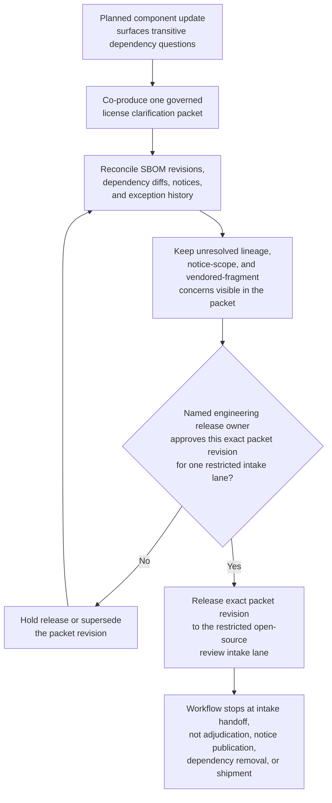
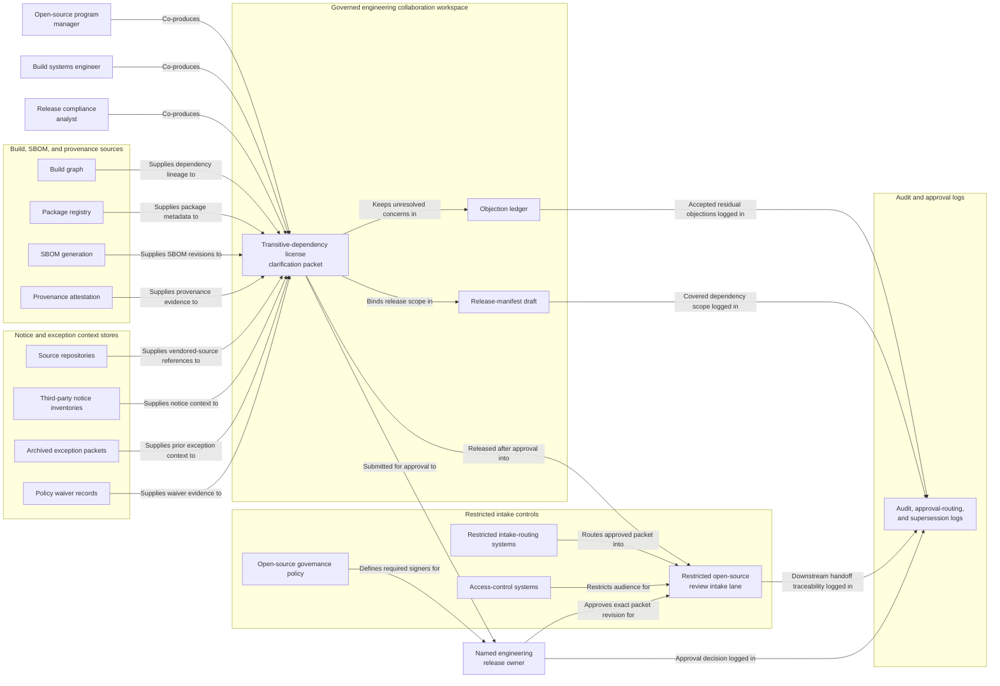

# Transitive-dependency license clarification packet approved for restricted open-source review intake

## Linked pattern(s)

- `approval-gated-collaborative-artifact-release`

## Domain

Engineering.

## Scenario summary

An open-source program manager, a build systems engineer, and a release compliance analyst are co-producing one governed license clarification packet because a planned internal component update now pulls in transitive dependencies whose lineage, vendored source fragments, notice obligations, and prior exception history are only partially reconciled across build metadata and third-party source snapshots. Agents help reconcile SBOM revisions, dependency-graph diffs, package metadata, repository notices, and reviewer comments into the shared packet while preserving which lineage questions, notice-scope objections, and vendored-fragment concerns remain unresolved and which residual disagreements the human artifact owner accepted explicitly. The workflow ends only when the named engineering release owner approves that exact packet revision for one restricted open-source review intake lane, where downstream reviewers may decide whether the package set is ready for formal open-source governance review or needs narrower scope. It does not adjudicate license obligations, publish notices, remove dependencies, authorize release shipment, or decide the downstream review outcome.

## Target systems / source systems

- Governed engineering collaboration workspace holding the transitive-dependency license clarification packet, revision history, objection ledger, and release-manifest draft
- Build graph, package registry, SBOM generation, and provenance-attestation systems supplying authoritative dependency lineage, version pinning, vendored-source references, and freshness timestamps
- Source repositories, third-party notice inventories, archived exception packets, and policy waiver records providing prior review context, disputed notice scope, and exception-history evidence
- Open-source governance policy, restricted intake-routing, and access-control systems defining required signers, approved reviewer audience, and the single downstream open-source review lane
- Audit, approval-routing, and supersession logs preserving held-release reasons, exact packet revision lineage, accepted residual objections, and downstream handoff traceability

## Why this instance matters

This grounds the pattern in engineering software-supply-chain governance rather than architecture exception handling, launch-risk packaging, or deployment readiness. The reusable challenge is collaborative stewardship of one license clarification artifact whose exact revision must be approved before it can cross into a restricted open-source review lane, while disagreement about dependency lineage, notice scope, vendored fragments, SBOM freshness, and exception history stays visible instead of being polished away. The example stays inside the pattern boundary because legal adjudication, notice publication, dependency removal, release shipment, and downstream open-source review decisions remain separate workflows.

## Likely architecture choices

- Approval-gated execution fits because the license clarification packet can be collaboration-ready while still blocked from restricted open-source review intake until the human release owner approves the exact revision.
- Human-in-the-loop control is required because only accountable engineering and open-source governance leaders may accept residual disagreement, confirm audience scope, and authorize release of the packet itself.
- Agents may crosswalk dependency lineage, refresh SBOM evidence, normalize disputed notice references, and maintain the release trace, but they must not decide license obligations, publish notices, remove packages, or authorize shipment.

## Governance notes

- The release manifest should bind one exact packet revision, the named restricted open-source review-intake lane, signer identities, the covered dependency set, and any residual objections the human release owner accepted explicitly.
- Disagreement about transitive dependency lineage, vendored source fragment provenance, third-party notice scope, SBOM freshness, and prior exception applicability should remain visible in the packet or boundary ledger rather than being normalized away before release.
- Audience scope should stay limited to the approved open-source review intake lane; reuse of the packet for legal adjudication, notice publication, dependency removal planning, or release shipment should require separate downstream approval.
- If dependency resolution changes materially, a fresh SBOM arrives, new vendored fragments are discovered, or reviewer assignments change during approval review, the workflow should hold release and supersede the prior packet revision rather than letting stale approval carry forward.

## Evaluation considerations

- Rate at which open-source review intake accepts the released packet without finding hidden lineage gaps, stale SBOM evidence, notice-scope mismatches, or audience-boundary mistakes
- Time required to keep one collaborative license clarification packet synchronized as dependency graphs, exception-history references, signer state, and objection wording evolve
- Reliability of binding between the released artifact revision, accepted residual disagreement, covered dependency scope, and the bounded restricted open-source review-intake lane
- Frequency with which humans reject agent-assisted edits because they drifted into legal adjudication, notice publication, dependency removal, release shipment, or downstream review decisions
